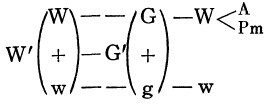
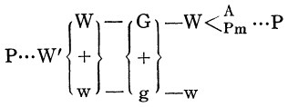
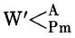
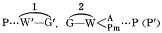

第二章 生产资本的循环

| [Ⅰ，简单再生产](https://www.marxists.org/chinese/marx-engels/24/004.htm#1) [Ⅱ，积累和规模扩大的再生产](https://www.marxists.org/chinese/marx-engels/24/004.htm#2) [Ⅲ，货币积累](https://www.marxists.org/chinese/marx-engels/24/004.htm#3) [Ⅳ，准备金](https://www.marxists.org/chinese/marx-engels/24/004.htm#4) |
|-------------------------------------------------------------------------------------------------------------------------------------------------------------------------------------------------------------------------------------------------------------------------------------------------------------------|

  
  
生产资本循环的总公式是：Ｐ…Ｗ′—Ｇ′—Ｗ…Ｐ。这个循环表示生产资本职能的周期更新，也就是表示再生产，或者说，表示资本的生产过程是增殖价值的再生产过程；它不仅表示剩余价值的生产，而且表示剩余价值的周期再生产；它表示，处在生产形式上的产业资本不是执行一次职能，而是周期反复地执行职能，因此，过程的重新开始，已由起点本身规定了。Ｗ′的一部分（在某些场合，在产业资本的某些投资部门内）可以直接再作为生产资料，进入把它当作商品生产出来的同一劳动过程；这样，它的价值就不用转化为实在货币或货币符号，或者它只是取得计算货币这种独立表现。这部分价值不进入流通。这样，有的价值不进入流通过程，但进入生产过程。Ｗ′中被资本家作为剩余产品部分以实物形式消耗的那一部分，也是这样。不过，这种情况对于资本主义生产来说并不重要，最多在农业上值得注意。  
在这个形式上，有两点是显而易见的。  
第一，在第一种形式Ｇ…Ｇ′中，生产过程，即Ｐ的职能，使货币资本的流通中断，只是在Ｇ—Ｗ和Ｗ′—Ｇ′这两个阶段之间充当媒介；而在这里，产业资本的总流通过程，它在流通阶段的全部运动，只是发生在作为始极使循环开始的生产资本，和作为终极以同一形式即以循环重新开始的形式使循环结束的生产资本这二者之间，使二者中断，从而只是充当二者之间的媒介。真正的流通，只是表现为周期更新的和通过更新而连续进行的再生产的媒介。  
第二，总流通表现的形式和它在货币资本循环中具有的形式相反。在货币资本的循环中，撇开价值规定不说，总流通的形式是Ｇ—Ｗ—Ｇ（Ｇ—Ｗ，Ｗ—Ｇ）；在生产资本的循环中，同样撇开价值规定不说，总流通的形式却是Ｗ—Ｇ—Ｗ（Ｗ—Ｇ，Ｇ—Ｗ），所以是简单商品流通的形式。  
  

`Ⅰ，简单再生产`

  
我们首先考察Ｐ…Ｐ二极之间在流通领域内进行的过程：Ｗ′—Ｇ′—Ｗ。  
这个流通的起点是商品资本Ｗ′＝Ｗ＋ｗ＝Ｐ＋ｗ。商品资本的职能Ｗ′—Ｇ′（这就是实现商品资本中包含的资本价值＝Ｐ，在这里就是商品组成部分Ｗ，以及实现商品资本中包含的剩余价值，在这里就是同一商品量中价值等于ｗ的那一组成部分），已经在循环的第一种形式中考察过了。但是在那里，它形成被中断的流通的第二阶段和整个循环的结束阶段。在这里，它形成循环的第二阶段，但又形成流通的第一阶段。第一次循环以Ｇ′告终；因为Ｇ′和原来的Ｇ一样，可以重新作为货币资本开始第二次循环，所以包含在Ｇ′中的Ｇ和ｇ（剩余价值）是继续在同一条轨道上运行，还是走上不同的轨道，起初没有必要作进一步的研究。假如我们进一步探讨第一次循环怎样更新，那就有必要来研究这个问题了。但是在生产资本的循环中，这一点是必须确定的，因为它的第一次循环的性质就要取决于这一点，而且在这个循环中，Ｗ′—Ｇ′表现为流通的第一阶段，这个阶段要由Ｇ—Ｗ来补充。这个公式代表简单再生产还是代表规模扩大的再生产，就取决于这一点是怎样确定的。因此，循环的性质随着这种确定而变化。  
现在，我们首先考察生产资本的简单再生产。在这里，和在第一章一样，假定一切条件不变，又假定商品是按照它们的价值买卖的。根据这些假定，全部剩余价值进入资本家的个人消费。商品资本Ｗ′一旦转化为货币，货币总额中代表资本价值的那一部分就在产业资本的循环中继续流通；另一部分，即已经转化为金的剩余价值，则进入一般的商品流通，这是以资本家为起点的货币流通，不过是在他的单个资本的流通之外进行的。  
用我们的例子来说。商品资本Ｗ′是10000磅纱，价值500镑。其中422镑是生产资本的价值，它作为8440磅纱的货币形式，使那个由Ｗ′开始的资本流通继续进行下去；78镑的剩余价值，即商品产品的超额部分1560磅纱的货币形式，则退出这个流通，而在一般商品流通内走一条分离的轨道。  
  

  
ｇ—ｗ是一系列用货币进行的购买。资本家或是用这个货币购买真正的商品，或是用来支付他自己的尊体或家庭的服务费用。这种购买是分散的，是在不同期间进行的。因此，这种货币暂时采取专供日常消费之用的货币储备或贮藏货币的形式，因为流通中断的货币就处在贮藏货币的形式上。这种货币的流通手段职能——也包含货币暂时充当贮藏货币的形式——不进入货币形式Ｇ上的资本的流通。这种货币不是预付的，而是花掉的。  
我们曾经假定，预付的总资本总是全部由一个阶段转到另一个阶段。在这里，我们也假定，Ｐ的商品产品代表生产资本Ｐ的总价值422镑＋生产过程中创造的剩余价值78镑。在我们的例子中，我们考察的是一种可分离的商品产品，按照我们的例子，剩余价值以1560磅纱的形式存在；以一磅纱作单位计算，就是以2R496盎斯纱的形式存在。相反，如果商品产品比如说是一台价值500镑并具有同样价值构成的机器，那末，虽然这台机器的价值的一部分＝78镑是剩余价值，但是这78镑只存在于总机器中；它不可能分成资本价值和剩余价值，除非把机器敲碎，而这样就连同它的使用价值一起把它的价值也毁掉了。因此，价值的两个组成部分只能观念地用商品体的各个组成部分来表示，而不象每一磅纱都是10000磅纱的可分离的独立的商品要素那样，表现为商品Ｗ′的互相独立的要素。在这种场合，总商品，商品资本，机器必须全部卖出，ｇ才能进入它的特殊流通。在相反的场合，只要资本家卖出8440磅纱，其余1560磅纱的出售就以ｗ（1560磅纱）—ｇ（78镑）—ｗ（消费品）的形式，表现剩余价值的一个完全分离的流通。但是产品10000磅纱的每一部分的价值要素，可以象表现在总产品上那样，表现在产品的各个部分上。10000磅纱可以分为：不变资本价值（ｃ），纱7440磅，价值372镑；可变资本价值（ｖ），纱1000磅，价值50镑；剩余价值（ｍ），纱1560磅，价值78镑。同样，每一磅纱也可以分为：ｃ＝纱11R904盎斯，价值8R928便士；ｖ＝纱1R600盎斯，价值1R200便士；ｍ＝纱2R496盎斯，价值1R872便士。资本家也可以在10000磅纱的逐次出售中，逐次消费包含在逐个部分中的剩余价值要素，并由此逐次实现ｃ＋ｖ之和。但是，这种做法的前提归根到底是要把10000磅纱全部卖出，从而要由8440磅纱的出售来补偿ｃ＋ｖ的价值（第1卷第7章第2节）。  
不管怎样，Ｗ′中包含的资本价值和剩余价值，通过Ｗ′—Ｇ′总会分开，分成不同的货币额；在这两种场合，Ｇ和ｇ实际都是价值的转化形式，这个价值原来在Ｗ′中只是具有商品价格这种独特的仅仅观念上的表现。  
ｗ—ｇ—ｗ是简单的商品流通。它的第一阶段ｗ—ｇ包含在商品资本的流通Ｗ′—Ｇ′中，从而包含在资本的循环中；相反，它的补充阶段ｇ—ｗ却在这个循环之外，成为同这一循环相分离的一般商品流通的行为。Ｗ和ｗ即资本价值和剩余价值的流通，在Ｗ′转化为Ｇ′之后分开了。由此可见：  
第一，当商品资本由Ｗ′—Ｇ′＝Ｗ′—（Ｇ＋ｇ）而实现时，在Ｗ′—Ｇ′中还是共同进行并由同一商品量承担的资本价值和剩余价值的运动，就变成可以分离的运动，因为现在二者都是货币额，具有独立的形式。  
第二，如果发生这种分离，就是说ｇ作为资本家的收入花掉，而Ｇ作为资本价值的职能形式继续沿着它的由循环决定的轨道运行，那末，第一个行为Ｗ′—Ｇ′和相继发生的行为Ｇ—Ｗ和ｇ—ｗ联系起来看，就可以表现为两个不同的流通：Ｗ—Ｇ—Ｗ和ｗ—ｇ—ｗ；就一般形式来说，这两个流通序列都属于普通商品流通。  
此外，就不可分割的具有连续性的商品体来说，它的价值的各个组成部分实际上是观念地分割开来的。以伦敦的建筑业为例，这种营业大部分依靠信用经营，建筑业主依照房屋建造的各个阶段取得垫款。其中任何一个阶段都不是整座房屋，而只是将要建成的房屋的一个现实存在的部分。因此，不管这个部分多么现实，也只是整座房屋的一个观念上的部分。但是，作为取得追加垫款的保证，它已经是足够现实的了。（关于这一点，可参看后面的第12章［注：见本卷第260—261页。——编者注］。）  
第三，如果在Ｗ和Ｇ中还是共同进行的资本价值和剩余价值的运动，只是部分地分离（以致剩余价值的一部分不是作为收入花掉），或者根本不分离，那末，资本价值本身还在它的循环中，还在它的循环完成以前就发生一种变化。用我们的例子来说，生产资本的价值等于422镑。假定这个资本以480镑或500镑继续通过Ｇ—Ｗ，它就作为一个比原来价值增长58镑或78镑的价值，通过循环的后面各个阶段。这种变化同时还可能和资本价值构成的变化结合在一起。——  
Ｗ′—Ｇ′，在循环Ｉ（Ｇ…Ｇ′）中是流通的第二阶段和这个循环的终结阶段；在现在这个循环中，却是这个循环的第二阶段和商品流通的第一阶段。因此，从流通来看，它必须用Ｇ′—Ｗ′补充。但是，Ｗ′—Ｇ′不仅发生在价值增殖过程（在这里是Ｐ执行职能，是第一阶段）之后，而且价值增殖过程的结果，商品产品Ｗ′也已经实现。因此，资本的价值增殖过程和体现了已经增殖的资本价值的商品产品的实现，都是以Ｗ′—Ｇ′结束的。  
我们已经假定是简单再生产，也就是假定ｇ—ｗ和Ｇ—Ｗ完全分开。由于ｗ—ｇ—ｗ和Ｗ—Ｇ—Ｗ这两个流通就一般形式来说都属于商品流通的范围（因此，也没有表示出两极之间的价值差别），所以很容易象庸俗经济学那样，把资本主义的生产过程看作单纯的商品生产，看作用于某种消费的使用价值的生产，而资本家生产这些商品，照庸俗经济学的错误论断，不过是为了用具有别种使用价值的商品来代替或者交换这些商品。  
Ｗ′从一开始就是作为商品资本出现的，而全部过程的目的，发财致富（价值增殖），决不排斥资本家的消费量随着剩余价值量（从而也随着资本量）而增大，倒是正好包含这种增大。  
实际上，在资本家的收入的流通中，生产出的商品ｗ（或商品产品Ｗ′中在观念上相当于ｗ的部分）的作用不过是使收入先转化为货币，再由货币转化为一系列可供个人消费的其他商品。但是，在这里，我们不要忽略这件小事：ｗ是资本家没有付出任何代价就得到的一个商品价值，是剩余劳动的化身，因此，它原来就是作为商品资本Ｗ′的一个组成部分出场的。所以，这个ｗ本身按它的存在来说，就和处在过程中的资本价值的循环联结在一起。循环一旦停顿或受到某种干扰，那时不仅ｗ的消费，而且一系列用来代替ｗ的商品的销售，都会受到限制，甚至完全停止。当Ｗ′—Ｇ′不能完成或者Ｗ′中只有一部分能卖出时，情形就是这样。  
我们讲过，ｗ—ｇ—ｗ，作为资本家的收入的流通，只有在ｗ是Ｗ′这个处于商品资本职能形式的资本的一个价值部分的时候，才进入资本的流通；但是，收入的流通一旦通过ｇ—ｗ，用完整的形式来说就是通过ｗ—ｇ—ｗ而独立出来，就不会进入资本家所预付的资本的运动，虽然它是从这种运动中出来的。它和这种运动联系起来，只是由于资本的存在以资本家的存在为前提，而资本家的存在又以他消费剩余价值为条件。  
在一般流通中，Ｗ′（例如纱）只是执行商品的职能；但是作为资本流通的要素，它是执行`商品资本`——资本价值交替采取和抛弃的一种形式——的职能。纱卖给商人以后，就离开把它生产出来的那个资本的循环过程，尽管如此，它还是作为商品继续处在一般流通的范围内。同一个商品量在继续流通，虽然这个流通不再是纺纱厂主的资本的独立循环中的要素。因此，资本家投入流通的商品量的现实的最终的形态变化，Ｗ—Ｇ，商品量的最后进入消费，可以在时间和空间上同这个商品量作为资本家的商品资本执行职能时所经历的形态变化完全分离开来。在资本流通中完成的同一个形态变化，还要在一般流通的领域内继续完成。  
如果纱再进入另一个产业资本的循环，事情也不会有所改变。一般的流通既包括社会资本各个不同独立部分的循环的互相交错，即各个单个资本的总体，也包括那些不作为资本投入市场而进入个人消费的价值的流通。  
作为一般流通的一个部分的资本循环和作为一个独立循环的环节的资本循环之间的关系，在我们考察Ｇ′或Ｇ＋ｇ的流通时，就进一步表示出来。Ｇ，作为货币资本，使资本循环继续进行。ｇ，作为收入花掉（ｇ—ｗ），则进入一般的流通，而退出资本循环。只有执行追加货币资本职能的那一部分，才进入资本循环。在ｗ—ｇ—ｗ中，货币只执行铸币的职能；这个流通的目的是资本家的个人消费。庸俗经济学把不进入资本循环的流通，即价值产品中作为收入消费的那个部分的流通，说成是资本特有的循环，这就典型地说明他们是多么痴呆。  
在第二阶段Ｇ—Ｗ中，资本价值Ｇ＝Ｐ（即在这里开始了产业资本循环的生产资本的价值）又出现了，不过已经和剩余价值分离，因此，它的价值量也和它在货币资本循环第一阶段Ｇ—Ｗ中一样大。尽管位置不同了，但现在由商品资本转化成的货币资本的职能还是一样：转化为Ｐｍ和Ａ，生产资料和劳动力。  
可见，资本价值在商品资本的职能Ｗ′—Ｇ′，中，和ｗ—ｇ同时经过Ｗ—Ｇ阶段，然后出现在补充的阶段

中；因此，它的总流通是Ｗ—

。  
第一，在形式Ｉ（Ｇ…Ｇ′循环）中，货币资本Ｇ以资本价值预付时的原有形式出现；在这里，它从一开始就是商品资本在第一流通阶段Ｗ′—Ｇ′中转化成的货币额的一部分，所以它从一开始就表示，生产资本Ｐ已通过商品产品的出售转化成货币形式。在这里，货币资本从一开始就不是作为资本价值的原有形式和结束形式而存在，因为只有再抛弃货币形式，那个使Ｗ—Ｇ阶段结束的Ｇ—Ｗ阶段才能够完成。因此，Ｇ—Ｗ中那个同时又是Ｇ—Ａ的部分，现在也不再表现为购买劳动力时的单纯的货币预付，而是表现为这样一种预付：把劳动力创造的商品价值中的一部分，价值50镑的1000磅纱，以货币形式预付给劳动力。这里预付给工人的货币，只是工人自己生产的商品价值的一部分转化成的等价形式。因此，Ｇ—Ｗ行为，就它是Ｇ—Ａ行为来说，已经不仅是用使用形式的商品代替货币形式的商品，而且包含其他一些与一般商品流通本身无关的因素。  
Ｇ′表现为Ｗ′的转化形式，Ｗ′本身又是Ｐ过去执行的职能即生产过程的产物；因此，货币总额Ｇ′是过去劳动的货币表现。用我们的例子来说，纺纱过程的产物10000磅纱＝500镑；其中7440磅纱＝预付的不变资本ｃ＝372镑；1000磅纱＝预付的可变资本ｖ＝50镑；1560磅纱＝剩余价值ｍ＝78镑。假定Ｇ′中只有原有的资本422镑重新预付，在其他条件不变的情况下，那末下周在Ｇ—Ａ中预付给工人的，只是工人本周生产的10000磅纱的一部分（1000磅纱的货币价值）。货币，作为Ｗ—Ｇ的结果，总是过去劳动的表现。如果补充的行为Ｇ—Ｗ立即在商品市场上完成，Ｇ和市场上现存的商品相交换，那仍然是过去劳动由一种形式（货币）转化为另一种形式（商品）。但是从时间上说，Ｇ—Ｗ和Ｗ—Ｇ是不同的。这两种行为，在例外情况下，也可以同时发生。例如，完成Ｇ—Ｗ的资本家和把这一行为作为Ｗ—Ｇ来完成的资本家，同时互相交付商品，而Ｇ只是用来平衡差额时，情形就是这样。Ｗ—Ｇ和Ｇ—Ｗ的实现在时间上可以有相当显著的差异。虽然Ｇ作为Ｗ—Ｇ行为的结果，是代表过去劳动，但是对于Ｇ—Ｗ行为来说，Ｇ可以代表在市场上还根本没有出现，将来才会出现的商品的转化形式，因为Ｇ—Ｗ要到Ｗ重新生产出来以后才进行。Ｇ还可以代表这样一些商品，这些商品和以Ｇ为货币表现的Ｗ是同时生产出来的。例如，在Ｇ—Ｗ交换（购买生产资料）中，煤炭在开采出来之前，就可以被买去。在ｇ不是作为收入花掉而是作为货币积累时，它可以代表要在明年才生产出来的棉花。在资本家花费他的收入即ｇ—ｗ时，也有这种情形。50镑工资Ａ也是这样；这个货币不仅是工人过去劳动的货币形式，同时还是取得正在实现的同时劳动或将来实现的未来劳动的凭证。工人可以用这个货币购买一件要到下周才制成的上衣。一生产出来要马上消费才不致坏掉的大多数必要生活资料，特别是这样。因此，工人在作为工资付给他的货币上得到的，是他自己的或其他工人的未来劳动的转化形式。资本家用工人过去劳动的一部分，作为工人取得自己未来劳动的凭证付给工人。工人自己的同时劳动或未来劳动，形成还不存在的储备，对工人过去劳动就是用这种储备支付的。在这里，储备形成的概念完全消失了。  
第二，在Ｗ—

流通中，同一个货币两次变换位置；资本家先作为卖者得到货币，然后再作为买者付出货币；商品转化为货币形式，只是为了由货币形式再转化为商品形式；因此，资本的货币形式，它作为货币资本的存在，在这种运动中，只是一个转瞬即逝的因素；或者说，只要运动是流畅的，货币资本充当购买手段时就只表现为流通手段；在资本家互相购买，因而只须结清支付差额时，它才表现为真正的支付手段。  
第三，货币资本不论是充当单纯的流通手段，还是充当支付手段，它的职能只是充当媒介，使Ａ和Ｐｍ来代替Ｗ，也就是使纱的各种生产要素来代替纱，代替由生产资本生产出来的商品产品（除掉用作收入的剩余价值），从而使资本价值从它的商品形式再转化为这个商品的各种形成要素；因此，归根到底，货币资本的职能只是商品资本再转化为生产资本的媒介。  
循环要正常进行，Ｗ′就必须按它的价值全部卖掉。其次，Ｗ—Ｇ—Ｗ不仅是一种商品由另一种商品代替，而且是按同一价值比例来代替。我们假定这里的情况就是这样。但是生产资料的价值实际上是会变动的；劳动生产率的不断变动是资本主义生产的特征，因此，价值比例的不断变动，正好是资本主义生产的固有现象。关于生产要素的价值变动，我们以后［注：见本卷第317—326页。——编者注］再论述，这里只是提一下。生产要素转化为商品产品，Ｐ转化为Ｗ′，是在生产领域进行的，Ｗ′再转化为Ｐ，则是在流通领域进行的。这种再转化是以简单的商品形态变化为媒介的。但它的内容是作为整体来看的再生产过程的一个要素。Ｗ—Ｇ—Ｗ，作为资本的流通形式，包含一种职能上确定的物质变换。其次，Ｗ—Ｇ—Ｗ这样一个交换，要求Ｗ和商品量Ｗ′的各种生产要素相等，并要求这些生产要素互相之间维持原有的价值比例；这就是假定，商品不仅按照它们的价值购买，而且在循环中不发生价值变动；不然的话，过程就不能正常进行。  
在Ｇ…Ｇ′中，Ｇ是资本价值的原有形式，资本价值抛弃这种形式，是为了再取得这种形式。在Ｐ…Ｗ′—Ｇ′—Ｗ…Ｐ中，Ｇ只是在过程中取得的形式，还在过程中就又被抛弃。货币形式在这里只表现为资本的转瞬即逝的独立的价值形式；作为Ｗ′的资本，渴望取得这种形式，而作为Ｇ′的资本，一旦蛹化为这种形式，则渴望放弃它，以便再转化为生产资本的形式。资本只要停留在货币形式上，就不执行资本的职能，从而不增殖价值；这个资本就闲置起来。在这里，Ｇ是起流通手段的作用，但是，它是起资本的流通手段的作用。［注：在马克思的手稿中这里有一个注：“驳图克”。——编者注］资本价值的货币形式在它的循环的第一种形式（货币资本循环）中具有的独立性这种外观，在这第二种形式中消失了，因此，这第二种形式就是对形式Ｉ的批判，并且把它归结为不过是一个特殊的形式。如果第二形态变化Ｇ—Ｗ遇到障碍（例如市场上缺乏生产资料），循环，再生产过程的进行，就会中断，这和资本凝结在商品资本形式上的情形一样。但有一个区别：资本在货币形式上，比在易逝的商品形式上，能坚持较长的时间。资本如果不执行货币资本的职能，它仍然可以是货币；但资本如果过久地停留在商品资本的职能上，它就不再成为商品，甚至不再成为使用价值。其次，资本在货币形式上能够不采取它原有的生产资本的形式，而采取另一种形式，但作为Ｗ′，则根本不能离开原位。  
Ｗ′—Ｇ′—Ｗ只是对Ｗ′来说，就它的形式来看，包含作为它的再生产的要素的各种流通行为；但是，要完成Ｗ′—Ｇ′—Ｗ，就要有Ｗ′所要转化成的Ｗ的现实的再生产；而这种再生产又要以Ｗ′所代表的单个资本的再生产过程之外进行的一些再生产过程为条件。——  
在形式Ｉ中，

只是准备了由货币资本到生产资本的第一个转化；在形式Ⅱ中，它准备了由商品资本到生产资本的再转化；也就是说，只要产业资本的投资不变，就是准备了商品资本到把它生产出来的各种相同的生产要素的再转化。因此，它在这里和在形式Ｉ中一样，表现为生产过程的准备阶段；不过，它是表现为生产过程的复归，生产过程的更新，从而表现为再生产过程的先导，也就是反复进行的价值增殖过程的先导。  
这里要再次指出，Ｇ—Ａ不是简单的商品交换，而是购买可用来生产剩余价值的商品Ａ，同样，Ｇ—Ｐｍ只是为实现这个目的在物质上所不可缺少的一种手续。  

完成时，Ｇ再转化为生产资本Ｐ，循环又重新开始。  
因此，Ｐ…Ｗ′—Ｇ′—Ｗ…Ｐ的详细形式是：  
  

  
货币资本转化为生产资本，就是为生产商品而购买商品。只有消费是这种生产消费，它才进入资本本身的循环；而这种消费的条件是，通过这样消费掉的商品生产出剩余价值。这和以维持生产者的生存为目的的生产，甚至商品生产，是很不相同的。这样一种由剩余价值的生产所决定的用商品代替商品，和本来的产品交换（只是以货币为媒介）完全不同。可是，经济学家们竟以此证明生产过剩是没有可能的。  
除了转化为Ａ和Ｐｍ的Ｇ的生产消费，循环还包含第一个环节Ｇ—Ａ。这个环节对于工人来说，就是Ａ—Ｇ＝Ｗ—Ｇ。在Ａ—Ｇ—Ｗ这一包含工人消费在内的工人的流通中，只有作为Ｇ—Ａ结果的第一个环节进入资本的循环。第二个行为Ｇ—Ｗ不进入单个资本的流通，虽然它是从这个流通出来的。不过，对于资本家阶级来说，工人阶级的经常存在是必要的，因此，工人通过Ｇ—Ｗ而进行的消费，也是必要的。  
要使资本价值的循环继续下去，要使资本家消费剩余价值，Ｗ′—Ｇ′行为所要求的只是Ｗ′转化为货币，被卖掉。当然，Ｗ′被购买，只是因为这种物品是一种使用价值，可供某种生产消费或个人消费。但是如果Ｗ′继续流通，比如在购买纱的商人手中继续流通，那对于把纱生产出来并卖给商人的单个资本的循环的继续进行，起初也不会有什么影响。整个过程继续进行，与此同时，由此决定的资本家和工人的个人消费也继续进行。这一点在考察危机时很重要。  
Ｗ′一旦卖出，转化为货币，就可以再转化为劳动过程的从而再生产过程的各种现实因素。因此，Ｗ′是由最后的消费者购买，还是由想转卖的商人购买，这都没有什么直接的影响。资本主义生产所生产出的商品量的多少，取决于这种生产的规模和不断扩大生产规模的需要，而不取决于需求和供给、待满足的需要的预定范围。在大量生产中，直接购买者除了别的产业资本家外，只能是大商人。在一定的界限内，尽管再生产过程排出的商品还没有实际进入个人消费或生产消费，再生产过程还可以按相同的或扩大的规模进行。商品的消费不进入这个商品从中出来的资本循环。例如，纱一旦卖出，不论卖出的纱起初变成什么，纱所代表的资本价值的循环便可以重新开始。产品只要卖出，在资本主义生产者看来，一切就都正常。他所代表的资本价值的循环就不会中断。如果这种过程扩大了，——这包括生产资料的生产消费的扩大，——那末随着资本的这种再生产，工人的个人消费（需求）也可能扩大，因为这个过程是以生产消费为先导和媒介的。这样，剩余价值的生产，从而资本家的个人消费，可以增长起来，整个再生产过程可以处在非常繁荣的状态中，但商品的一大部分只是表面上进入消费，实际上是堆积在转卖者的手中没有卖掉，事实上仍然留在市场上。这时，商品的潮流一浪一浪涌来，最后终于发现，以前涌入的潮流只是表面上被消费吞没。商品资本在市场上互相争夺位置。后涌入的商品，为了卖掉只好降低价格出售。以前涌入的商品还没有变成现金，支付期限却已经到来。商品持有者不得不宣告无力支付，或者为了支付不得不给价就卖。这种出售同需求的实际状况绝对无关。同它有关的，只是支付的需求，只是把商品转化为货币的绝对必要。于是危机爆发了。它不是表现在消费需求，即个人消费需求的直接缩减上，而是表现在资本对资本的交换，即资本再生产过程的缩减上。——  
Ｇ要完成它作为货币资本，作为要再转化为生产资本的资本价值的职能，就要转化为商品Ｐｍ和Ａ。如果这些商品要在不同的时期购买或支付，因而Ｇ—Ｗ是代表一系列相继进行的购买和支付，那末，当Ｇ的一部分完成Ｇ—Ｗ行为时，它的另一个部分就停留在货币状态中，要到由过程本身的条件所规定的时期，才在那些同时进行或相继进行的Ｇ—Ｗ行为中发生作用。Ｇ的这个部分暂时从流通退出，只是为了到一定的时候发生作用，执行职能。在这种情况下，它的贮存本身就是一种由它的流通并且为了流通而规定的职能；它作为购买基金和支付基金的存在，它的运动的中止，它的流通中断状态，就是货币作为货币资本借以执行货币的一种职能的状态。它是作为货币资本，因为这里暂时处于静止状态的货币本身，就是货币资本Ｇ（Ｇ′—ｇ＝Ｇ）的一部分，是商品资本中同作为循环起点的生产资本价值Ｐ相等的那部分价值的一部分。另一方面，一切从流通退出的货币，都是处在贮藏货币的形式中。因此，货币的贮藏形式在这里成了货币资本的职能，正如在Ｇ—Ｗ中货币作为购买手段或支付手段的职能成为货币资本的职能一样，这是因为资本价值在这里是以货币形式存在，货币状态在这里是由循环的联系所规定的、产业资本在它的一个阶段上所采取的状态。但在这里，同时再一次证明了，货币资本在产业资本的循环中，除执行货币职能外，不执行其他任何职能，并且这种货币职能只是由于它和这种循环的其他阶段的联系，才同时具有资本职能的意义。  
把Ｇ′表现为ｇ对Ｇ的关系，表现为资本关系，直接地说，不是货币资本的职能，而是商品资本Ｗ′的职能；商品资本Ｗ′本身，作为ｗ和Ｗ的关系，又只是表示生产过程的结果，只是表示资本价值在生产过程中自行增殖的结果。  
如果流通过程的继续进行遇到障碍，Ｇ由于市场状况等等这类的外部情况而不得不中止它的Ｇ—Ｗ职能，因而在一个或长或短的期间停留在货币状态中，这时货币便又处于贮藏货币状态。这种状态在简单商品流通中也会发生，如果由Ｗ—Ｇ到Ｇ—Ｗ的转变因外部情况而发生中断。这是非自愿的货币贮藏。因此在我们考察的场合，货币具有闲置的、潜在的货币资本的形式。不过，我们现在不来进一步研究这个问题。  
但是，在两种场合，货币资本停留在货币状态中，都是运动中断的结果，不管这种运动中断是合乎目的的还是违反目的的，是自愿的还是非自愿的，是与职能相适应的还是与职能相违背的。  
  

`Ⅱ，积累和规模扩大的再生产`

  
生产过程可能扩大的比例不是任意规定的，而是技术上规定的，因此，已经实现的剩余价值虽然要资本化，但往往要经过若干次循环的反复，才能增长到必要的规模（也就是要积累到必要的规模），这时它才能实际执行追加资本的职能，即进入处在过程中的资本价值的循环。因此，这个剩余价值凝结为贮藏货币，并在这一形式上形成潜在的货币资本。这种货币资本所以是潜在的，因为在它停留于货币形式时，不能作为资本发生作用。［注：《latent》〔“潜在”〕一词，是从潜热这个物理学概念借用来的。这个概念现在差不多已为能量转化理论代替了。因此，马克思在第三篇（晚些时候的修订稿）中采用了《potentiell》〔“可能的”〕这个从《potentielle
Energie》〔“位能”〕这一概念中借用来的名词；或者仿效达兰贝尔的《virtuelle
Geschwindigkeit》〔“虚速度”〕，称作《virtuelles
Kapital》。——弗·恩·］可见，在这里，货币贮藏表现为一种包含在资本主义积累过程中，随着它发生，但同时又和它有本质区别的要素。因为潜在的货币资本的形成并不使再生产过程本身扩大。正好相反，潜在的货币资本在这里形成，倒是因为资本主义生产者不能直接扩大他的生产的规模。如果他把他的剩余产品卖给一个把新的金或银投入流通的金或银的生产者，或者——结果是一样的——卖给一个用一部分本国剩余产品从外国换进追加的金或银的商人，那末，他的潜在的货币资本就在本国金或银的贮藏中形成一个增长额。在所有其他场合，例如，原来在买者手中充当流通手段的78镑，现在在资本家手中则只是取得贮藏货币的形式；就是说，只是本国的金或银的贮藏在分配上发生变化。  
如果货币在我们这个资本家的交易中执行支付手段的职能（其方式是商品要经过或长或短的时期才由买者支付），那末，要资本化的剩余产品就不转化为货币，而转化为债权，也就是对买者或许已经到手或许可望到手的等价物的所有权。这个货币和投在有息证券等等上面的货币一样，不进入循环的再生产过程，虽然它可以进入其他单个产业资本的循环。  
资本主义生产的全部性质，是由预付资本价值的增殖决定的，就是说，首先是由生产尽可能多的剩余价值决定的；其次（参看第1卷第22章）是由资本的生产，即由剩余价值到资本的转化决定的。积累或规模扩大的生产，是剩余价值生产不断扩大，从而资本家发财致富的手段，是资本家的个人目的，并且包含在资本主义生产的一般趋势中，但是后来，如第一卷指出的，由于资本主义生产的发展，它对于任何单个资本家都成为一种必要。他的资本的不断增大，成为保存他的资本的条件。不过以前已经说明的问题，我们不再重复。  
我们先是考察简单再生产，假定全部剩余价值作为收入花掉。实际上，剩余价值在正常情况下总要有一部分作为收入花掉，另一部分则资本化，至于一定期间内生产的剩余价值是否有时全部消费掉，有时全部资本化，这是完全没有关系的。从运动的平均情况——总公式也只能代表这个平均情况——来看，这两种情形都会发生。为了不使公式复杂化，最好还是假定剩余价值全部积累起来。公式Ｐ…Ｗ′—Ｇ′—

…Ｐ′表示这样一个生产资本，它按更大的规模，以更大的价值被再生产出来，并且又作为已经增大的生产资本，开始它的第二次循环，或者说，更新它的第一次循环。一旦这第二次循环开始，Ｐ就又成为起点；不过，这个Ｐ，和第一个Ｐ相比，已经是一个更大的生产资本。正如在Ｇ…Ｇ′公式中当Ｇ′开始第二次循环时，Ｇ′是作为Ｇ，作为一定量的预付货币资本执行职能；它和用来开始第一次循环的货币资本相比，是一个更大的货币资本，但是，一旦它作为预付货币资本执行职能，它由剩余价值资本化而增大的一切关系便都消失了。这个起源在它用来开始循环的货币资本的形式中消失了。一旦Ｐ′作为一个新循环的起点执行职能，情形也是这样。  
我们拿Ｐ…Ｐ′和Ｇ…Ｇ′即第一种循环比较一下，就会发现，二者的含义完全不同。Ｇ…Ｇ′作为一个孤立的循环来看，不过表示：货币资本（即作为货币资本进行循环的产业资本）Ｇ是会生出货币的货币，会生出价值的价值，它会生出剩余价值。而在Ｐ的循环中，价值增殖过程本身在第一阶段即生产过程结束时已经完成，在第二阶段（流通的第一阶段）Ｗ′—Ｇ′完成之后，资本价值＋剩余价值就已经作为实现了的货币资本，作为Ｇ′存在了，而Ｇ′在第一种循环中是作为终极出现的。剩余价值的生产，在前面考察的Ｐ…Ｐ形式（参看第47页的详细公式［注：见本卷第87页。——编者注］）中，由ｗ—ｇ—ｗ表示出来，ｗ—ｇ—ｗ的第二阶段不属于资本流通，而表示作为收入的剩余价值的流通。因此，在全部运动由Ｐ…Ｐ表示，因而两极之间不存在价值差额的这个形式中，预付价值的增殖，即剩余价值的生产，是和在Ｇ…Ｇ′中一样被表示出来的；不过，Ｗ′—Ｇ′行为在Ｇ…Ｇ′中是表现为最终阶段，在Ｐ…Ｐ中则表现为循环的第二阶段，流通的第一阶段。  
在Ｐ…Ｐ′中，Ｐ′所表示的，不是剩余价值生产出来，而是生产出来的剩余价值已经资本化，就是说，资本已经积累，因此，Ｐ′和Ｐ不同，它是由原有的资本价值加上在这个资本价值的运动中积累起来的资本的价值构成的。  
作为Ｇ…Ｇ′的单纯终结的Ｇ′，以及在这一切循环中出现的Ｗ′，就其自身来看，不是表现运动，而是表现运动的结果，即以商品形式或货币形式实现的资本价值的增殖，因而是把资本价值表现为Ｇ＋ｇ或Ｗ＋ｗ，表现为资本价值和它的幼仔剩余价值的关系。它们把这个结果表现为已经增殖的资本价值的不同的流通形式。但是不论在Ｗ′形式上，还是在Ｇ′形式上，所发生的价值增殖本身，既不是货币资本的职能，也不是商品资本的职能。作为与产业资本的特殊职能相适应的不同的特殊形式或存在方式，货币资本只能完成货币的职能，商品资本只能完成商品的职能，二者的区别只是货币和商品的区别。同样，生产资本形式的产业资本，也和任何别一种形成产品的劳动过程一样，只能由这样的要素构成：一方面是物化的劳动条件（生产资料），另一方面是生产地（有目的地）发挥作用的劳动力。产业资本在生产领域只能存在于和一般生产过程，从而也和非资本主义的生产过程相适应的构成中，同样，它在流通领域也只能存在于两种和流通领域相适应的形式，即商品形式和货币形式中。但是，由于劳动力是别人的劳动力，资本家要从劳动力所有者那里购买劳动力，就象要从其他商品所有者那里购买生产资料完全一样，所以各种生产要素的总和从一开始就表现为生产资本，因而生产过程本身也表现为产业资本的生产职能，同样，货币和商品也表现为同一产业资本的流通形式，因而，它们的职能也表现为产业资本的流通职能，这些职能或者是生产资本的职能的先导，或者是从生产资本的职能产生。在这里，货币职能和商品职能所以同时又是货币资本的职能和商品资本的职能，只是由于它们作为产业资本在循环过程不同阶段上所要完成的职能的形式是互相联系的。因此，企图从货币和商品的资本性质得出表明货币所以是货币，商品所以是商品的特征的那些属性和职能，是错误的；反过来，企图从生产资本采取的生产资料这一存在方式得出生产资本的属性，同样是错误的。  
一旦Ｇ′或Ｗ′作为Ｇ＋ｇ或Ｗ＋ｗ固定下来，即作为资本价值和它的分蘖剩余价值的关系固定下来，这种关系就会在两种形式上表示出来，一次是在货币形式上，一次是在商品形式上，不过这对问题本身没有什么影响。因此，这种关系既不是来源于货币本身所有的属性和职能，也不是来源于商品本身所有的属性和职能。在这两个场合，表明资本特征的属性，即资本是生出价值的价值，只表现为结果。Ｗ′始终是Ｐ的职能的产物，Ｇ′始终只是Ｗ′在产业资本循环中的转化形式。因此，已经实现的货币资本，只要重新开始执行它作为货币资本的特殊职能，就不再表现那种包含在Ｇ′＝Ｇ＋ｇ中的资本关系。当Ｇ…Ｇ′已经完成，Ｇ′重新开始循环时，Ｇ′中所包含的剩余价值即使全部资本化了，Ｇ′也不是作为Ｇ′，而是作为Ｇ出现。用我们的例子来说，第一次循环是用422镑的货币资本开始，第二次循环则用500镑开始。开始第二次循环的货币资本比从前增大78镑；这种区别是在一次循环和另一次循环相比较时才存在的；但是，这种比较在任何一次循环内部都是不存在的。作为货币资本预付的500镑，虽然其中有78镑以前是剩余价值，但是所起的作用同另外一个资本家用来开始第一次循环的500镑没有什么不同。生产资本的循环也是这样。已经增大的Ｐ′在重新开始时是作为Ｐ出现，和简单再生产Ｐ…Ｐ中的Ｐ没有什么两样。  
在Ｇ′—

阶段上，已经增大的量只是由Ｗ′表示出来，而不是由Ａ′和Ｐｍ′表示出来。因为Ｗ是Ａ和Ｐｍ之和，所以Ｗ′已经表示出，其中包含的Ａ和Ｐｍ之和大于原来的Ｐ。其次，如果使用Ａ′和Ｐｍ′这样的符号，那是错误的，因为我们知道，在资本增大时，资本的价值构成也会发生变化，随着这种变化，Ｐｍ的价值增大，Ａ的价值总是相对地减少，甚至往往是绝对地减少。  
  

`Ⅲ，货币积累`

  
ｇ这个转化为金的剩余价值，能否立即再加入处在过程中的资本价值，从而和资本Ｇ一起，形成Ｇ′量而进入循环过程，这要取决于一些和ｇ的单纯存在无关的情况。如果ｇ作为货币资本投入与第一个企业并存的另一个独立的企业，那很明显，它只有达到这个企业所需要的最低限量时，才能用于这个企业。如果它是用来扩大原有的企业，Ｐ的各种物质要素的比例和它们的价值比例，也要求ｇ具有一定的最低限量。在这个企业中所使用的一切生产资料，不仅互相间有质的关系，而且有一定的量的关系，一种比例量。加入生产资本的各种要素的这些物质比例，以及它们所承担的价值比例，规定了一个最低限量，ｇ必须达到这个最低限量，才能作为生产资本的增长部分转化为追加的生产资料和劳动力，或者只转化为前者。可见，纺纱厂主不同时购置相应数量的梳棉机和粗纺机，就不能增加纱锭的数目，且不说企业的这种扩大还要求增加棉花和工资的支出。因此，要实行企业的这种扩大，剩余价值必须已经达到相当的数额（通常是每新安装一个纱锭按一镑计算）。在ｇ没有达到这种最低限量以前，资本的循环必须多次反复，直到由资本逐次生产出的ｇ的总额能够和Ｇ合在一起执行职能，就是说，在Ｇ′—

中执行职能。哪怕纺纱机发生细小的变化，只要这种变化会提高机器的效率，就要增加纺纱材料的消耗，就要增加粗纺机，等等。因此，ｇ就在这个间歇期间积累起来，这种积累，不是ｇ本身的职能，而是Ｐ…Ｐ反复进行的结果。ｇ本身的职能是停留在货币状态中，直到它由价值增殖的反复循环即由外部得到充分的追加，达到它为了能动地执行职能而必须具有的最低限量。ｇ只有达到这种最低限量，才能实际作为货币资本，在这里就是作为正在执行职能的货币资本Ｇ的积累部分，同Ｇ一道执行职能。在这个间歇期间，它积累着，只是存在于一个正在形成、正在增长的贮藏货币的形式中。因此，货币积累，货币贮藏，在这里表现为随着现实积累即产业资本作用规模的扩大而暂时发生的过程。这个过程所以是暂时发生的，是因为贮藏货币只要停留在贮藏状态中，就不执行资本的职能，不参加价值增殖过程，它仍然是一个货币额，这个货币额所以会增大，只是因为那种没有它的作用而存在的货币被投到同一个钱柜中去。  
贮藏货币形式只是不处在流通中的货币的形式，这种货币的流通中断了，因此就保存在货币形式上。至于货币贮藏的过程本身，它是一切商品生产所共有的，而只有在不发达的、资本主义以前的商品生产形式中，才为贮藏货币而贮藏货币。而在这里，贮藏货币表现为货币资本的形式，货币贮藏表现为随着资本积累暂时发生的过程，这是因为而且只是因为货币在这里充当潜在的货币资本；这是因为，货币贮藏，即以货币形式存在的剩余价值的贮藏状态，对于剩余价值转化为实际执行职能的资本来说，是一个在资本循环之外进行的、职能上确定的预备阶段。可见，它是潜在的货币资本，就是由于它的这种使命；因而，它为了进入过程而必须达到的数量，每一次都是由生产资本的价值构成决定的。但只要它停留在贮藏状态中，它就还不是执行货币资本的职能，而是闲置的货币资本；不是象前面所说的那种职能中断的货币资本，而是还不能执行职能的货币资本。  
我们这里考察的货币积累，是它的本来的实在的形式，是实际的货币贮藏。货币积累也能存在于出售Ｗ′的资本家的单纯的贷款即债权的形式上。这种潜在的货币资本，在间歇期间还会以会生出货币的货币的形式而存在，例如成为银行的有息存款，换成某种票据或有价证券，不过这些形式不属于这里研究的范围。在货币上实现的剩余价值，在那种场合下，是在产生这一剩余价值的产业资本的循环之外，执行着某些特殊的资本职能；这些职能，首先和这个循环本身无关，其次，是以一些和产业资本职能不同的、这里还没有阐述的资本职能为前提的。  
  

`Ⅳ，准备金`

  
在以上考察的形式上作为剩余价值存在形式的贮藏货币，是货币积累基金，是资本积累暂时具有的货币形式，并且就这一点来说，它本身是资本积累的条件。不过，这种积累基金还可以完成特殊的附带的职能，也就是可以进入资本的循环过程，而并没有使这个过程具有Ｐ…Ｐ′的形式，即没有使资本主义的再生产扩大。  
如果Ｗ′—Ｇ′过程超出了正常时间，商品资本不正常地停滞在它向货币形式转化的过程中；或者，在这种转化完成之后，比如说，货币资本必须转化成的生产资料的价格上涨，超过了循环开始时的水平，这种起着积累资金作用的贮藏货币，就可以用来代替货币资本或它的一部分。这样，货币积累基金就充当准备金，来消除循环中出现的干扰。  
它作为这样的准备金，和我们在Ｐ…Ｐ循环中看到的购买手段或支付手段的基金是不同的。这种购买手段和支付手段是执行职能的货币资本的一部分（因而是处在过程中的资本价值的一部分的存在形式），这个资本的各部分只是在不同的时期相继执行职能。在生产过程连续进行中，准备货币资本不断形成，因为今天收进货款，以后才需要再把它支出；今天卖出大量商品，以后才需要再买进大量商品；因此，在这期间，流动资本的一部分不断以货币形式存在。相反，准备金不是执行职能的资本的组成部分，确切地说，不是执行职能的货币资本的组成部分，而是处在积累的预备阶段中的资本的组成部分，是还没有转化为能动资本的剩余价值的组成部分。此外，不言而喻，资本家在急需的时候会不顾他手中的货币的规定职能，而动用他拥有的一切，来保证他的资本的循环过程照常进行。例如，用我们的例子来说，Ｇ＝422镑，Ｇ′＝500镑。如果422镑资本中有一部分是作为支付手段和购买手段的基金，作为货币储备而存在，那末，它是打算用来在条件不变的情况下全部加入循环，而为此它也足够用了。准备金却是78镑剩余价值的一部分；它只有在422镑资本的循环不是在条件不变的情况下进行时，才能进入这个循环过程；因为它是积累基金的一部分，而它在这里的作用并没有使再生产的规模扩大。  
货币积累基金已经是潜在的货币资本的存在；从而，已经是货币到货币资本的转化。  
把简单再生产和规模扩大的再生产总括在内的生产资本循环的总公式是：  
  

  
如果Ｐ＝Ｐ，（2）项的Ｇ就＝Ｇ′—ｇ；如果Ｐ＝Ｐ′，（2）项的Ｇ就大于Ｇ′—ｇ；这就是说，ｇ是全部或部分地转化为货币资本。  
生产资本的循环是古典经济学用来考察产业资本循环过程的形式。
