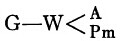

中文马克思主义文库 -\> [马克思](https://www.marxists.org/chinese/marx/index.htm)
- [恩格斯](https://www.marxists.org/chinese/engels/index.htm) -\>
[《马克思恩格斯全集》第二十四卷](https://www.marxists.org/chinese/marx-engels/24/index.htm)

第三章 商品资本的循环

  
  
商品资本循环的总公式是：  

Ｗ′—Ｇ′—Ｗ…Ｐ…Ｗ′。

Ｗ′不仅是前面两种循环的产物，而且是它们的前提，因为，只要生产资料本身至少有一部分是另一些处在循环中的单个资本的商品产品，一个资本的Ｇ—Ｗ就已经包含另一个资本的Ｗ′—Ｇ′。例如，用我们的例子来说，煤炭、机器等等，就是采矿业主、资本主义机器制造业主等等的商品资本。其次，我们在第一章第四节已经指出，还在Ｇ…Ｇ′第一次反复时，还在货币资本第二个循环完成之前，不仅Ｐ…Ｐ循环，而且Ｗ′…Ｗ′循环就已作为前提存在了。  
如果再生产按扩大的规模进行，终点的Ｗ′就大于起点的Ｗ′，因此，终点的Ｗ′应当用Ｗ″来表示。  
第三个形式和前两个形式的区别如下：第一，在这里，是以包含两个对立阶段的总流通来开始循环，而在形式Ⅰ中，流通为生产过程所中断，在形式Ⅱ中，包含两个互相补充阶段的总流通，只是再生产过程的媒介，因此是Ｐ…Ｐ之间的媒介运动。在Ｇ…Ｇ′中，流通形式是Ｇ—Ｗ…Ｗ′—Ｇ′＝Ｇ—Ｗ—Ｇ。在Ｐ…Ｐ中则相反，流通形式却是Ｗ′—Ｇ′，Ｇ—Ｗ＝Ｗ—Ｇ—Ｗ。在Ｗ′…Ｗ′中，流通形式与后一个形式相同。  
第二，在循环Ⅰ和Ⅱ的反复中，即使终点的Ｇ′和Ｐ′是更新的循环的起点，它们产生时的形式也会消失。Ｇ′＝Ｇ＋ｇ和Ｐ′＝Ｐ＋ｐ重新作为Ｇ和Ｐ开始新的过程。但是在形式Ⅲ中，即使循环以相同的规模更新，起点Ｗ也必须用Ｗ′来表示，而这是由于下面的原因。在形式Ⅰ中，只要Ｇ′本身开始新的循环，它就作为货币资本Ｇ，作为以货币形式预付的待增殖的资本价值执行职能。预付的货币资本的量由于在第一个循环中实行的积累而增加，变得更大了。但不论预付的货币资本的量是422镑还是500镑，都不会改变这种情况：它是单纯的资本价值。Ｇ′不再作为已经增殖的即包含剩余价值的资本，不再作为资本关系而存在。它要在过程中才增殖价值。Ｐ…Ｐ′也是这样；Ｐ′总是要作为Ｐ，作为要生产剩余价值的资本价值继续执行职能，使循环更新。——相反，商品资本的循环不是以资本价值开始，而是以商品形式上增大了的资本价值开始，因而它一开始就不仅包含商品形式的资本价值的循环，而且包含剩余价值的循环。因此，如果简单再生产以这种形式进行，在终点就会出现一个和起点上一样大的Ｗ′。如果一部分剩余价值进入资本循环，在终点出现的虽然不是Ｗ′，而是Ｗ″，一个更大的Ｗ′，但下一个循环会再次以Ｗ′开始，不过和前一个循环相比，那是一个更大的Ｗ′，它用更大的已经积累的资本价值，因此也是用较大的新生产的剩余价值，开始它的新的循环。在所有情况下，Ｗ′总是作为一个商品资本（＝资本价值＋剩余价值）来开始循环。  
在一个单个的产业资本的循环中作为Ｗ的Ｗ′，不是这个资本的形式，而是另一个生产生产资料的产业资本的形式。第一个资本的Ｇ—Ｗ（即Ｇ—Ｐｍ）行为，对这第二个资本来说，就是Ｗ′—Ｇ′。  
在流通行为

中，Ａ和Ｐｍ就下面这一点来说是相同的：它们都是卖者手中，即一方面是出卖劳动力的工人，另一方面是出卖生产资料的生产资料所有者手中的商品。对于在这里把货币作为货币资本执行职能的买者来说，只要他还没有购买它们，只要它们还是作为别人所有的商品，和他的货币形式的资本相对立，它们就只执行商品的职能。在这里，Ｐｍ和Ａ只是就下面这一点来说是互相区别的：如果Ｐｍ是卖者的资本的商品形式，Ｐｍ在它的卖者手中就＝Ｗ′，就能成为资本；而Ａ对工人来说却始终只是商品，要到买者手中，作为Ｐ的组成部分，才成为资本。  
因此，Ｗ′决不能作为单纯的Ｗ，作为资本价值的单纯商品形式来开始循环。作为商品资本，它总是一个二重物。从使用价值的观点看，它是Ｐ执行职能的产物，在这里是纱，而作为商品来自流通的Ｐ的要素，即Ａ和Ｐｍ，只是作为这种产品的产品形成要素发生作用。第二，从价值的观点看，它是资本价值Ｐ加上Ｐ执行职能时产生的剩余价值ｍ。  
只有在Ｗ′本身的循环中，Ｗ（＝Ｐ＝资本价值）才能够并且必须和Ｗ′中的剩余价值借以存在的部分，即包含剩余价值的剩余产品分离，而不管这两部分实际上是能够分离，如纱，还是不能够分离，如机器。一旦Ｗ′转化为Ｇ′，它们就总是可以分离的。  
如果全部商品产品，同例如我们的10000磅纱一样，能够分割为独立的、同类的部分产品，从而Ｗ′—Ｇ′行为能够表现为一系列依次完成的售卖，那末，商品形式的资本价值就能够在剩余价值实现之前，因而在Ｗ′全部实现之前，作为Ｗ发挥作用，从Ｗ′中分离出来。  
在价值500镑的10000磅纱中，8440磅的价值＝422镑＝同剩余价值分离的资本价值。如果资本家先卖掉价值422镑的8440磅纱，这8440磅纱就代表Ｗ，即商品形式的资本价值。Ｗ′中除此以外包含的剩余产品1560磅纱＝78镑剩余价值，可以在以后进入流通；资本家能够在剩余产品的流通ｗ—ｇ—ｗ进行之前，完成Ｗ—

。  
或者，如果他先卖掉价值372镑的7440磅纱，然后卖掉价值50镑的1000磅纱，他就能够用Ｗ的第一个部分补偿生产资料（不变资本部分ｃ），用Ｗ的第二个部分补偿可变资本部分ｖ即劳动力，然后照上面一样进行。  
但是，如果这样逐次出卖，循环的各种条件又允许这样做，资本家就可以不把Ｗ′分为ｃ＋ｖ＋ｍ，而在Ｗ′的任何部分上进行这种分割。  
例如，作为Ｗ′（10000磅纱＝500镑）的一部分，代表不变资本部分的7440磅纱＝372镑，本身可以再分为：价值276，768镑的5535，360磅纱，这部分纱只补偿不变部分，即补偿7440磅纱中消费掉的生产资料的价值；价值37，200镑的744磅纱，只补偿可变资本；价值58，032镑的1160，640磅纱则作为剩余产品，成为剩余价值的承担者。因此，在卖出的7440磅中，他能够用按价格313R968镑卖出的6279R360磅纱补偿其中的资本价值，而以剩余产品1160，640磅的价值＝58，032镑，作为收入花掉。  
资本家还同样能够把1000磅纱（＝50镑＝可变资本价值）分割开来，并按照同样的方法卖出去；价值37，200镑的744磅纱代表1000磅纱中的不变资本价值；价值5，000镑的100磅纱代表其中的可变资本部分；因此，价值42，200镑的844磅纱补偿1000磅纱中所包含的资本价值。最后，价值7，800镑的156磅纱，代表其中包含的剩余产品，并可以作为剩余产品消费。  
最后，他还能把余下的价值78镑的1560磅纱，在卖出以后，照如下方式分割开来：用卖出的价值58，032镑的1160，640磅纱，补偿1560磅纱中所包含的生产资料的价值，用卖出的价值7，800镑的156磅纱，补偿可变资本的价值。合计1316，640磅纱＝65，832镑，补偿全部资本价值；最后，243，360磅剩余产品＝12，168镑留作收入花掉。  
正如纱中存在的每一个要素ｃ，ｖ，ｍ都能再分割为相同的各个组成部分一样，价值1先令＝12便士的每一磅纱也可以分割为：

| ｃ＝0.744磅纱＝8.928便士  ｖ＝0.100磅纱＝1.200便士  ｍ＝0.156磅纱＝1.872便士  ──────────────  ｃ＋ｖ＋ｍ＝1磅纱＝12便士  |
|--------------------------------------------------------------------------------------------------------------------------|

把上述三部分出售的结果加起来，就和一次把10000磅纱卖掉的结果一样。

| 不变资本：  第一次卖：5535.360磅纱＝276.768镑  第二次卖： 744.000磅纱＝ 37.200镑  第三次卖：1160.640磅纱＝ 58.032镑  ─────────────────  合 计 7440 磅纱＝ 372镑 可变资本：  第一次卖：744.000磅纱＝37.200镑  第二次卖：100.000磅纱＝ 5.000镑  第三次卖：156.000磅纱＝ 7.800镑  ─────────────────  合 计 1000 磅纱＝50镑 剩余价值：  第一次卖：1160.640磅纱＝58.032镑  第二次卖： 156.000磅纱＝ 7.800镑  第三次卖： 243.360磅纱＝12.168镑  ─────────────────  合 计 1560 磅纱＝78 镑 总计：  不变资本： 7440磅纱＝372镑  可变资本： 1000磅纱＝ 50镑  剩余价值： 1560磅纱＝ 78镑  ─────────────  合 计 10000磅纱＝500镑 |
|-----------------------------------------------------------------------------------------------------------------------------------------------------------------------------------------------------------------------------------------------------------------------------------------------------------------------------------------------------------------------------------------------------------------------------------------------------------------------------------------------------------------------------------------------------------------------------------------------------------------------|

Ｗ′—Ｇ′本身不过是10000磅纱的出售。这10000磅纱和其他一切纱一样是商品。买者关心的是每磅一先令或10000磅500镑的价格。如果他在交易时注意价值的构成，那只是因为他怀着诡谲的企图，想证明每磅可以按低于一先令的价格来卖，而且按那种价格，卖者还是会做一笔好生意。但是他所买的量，是取决于他的需要；例如，如果他是织布厂主，那就是取决于他自己的在织布厂内起作用的资本的构成，而不是取决于卖纱给他的纺纱厂主的资本的构成。Ｗ′一方面要补偿制造它用掉的资本（或者这种资本的不同组成部分），另一方面要充当剩余产品，用于剩余价值的消费，或者用于资本积累；二者的比例只存在于用10000磅纱作为商品形式的资本的循环中。这种比例与卖本身无关。此外，我们在这里假定，Ｗ′是按照它的价值出卖，因此，这里涉及的只是它由商品形式到货币形式的转化。对于Ｗ′来说，即对于在这个单个资本的循环中生产资本必须由以补偿的职能形式来说，出卖时价格和价值是否不一致并且在什么程度上不一致，当然具有决定的意义，但是在这里考察单纯形式区别时，这个问题与我们无关。  
在形式ⅠＧ…Ｇ′中，生产过程出现在资本流通的两个互相补充又互相对立的阶段的中间；在终结阶段Ｗ′—Ｇ′出现以前，它已经过去了。货币作为资本先是预付在各种生产要素上，由这些生产要素转化为商品产品，这种商品产品再转化为货币。这是一个完全的营业周期，其结果是可以用于一切东西的货币。因此，新的开始只是有了可能。Ｇ…Ｐ…Ｇ′可以是在一个单个资本从营业退出时，结束这个资本的职能的最后的循环，也可以是一个新执行职能的资本的最初的循环。在这里，一般的运动是Ｇ…Ｇ′，即由货币到更多的货币。  
在形式ⅡＰ…Ｗ′—Ｇ′—Ｗ…Ｐ（Ｐ′）中，总流通过程跟随在第一个Ｐ的后面，发生在第二个Ｐ的前面；但它的顺序和形式Ⅰ中相反。第一个Ｐ是生产资本，它的职能是生产过程，即随之而来的流通过程的先决条件。相反，结束的Ｐ不是生产过程，它不过是产业资本在生产资本形式上的再存在。而且它是资本价值在最后流通阶段转化为Ａ＋Ｐｍ，转化为主观因素和客观因素的结果，这两种因素结合起来就是生产资本的存在形式。资本不论是Ｐ还是Ｐ′，终结时会再次出现在必须重新执行生产资本职能，完成生产过程的形式上。运动的一般形式Ｐ…Ｐ是再生产的形式，它与Ｇ…Ｇ′不同，不表示价值增殖是过程的目的。因此，这个形式使古典经济学更加容易忽视生产过程的确定的资本主义形式，而把生产本身说成是过程的目的，好象就是要尽可能多和尽可能便宜地进行生产，要使产品去交换尽可能多样的其他产品，一部分用于生产的更新（Ｇ—Ｗ），一部分用于消费（ｇ—ｗ）。在这里，由于Ｇ和ｇ只是转瞬即逝的流通手段，所以，货币和货币资本的特性都可能被忽视，全部过程也显得简单和自然，也就是说，具有浅薄的唯理论的自然性。同样，在考察商品资本时，利润有时被忘记，在说到作为总体的生产循环时，商品资本不过作为商品出现；而在说到价值的组成部分时，商品资本则作为商品资本出现。当然，积累也是用和生产一样的方式来表达的。  
在形式ⅢＷ′—Ｇ′—Ｗ…Ｐ…Ｗ′中，循环由流通过程的两个阶段开始，并且和形式ⅡＰ…Ｐ中的顺序相同；然后出现的是Ｐ，并且它和形式Ⅰ中一样执行职能，即进行生产过程；循环以生产过程的结果Ｗ′结束。在形式Ⅱ中，循环以生产资本单纯的再存在Ｐ结束，同样，在这里，循环以商品资本的再存在Ｗ′结束；在形式Ⅱ中，资本在它的结束形式Ｐ上，必须使过程作为生产过程重新开始，同样，在这里，在产业资本以商品资本形式再出现时，循环也必须用流通阶段Ｗ′—Ｇ′重新开始。循环的这两个形式都没有完成，因为它们都不是用Ｇ′即已经再转化为`货币`的、已经增殖的资本价值来结束。所以，二者都必须继续进行，因而都包含着再生产。形式Ⅲ的总循环是Ｗ′…Ｗ′。  
第三种形式和前两种形式的区别在于：只有在这种循环中，表现为价值增殖的起点的，是已经增殖的资本价值，而不是原来的有待增殖的资本价值。在这里，Ｗ′作为资本关系是起点，并且作为这种关系，对整个循环起决定性的作用，因为这个循环还在自己的第一阶段就既包含资本价值的循环，也包含剩余价值的循环，而剩余价值，即使不是就每一个循环来说，而是就平均来说，必须有一部分作为收入花掉，经过ｗ—ｇ—ｗ流通，有一部分作为资本积累的要素发挥作用。  
在Ｗ′…Ｗ′形式中，全部商品产品的消费是资本本身循环正常进行的条件。工人的个人消费和剩余产品中非积累部分的个人消费，包括全部的个人消费。因此，全部消费——个人的消费和生产的消费——作为Ｗ′的循环的条件进入这一循环。生产消费（其实也包括工人的个人消费，因为在一定界限之内，劳动力是工人个人消费的不断的产物）是由每个单个资本自己进行的。个人消费——除了资本家个人生存所必需的消费——只是作为社会的行为，而决不是作为单个资本家的行为包含在这个循环中。  
在形式Ⅰ和形式Ⅱ中，总运动都表现为预付资本价值的运动。在形式Ⅲ中，表现为全部商品产品的已经增殖的资本成为起点，并具有运动着的资本即商品资本的形式。只是在这个商品资本转化为货币以后，这个运动才分成资本的运动和收入的运动。在这个形式上，社会总产品的分配（一方面分为个人消费基金，另一方面分为再生产基金），同任何单个商品资本的产品的特殊分配一样，已经包含在资本的循环中。  
在Ｇ—Ｇ′中，包含有循环扩大的可能，这要看ｇ中有多大的量进入更新的循环而定。  
在Ｐ…Ｐ中，Ｐ能够用相同的，也许更小的价值来开始新的循环，但还是代表规模扩大的再生产；例如，各种商品要素由于劳动生产率提高而变得便宜时就是这样。反之，价值增大的生产资本也可以代表物质规模缩小的再生产，例如各种生产要素变得昂贵时就是这样。这对Ｗ′…Ｗ′也是适用的。  
在Ｗ′…Ｗ′中，商品形式的资本是生产的前提；在这个循环中在第二个Ｗ上，它重新表现为前提。如果这个Ｗ还没有生产或再生产出来，循环就被阻止；这个Ｗ必须再生产出来，大部分必须作为另一个产业资本的Ｗ′再生产出来。在这个循环中，Ｗ′是作为运动的起点、经过点和终点，因此，它总是存在着。它是再生产过程的经常性的条件。  
Ｗ′…Ｗ′还由于另一个要素而同形式Ⅰ和形式Ⅱ相区别。这三种循环的共同点是：资本开始循环过程的形式，就是它结束循环过程的形式，因此它又处在开端的形式上，重新开始同一个循环。开端的形式Ｇ、Ｐ、Ｗ′，总是资本价值（在形式Ⅲ中还包含它的增殖部分，剩余价值）进行预付的形式，因而对循环来说是资本价值原有的形式；结束的形式Ｇ′、Ｐ、Ｗ′，总是循环中的前一个与原有形式不同的职能形式的转化形式。  
因此，Ⅰ的Ｇ′是Ｗ′的转化形式；Ⅱ终点上的Ｐ是Ｇ的转化形式（在Ⅰ与Ⅱ中，这种转化都是由商品流通的简单行为，由商品和货币的形式换位引起的）；Ⅲ的Ｗ′是生产资本Ｐ的转化形式。不过在Ⅲ中，第一，这种转化不仅关系到资本的职能形式，而且也关系到它的价值量；第二，这种转化不是属于流通过程的单纯形式换位的结果，而是生产资本各个商品组成部分的使用形式和价值在生产过程中完成的现实转化的结果。  
始极的形式Ｇ、Ｐ、Ｗ′，是各相应的循环Ⅰ、Ⅱ、Ⅲ的前提；在终极上复归的形式，是由循环本身的形态变化序列所引起的，因而是受它制约的。Ｗ′作为一个单个产业资本的循环的终点，只是以该产业资本的不属于流通的形式Ｐ为前提，而它就是这个Ｐ的产品。Ｇ′，作为Ⅰ的终点，作为Ｗ′的转化形式（Ｗ′—Ｇ′），以买者手中的Ｇ为前提，Ｇ存在于Ｇ…Ｇ′循环之外，由Ｗ′的出售引入这个循环，变成这个循环自己的结束形式。同样，Ⅱ的终点Ｐ以Ａ和Ｐｍ（Ｗ）为前提，Ａ和Ｐｍ存在于循环之外，通过Ｇ—Ｗ，作为结束的形式并入这个循环。但是，撇开终极不说，单个货币资本的循环不是以货币资本的存在为前提，单个生产资本的循环也不是以生产资本的存在为前提。在形式Ⅰ中，Ｇ可以是历史舞台上出现的第一个货币资本，在形式Ⅱ中，Ｐ也可以是历史舞台上出现的第一个生产资本，但是形式Ⅲ  
  

  
以Ｗ两次存在于循环之外为前提。一次是在Ｗ′—Ｇ′—

循环中。这个Ｗ，只要它由Ｐｍ构成，就是卖者手中的商品；只要它是资本主义生产过程的产物，它本身就是商品资本；即使不是，它也在商人手中表现为商品资本。另一次是ｗ—ｇ—ｗ中的第二个ｗ，它也必须作为商品存在，以便能被人购买。总之，Ａ和Ｐｍ不管是不是商品资本，都和Ｗ′一样是商品，并且互相作为商品发生关系。ｗ—ｇ—ｗ中的第二个ｗ，也是如此。因此，如果Ｗ′＝Ｗ（Ａ＋Ｐｍ），它就有商品作为自己的形成要素，并且必须在流通中用同样的商品来补偿；ｗ—ｇ—ｗ中的第二个ｗ，也必须在流通中用另一些同样的商品来补偿。  
此外，在资本主义生产方式占统治地位的基础上，卖者手中的一切商品都必然是商品资本。它们在商人手中仍旧是商品资本，或者，如果原来不是商品资本，到商人手中也就变成商品资本。或者，它们，例如输入品，必然是补偿原有商品资本的商品，因而只是给了原有商品资本另一种存在形式。  
构成生产资本Ｐ的商品要素Ａ和Ｐｍ，作为Ｐ的存在形式，具有和它们在不同的商品市场上被搜集时不同的形态。它们现在结合起来了，在这种结合中，它们就能够执行生产资本的职能。  
只有在这个形式Ⅲ中，Ｗ才在循环自身之内表现为Ｗ的前提，因为起点就是商品形式的资本。循环是由Ｗ′（只要它执行资本价值的职能，那就不管它是否由于剩余价值的加入而增大）转化为各种形成它的生产要素的商品而开始的。但这种转化包括全部流通过程Ｗ—Ｇ—Ｗ（＝Ａ＋Ｐｍ），并且是它的结果。在这里，Ｗ是在两极上，但这个由外部从商品市场通过Ｇ—Ｗ取得Ｗ形式的第二极，不是循环的终极，而只是它最初两个包含流通过程的阶段的终极。它的结果是Ｐ，然后Ｐ执行职能，即进行生产过程。Ｗ′不是作为流通过程的结果，而只是作为生产过程的结果，才表现为循环的终结，具有和始极Ｗ′相同的形式。相反，在Ｇ…Ｇ′和Ｐ…Ｐ中，终极Ｇ′和Ｐ却是流通过程的直接结果。因此，这里的前提是，只是在终结时一个场合的Ｇ′和另一个场合的Ｐ已经在别人手中。既然循环是在两极之间进行，一个场合的Ｇ和另一个场合的Ｐ——Ｇ作为别人所有的货币存在，Ｐ则作为别人的生产过程存在——都不表现为循环的前提。而Ｗ′…Ｗ′却以Ｗ（＝Ａ＋Ｐｍ）是别人所有的、别人手中的商品为前提，这些商品由作为先导的流通过程引入循环，转化为生产资本，然后Ｗ′作为生产资本执行职能的结果，再成为循环的结束形式。  
但是，正因为Ｗ′…Ｗ′循环在进行中要以另一个在Ｗ（＝Ａ＋Ｐｍ）形式上的产业资本为前提（并且Ｐｍ还包括各种其他资本，用我们的例子来说，包括机器、煤炭、润滑油等等），所以，这个循环本身就要求我们不仅把它看作循环的`一般`形式，即能够用来考察每一个单个产业资本（第一次投资的场合除外）的社会形式，因而不仅看作一切单个产业资本共有的运动形式，而且同时看作各单个资本的总和即资本家阶级的总资本的运动形式，在这个运动中，每一个单个产业资本的运动，都只表现为一个部分运动，和其他部分运动交织在一起，并且受它们制约。例如，如果我们考察一个国家的全部年商品产品，分析其中一部分补偿一切单个企业的生产资本，另一部分进入不同阶级的个人消费的运动，那末，我们就把Ｗ′…Ｗ′看作社会资本和由此产生的剩余价值或剩余产品的运动形式。社会资本＝单个资本（包括股份资本；如果政府在采矿业、铁路等等上面使用生产的雇佣劳动，起产业资本家的作用，那也包括国家资本）之和，社会资本的总运动＝各单个资本的运动的代数和，这一事实并不排除：这个运动，作为一个孤立的单个资本的运动来看，和同一个运动，作为社会资本总运动的一部分来看，即和社会资本的其他部分的运动联系起来看，会表现出不同的现象；同时，这个运动还会解决这样一些问题，这些问题在考察一个单独的单个资本的循环时必须事先已经解决，而不是要由这种考察去解决。  
Ｗ′…Ｗ′是唯一的这样的一个循环，在这个循环中，原来预付的资本价值只形成运动始极的一部分，因而运动一开始就表明是产业资本的总和运动，既是补偿生产资本的那部分产品的运动，又是形成剩余产品的那部分产品（通常部分作为收入花掉，部分要用作积累要素）的运动。只要剩余价值作为收入花掉已包含在这个循环中，个人的消费也就包含在这个循环中了。其次，个人的消费包含在内，还由于起点的商品Ｗ，是作为某种使用物品存在着；而每一种按资本主义方式生产的物品，不论它的使用形式决定它要用于生产的消费，还是要用于个人的消费，还是要用于二者，都是商品资本。Ｇ…Ｇ′只表明价值方面，表明预付资本价值的增殖是全部过程的目的；Ｐ…Ｐ（Ｐ′）表明资本的生产过程是用相同的或增大的生产资本（即积累）来进行的再生产过程；Ｗ′…Ｗ′既然在它的始极上已经表明是资本主义商品生产的形式，所以一开始就把生产消费和个人消费包括在内；生产消费和其中包含的价值增殖，不过表现为Ｗ′…Ｗ′运动的一个分枝。最后，因为Ｗ′可以在不能再进入任何一个生产过程的使用形式上存在，所以，这一开始就已经表明：Ｗ′的由产品部分表现的各个价值组成部分，要看Ｗ′…Ｗ′是作为社会总资本的运动的形式，还是作为一个单个产业资本的独立运动，而必然占有不同的位置。这个循环的所有这些特征，都表明这个循环已经超出它作为一个单纯单个资本的孤立循环的范围。  
在Ｗ′…Ｗ′公式上，商品资本即按资本主义方式生产的总产品的运动，既是单个资本的独立循环的前提，又受这种循环的制约。因此，要把握住这个形式的特征，仅仅指出，Ｗ′—Ｇ′和Ｇ—Ｗ这两个形态变化，一方面是资本形态变化中职能上确定的阶段，另一方面又是一般商品流通的环节，就已经不够了。还必须弄清楚一个单个资本的形态变化同其他单个资本的形态变化的错综关系，以及它同总产品中决定用于个人消费的部分的错综关系。因此，在分析单个产业资本的循环时，我们主要是用前两个形式作为基础。  
Ｗ′…Ｗ′循环也表现为一个单独的单个资本的形式，例如在农业中就是这样，在那里，是从收成计算到收成。公式Ⅱ是由播种出发，公式Ⅲ则是由收成出发，或如重农学派所说，前者是由“预付”〔avances〕出发，后者是由“回收”〔reprises〕出发。在形式Ⅲ中，资本价值的运动，一开始就只表现为总产品量的运动的一部分，而在形式Ⅰ和Ⅱ中，Ｗ′的运动却只是一个孤立资本的运动中的一个因素。  
在公式Ⅲ中，市场上的商品是生产过程和再生产过程的经常性的前提。因此，如果专门注意这个公式，生产过程的一切要素就好象都是来自商品流通，只是由商品构成。这种片面的看法忽视了生产过程的那些与商品要素无关的要素。  
因为在Ｗ′…Ｗ′中总产品（总价值）是起点，所以这里表明，撇开对外贸易不说，在生产率不变的情况下，只有在剩余产品的待资本化的部分已经包含追加生产资本的物质要素时，规模扩大的再生产才能进行；因而也表明，既然一年的生产是下年的生产的前提，或者说，既然规模扩大的再生产能够在一年之内和简单的再生产过程同时进行，所以剩余产品就立即在那种能使它作为追加资本执行职能的形式上被生产出来。提高了的生产率只能增加资本物质，而不增大资本价值；但以此它也就为价值增殖形成追加的材料。  
Ｗ′…Ｗ′是魁奈《经济表》的基础。他选用这个形式，而不选用Ｐ…Ｐ形式，来和Ｇ…Ｇ′（重商主义体系孤立地坚持的形式）相对立，这就显示出他的伟大的正确的见识。  

