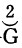
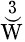

中文马克思主义文库 -\> [马克思](https://www.marxists.org/chinese/marx/index.htm)
- [恩格斯](https://www.marxists.org/chinese/engels/index.htm) -\>
[《马克思恩格斯全集》第二十四卷](https://www.marxists.org/chinese/marx-engels/24/index.htm)

第二十章 简单再生产

| [Ⅰ，问题的提出](https://www.marxists.org/chinese/marx-engels/24/022.htm#1) [Ⅱ，社会生产的两个部类](https://www.marxists.org/chinese/marx-engels/24/022.htm#2) [Ⅲ，两个部类之间的交换：Ⅰ（ｖ＋ｍ）和Ⅱｃ的交换](https://www.marxists.org/chinese/marx-engels/24/022.htm#3) [Ⅳ，第Ⅱ部类内部的交换。必要生活资料和奢侈品](https://www.marxists.org/chinese/marx-engels/24/022.htm#4) [Ⅴ，货币流通在交换中的媒介作用](https://www.marxists.org/chinese/marx-engels/24/022.htm#5) [Ⅵ，第Ⅰ部类的不变资本](https://www.marxists.org/chinese/marx-engels/24/022.htm#6) [Ⅶ，两个部类的可变资本和剩余价值](https://www.marxists.org/chinese/marx-engels/24/022.htm#7) [Ⅷ，两个部类的不变资本](https://www.marxists.org/chinese/marx-engels/24/022.htm#8) [Ⅸ，对于亚·斯密、施托尔希和拉姆赛的回顾](https://www.marxists.org/chinese/marx-engels/24/022.htm#9) [Ⅹ，资本和收入：可变资本和工资](https://www.marxists.org/chinese/marx-engels/24/022.htm#10) [Ⅺ，固定资本的补偿](https://www.marxists.org/chinese/marx-engels/24/022.htm#11)  [1，损耗的价值部分在货币形式上的补偿](https://www.marxists.org/chinese/marx-engels/24/022.htm#1101)  [2，固定资本的实物补偿](https://www.marxists.org/chinese/marx-engels/24/022.htm#1102)  [3，结论](https://www.marxists.org/chinese/marx-engels/24/022.htm#1103) [Ⅻ，货币材料的再生产](https://www.marxists.org/chinese/marx-engels/24/022.htm#12) [ⅩⅢ，德斯杜特·德·特拉西的再生产理论](https://www.marxists.org/chinese/marx-engels/24/022.htm#13) |
|---------------------------------------------------------------------------------------------------------------------------------------------------------------------------------------------------------------------------------------------------------------------------------------------------------------------------------------------------------------------------------------------------------------------------------------------------------------------------------------------------------------------------------------------------------------------------------------------------------------------------------------------------------------------------------------------------------------------------------------------------------------------------------------------------------------------------------------------------------------------------------------------------------------------------------------------------------------------------------------------------------------------------------------------------------------------------------------------------------------------------------------------------------------------------------------------------------------------------------------------------------------------------------------------------------------------------------------------------------------------------------------------------------------------------------------------------------------------------------------|

  
  
  
  

`I、问题的提出`

  
如果我们考察社会资本，即总资本——各单个资本只形成它的分数部分，这些部分的运动，既是它们的单个的运动，同时又是总资本运动的不可缺少的环节——在一年内执行职能的结果，也就是说，如果我们考察社会在一年间提供的商品产品，那末，就会清楚地看到：社会资本的再生产过程是怎样进行的，这个再生产过程和单个资本的再生产过程相比有哪些不同的特征，二者又有那些共同的特征。年产品既包括补偿资本的那部分社会产品，即社会再生产，也包括归入消费基金的、由工人和资本家消费的那部分社会产品，就是说，既包括生产消费，也包括个人消费。这种消费包括资本家阶级和工人阶级的再生产（即维持），因而也包括总生产过程的资本主义性质的再生产。  
显然，我们应当分析的是

［W'—G（g）—W（w）…P…W'］。这个流通公式，在这里，消费必然会起作用；因为起点W'=W＋w，即商品资本，既包含不变资本价值和可变资本价值，也包含剩余价值。所以，它的运动既包括生产消费，也包括个人消费。在G—W…P'…W'—G'循环和P…W'—G'—W…P循环中，`资本`的运动是起点和终点：这一运动自然也包括消费，因为商品，即产品，必须出售。但是，只要商品已经出售，这个商品以后变成什么，对单个资本的运动是没有关系的。相反地，在W'…W'，运动中，正是要通过说明总产品W'的每一价值部分会变成什么，才能认识社会再生产的条件。在这里，总的再生产过程既包括资本本身的再生产过程，也包括以流通为媒介的消费过程。  
为了我们当前的目的，再生产过程必须从W'的各个组成部分的价值补偿和物质补偿的观点来加以考察。在分析单个资本的产品价值时，我们`假定`，单个资本家通过出售他的商品产品，先把他的资本的组成部分转化为货币，然后，通过在商品市场上再购买各种生产要素，把它们再转化为生产资本。现在，我们已经不能再满足于这个假定了。既然这些生产要素是物质的东西，那它们就同用来和它们交换并由它们来补偿的单个成品一样，是社会资本的组成部分。另一方面，工人用工资和资本家用剩余价值所消费的那部分社会商品产品的运动，不仅是总产品运动的一个不可缺少的环节，而且同单个资本的运动交织在一起。因此，只是假定这个过程发生，是不能说明这个过程的。  
直接摆在我们面前的问题是：生产上消费掉的`资本`，就它的价值来说，怎样由年产品得到补偿？这种补偿的运动怎样同资本家对剩余价值的消费和工人对工资的消费交织在一起？因此，首先要研究原有规模的再生产。其次，不仅要假定，产品按照它们的价值交换，而且还假定，生产资本的组成部分没有发生任何价值革命。如果价格同价值发生偏离，这种情况对社会资本的运动并不会有任何影响。虽然单个资本家这时分到的价值份额将不再和他们各自预付的资本成比例，不再和他们每人各自生产的剩余价值量成比例，但总起来说，进行交换的仍然是同一产品量。至于价值革命，那末，只要它是普遍地和均衡地发生的，就不会改变全部年产品的价值组成部分之间的比例。然而，只要它是局部地和不均衡地发生的，就会成为干扰。`第一`，这种干扰只有在被看作是对保持不变的价值比例的`偏离`时，才能被认为是干扰；但是，`第二`，关于年产品价值以一部分补偿不变资本，以另一部分补偿可变资本的规律一经证明，那末，价值革命，无论在不变资本的价值上还是在可变资本的价值上发生，都不会改变这个规律。它所改变的，只是执行着这种或那种职能的价值部分的相对量，因为原有价值将被另外的价值取而代之。  
当我们从单个资本的角度来考察资本的价值生产和产品价值时，商品产品的实物形式，对于分析是完全无关的，例如，不论它是机器，是谷物，还是镜子都行。这始终只是举例而已，任何一个生产部门都同样可以作为例证。我们必须考察的是直接的生产过程本身。这种生产过程，在任何场合，都表现为一个单个资本的过程。说到资本的再生产，我们只要假定，代表资本价值的那部分商品产品，会在流通领域内找到机会再转化为它的生产要素，从而再转化为它的生产资本的形式。同样，我们只要假定，工人和资本家会在市场上找到他们用工资和剩余价值购买的商品。但是，当我们考察社会总资本及其产品价值时，这种仅仅从形式上来说明的方法，就不够用了。产品价值的一部分再转化为资本，另一部分进入资本家阶级和工人阶级的个人消费，这在表现出总资本执行职能的结果的产品价值本身内形成一个运动。这个运动不仅是价值补偿，而且是物质补偿，因而既要受社会产品的价值组成部分相互之间的比例的制约，又要受它们的使用价值，它们的物质形式的制约。  
既然［注：这一段采自第Ⅷ稿。］一方面，在资本主义基础上，没有任何积累或规模扩大的再生产，是一种奇怪的假定，另一方面，生产条件在不同的年份不是绝对不变的（而假定它们是不变的），那末，规模不变的简单再生产就只是一个抽象。前提是：一定价值的社会资本，今年和去年一样，再提供一样多的商品价值，满足一样多的需要，虽然商品形式在再生产过程中可能改变。但是，只要有积累，简单再生产总是积累的一部分，所以，可以就简单再生产本身进行考察，它是积累的一个现实因素。年产品的价值可以减少，而使用价值量不变；年产品的价值可以不变，而使用价值量减少；价值量和再生产的使用价值量也可以同时减少。这一切就在于，再生产不是在比以前更有利的情况下进行，就是在更困难的情况下进行。后者可能造成的结果，是出现一个不完备的——有缺陷的——再生产。这一切都只能涉及再生产的不同要素的量的方面，但不涉及它们作为进行再生产的资本或作为再生产出来的收入在总过程中所起的作用。  
  
  

`II、社会生产的两个部类`

［注：主要采自第Ⅱ稿，公式采自第Ⅷ稿。］

  
社会的总产品，从而社会的总生产，分成两大部类：  
I、`生产资料`：具有必须进入或至少能够进入生产消费的形式的商品。  
II、`消费资料`：具有进入资本家阶级和工人阶级的个人消费的形式的商品。  
这两个部类中，每一部类拥有的所有不同生产部门，总合起来都形成一个单一的大的生产部门：一个是生产资料的生产部门，另一个是消费资料的生产部门。两个生产部门各自使用的全部资本，都形成社会资本的一个特殊的大部类。  
每一部类的资本都分成两个组成部分：  
1、`可变资本`。从`价值`方面看，这个资本等于该生产部门使用的社会劳动力的价值，也就是等于为这个社会劳动力而支付的工资总额。从物质方面看，这个资本是由发挥作用的劳动力本身构成的，即由这个资本价值所推动的活劳动构成的。  
2、`不变资本`，即该部门在生产上使用的全部生产资料的价值。这些生产资料本身又分成`固定`资本：机器、工具、建筑物、役畜等等，`流动`不变资本：生产材料，如原料、辅助材料、半成品等等。  
这两个部类中，每一部类借助于这些资本而生产的全部年产品的价值，都分成：代表生产上消费掉的、按其价值来说只是转移到产品中去的不变资本c的价值部分和由全部年劳动加入的价值部分。后者又分成：补偿预付可变资本v的部分和超过可变资本而形成剩余价值m的部分。因此，每一部类的全部年产品的价值，和每个个别商品的价值一样，也分成c＋v＋m。  
代表生产上`消费掉的`不变资本的那部分价值c，是和生产上`使用的`不变资本的价值不一致的。诚然，生产材料会全部消费掉，从而它的价值全部转移到产品中去。但是所使用的`固定`资本只有一部分会完全消费掉，因而只有这部分价值转移到产品中去。固定资本即机器、建筑物等等的其余部分继续存在，并且和以前一样，继续执行职能，虽然它的价值由于逐年损耗而减少；在我们考察产品价值时，继续执行职能的这部分固定资本，对我们来说是不存在的。它是在这个新生产的商品价值之外而和这个商品价值并存的一部分资本价值。这一点在考察单个资本的产品价值时已经作了说明（第1卷第6章）。但是，我们现在必须暂时撇开那里使用过的考察方法。在考察单个资本的产品价值时，我们讲过，固定资本因损耗而失去的价值，会转移到在损耗期间生产的商品产品中去，不管这个固定资本在此期间是否有任何部分由于这种价值转移而得到实物补偿。相反地，在这里，在考察社会总产品及其价值时，我们不得不撇开，至少是暂时撇开固定资本在当年因损耗而转移到年产品中去的那部分价值，因为这种固定资本不会在当年重新得到实物补偿。在本章的后面有一节，我们将专门论述这一点。  

  
我们研究简单再生产，要以下列公式为基础，其中c=不变资本，v=可变资本，m=剩余价值，并且假定价值增殖率m/v=100%。数字可以表示几百万马克，几百万法郎，或几百万镑。  
I、生产资料的生产：  
资本…………………4000c＋1000v=5000，  
商品产品……………4000c＋1000v＋1000m=6000，  
以生产资料的形式存在。  
II、消费资料的生产：  
资本…………………2000c＋500v=2500，  
商品产品……………2000c＋500v＋500m=3000，  
以消费资料的形式存在。  
概括起来说，全年总商品产品：  
I、4000c＋1000v＋1000m=6000生产资料；  
II、2000c＋500v＋500m=3000消费资料。  
总价值=9000，按照假定，其中不包括继续以实物形式执行职能的固定资本。  
现在，如果我们研究简单再生产基础上（这里全部剩余价值都是非生产地消费掉）的各种必要的交换，并且先不考察作为交换媒介的货币流通，那末，我们一开始就会得出三大要点：  
1、第II部类工人的工资500v和资本家的剩余价值500m，必须用于消费资料。但是，它们的价值存在于价值1000的消费资料中，这种消费资料掌握在第II部类的资本家的手里，补偿预付的500v，并代表500m。因此，第II部类的工资和剩余价值，将在第II部类内部同第II部类的产品交换。这样，就有（500v＋500m）II=1000以消费资料形式从总产品中消失。  
2、第I部类的1000v＋1000m，同样必须用于消费资料，即用于第II部类的产品。因此，它们必须同第II部类产品的其余的、数量与他们相等的不变资本部分2000c交换。为此，第II部类会得到数额相等的生产资料，得到体现第I部类的1000v＋1000m的价值的第I部类产品。因此，就有2000IIc和（1000v＋1000m）I从计算中消失。  
3、还剩下4000Ic。它们由生产资料构成，只能用于第I部类，以便补偿该部类消费掉的不变资本，因此，要通过第I部类的各个资本家之间的互相交换来解决，就象（500v＋500m）II要通过第II部类的工人和资本家之间的交换，或通过第II部类的各个资本家之间的交换来解决一样。  
暂时说到这里，这些只是为了更好地理解以下的叙述。  
  
  

`III、两个部类之间的交换：I（v＋m）和IIc的交换`

［注：以下又是第Ⅷ稿。］

  
我们从两个部类之间的大宗交换开始。（1000v＋1000m）I——这些价值以生产资料的实物形式存在于它们的生产者手中——要和2000IIc，即以消费资料的实物形式存在的价值交换。通过这种交换，第II部类的资本家把他们的不变资本=2000从消费资料形式再转化为消费资料的生产资料形式，在这种形式中，不变资本可以重新作为劳动过程的因素，并且对于价值增殖来说作为不变的资本价值执行职能。另一方面，通过这种交换，第I部类的劳动力的等价物（1000Iv）和第I部类的资本家的剩余价值（1000Im），在消费资料中实现；二者都由生产资料的实物形式转化为一种可以作为收入来消费的实物形式。  
但这种互相交换是通过货币流通完成的。货币流通成为交换的媒介，同时也使这种交换难于理解，然而它却具有决定性的重要意义，因为可变资本部分必须一再表现为货币形式，即表现为由货币形式转化为劳动力的货币资本。在整个社会范围内同时进行经营的一切生产部门，不论它们属于第I部类还是第II部类，可变资本都必须以货币形式来预付。资本家购买劳动力，是在劳动力进入生产过程之前，但是支付劳动力的报酬，却是在约定的期限，在劳动力已经在使用价值的生产上消耗掉之后。就象产品价值的其余部分一样，产品价值中仅仅作为在劳动力报酬上支出的货币的等价物的那部分价值，即产品价值中代表可变资本价值的那部分价值，也是属于资本家的。在这部分价值中，工人已经把他的工资的等价物提供给资本家了。但是，只有商品再转化为货币，即把商品卖出去，资本家的可变资本才能重新成为他的货币资本，可以为购买劳动力而重新预付。  
因此，第I部类的总体资本家已经支付给工人1000镑（我说“镑”，只是为了表示它是`货币形式`的价值）=1000v，以偿付第I部类产品中即工人所生产的生产资料中已经作为v部分存在的价值部分。工人用这1000镑向第II部类的资本家购买同等价值的消费资料，这就把第II部类的不变资本的一半转化为货币；第II部类的资本家再用这1000镑向第I部类的资本家购买价值1000的生产资料；因此，第I部类的资本家的可变资本价值=1000v，由原来以生产资料的实物形式存在的一部分产品再转化为货币，现在可以在第I部类的资本家手中重新作为货币资本执行职能，这个货币资本会再转化为劳动力，即转化为生产资本中最重要的要素。这样，由于第I部类的资本家的一部分商品资本的实现，他们的可变资本就以货币形式流回到他们手中。  
至于第I部类的商品资本的m部分和第II部类的不变资本的另一半交换时所需要的货币，它可以按不同的方式预付。实际上，这种流通包括两个部类的各单个资本家之间的无数个别的买和卖，而这种货币在任何情况下都必须来自这些资本家，因为由工人投入流通的货币量，我们已经计算过了。或者是，第II部类的一个资本家可以用他的和生产资本并存的货币资本，向第I部类的资本家购买生产资料；或者是相反，第I部类的一个资本家把用于个人支出而非资本支出的货币基金，向第II部类的资本家购买消费资料。正如前面第一篇和第二篇中已经指出的，前提是：在任何情况下，资本家手中除生产资本外，必须要有一定的货币储备——或者作为资本预付，或者作为收入花掉。我们假定，——比例如何，对我们这里的目的是完全没有关系的，——货币的一半由第II部类的资本家预付来购买生产资料，以补偿他们的不变资本，另一半则由第I部类的资本家为消费而支出。这样，第II部类预付500镑，向第I部类购买生产资料，从而（连同上述来自第I部类的工人的1000镑）用实物补偿它的不变资本的3/4；然后第I部类拿由此得到的500镑向第II部类购买消费资料，从而使第I部类由m构成的那部分商品资本的一半，完成w—g—w流通，这就使第I部类的这部分产品实现为消费基金。通过这第二个过程，500镑也就作为货币资本回到第II部类资本家手中，而同他的生产资本并存。另一方面，第I部类预期到它的商品资本中还作为库存产品的m部分的一半要出售，因而，在此以前，就支出货币500镑，来购买第II部类的消费资料。第II部类又用这500镑向第I部类购买生产资料，从而用实物补偿了自己的全部不变资本（1000＋500＋500=2000），而第I部类则使自己的全部剩余价值在消费资料中实现。总计起来，价值4000镑的商品的交换，通过2000镑的货币流通来进行。其所以是2000镑；只是因为按照我们的叙述，全部年产品是作为几大部分一次进行交换的。在这里，重要的只是这一情况：第II部类不仅已经把它以消费资料形式再生产的不变资本再转化为生产资料的形式，而且，除此以外，还使它为购买生产资料而预付到流通中去的500镑也回到它那里；同样，第I部类不仅再一次以货币形式得到它以生产资料形式再生产的可变资本，即可以再直接转化为劳动力的货币资本，而且，除此以外，第I部类预期到它的资本中的剩余价值部分会出售而先用来购买消费资料的500镑也流回到它那里。但是，这500镑流回到它那里，不是由于已经用掉，而是由于它的商品产品中承担着一半剩余价值的那一部分以后会出售。  
在这两个场合，不仅第II部类的不变资本由产品形式再转化为生产资料的实物形式，即它唯一能作为资本执行职能的形式；同样，不仅第I部类的可变资本部分转化为货币形式，第I部类的生产资料的剩余价值部分转化为可以消费的形式，即可以作为收入来消费的形式。而且，除此以外，第II部类为购买生产资料而预付的500镑货币资本，——它是在相应的、补偿这500镑的不变资本价值部分（以消费资料形式存在）出售以前预付的，——也流回到第II部类那里；其次，第I部类为购买消费资料而预先用掉的500镑也流回到它那里。如果第II部类因预计到它的商品产品中的不变部分要出售而预付的货币以及第I部类因预计到它的商品产品中的剩余价值部分要出售而预付的货币，会分别流回到它们那里，那末，这只是因为一个部类的资本家除了把以第II部类的商品形式存在的不变资本投入流通以外，另一部类的资本家除了把以第I部类的商品形式存在的剩余价值投入流通以外，各以500镑货币投入了流通。最后，他们通过各自的商品等价物的交换，彼此付清了各自的款项。他们在自己商品的价值额以外作为这种商品交换的手段投入流通的货币，按照他们各自投入流通的货币数量的比例，从流通中回到他们手里。他们并不因此增加分文。第II部类原来有不变资本=消费资料2000＋货币500；它现在和以前一样，有生产资料2000和货币500。同样，第I部类也和以前一样；有剩余价值1000（以前由商品，生产资料构成，现在已转化为消费基金）＋货币500。——总的结论是：产业资本家为了促成他们自己的商品流通而投入流通的货币，无论是记在商品的不变价值部分的账上，还是记在存在于商品中的剩余价值（在它作为收入花掉的时候）的账上，总是按照各个资本家为货币流通而预付的数额回到他们手中。  
至于第I部类的可变资本再转化为货币形式问题，那末，对第I部类的资本家来说，在他们把可变资本用在工资上以后，可变资本首先以工人向他们提供的商品的形式存在。资本家已经以货币形式把可变资本作为工人劳动力的价格支付给工人。就这一点来说，资本家对他们商品产品中等于以货币形式支出的可变资本的价值组成部分，已经支付了报酬。因此，他们也是这部分商品产品的所有者。但是，他们使用的那部分工人阶级，不是那部分工人阶级自己所生产的生产资料的买者；那部分工人阶级是第II部类所生产的消费资料的买者。因此，为支付劳动力报酬而以货币形式预付的可变资本，不是直接回到第I部类的资本家手中。它要通过工人的购买，转到工人所必需的而又买得起的商品的资本主义生产者手中，即转到第II部类的资本家手中。只有当第II部类的资本家用这种货币来购买生产资料的时候，它才通过迂回的道路回到第I部类的资本家手中。  
由此得出结论：在简单再生产中，第I部类的商品资本中的v＋m价值额（也就是第I部类的总商品产品中与此相应的比例部分），必须等于不变资本IIc，也就是第II部类的总商品产品中分出来的与此相应的部分；或者说，I（v＋m）=IIc。  
  
  

`IV、第II部类内部的交换。必要生活资料和奢侈品`

  
在第II部类商品产品的价值中，v＋m这一组成部分还要加以研究。考察这个组成部分，同我们在这里研究的最重要的问题无关。我们研究的问题是：每个单个资本主义商品产品的价值分为c＋v＋m的这种分割，即使以不同的表现形式作为媒介，在什么程度内同样也适用于全部年产品的价值。这个问题，一方面通过I（v＋m）和IIc的交换来解决，另一方面通过我们以后对第I部类年商品产品中Ic的再生产的研究来解决。既然II（v＋m）以消费品的实物形式存在，既然第II部类为支付劳动力报酬而预付给工人的可变资本，总的来说要由工人用于消费资料，既然在简单再生产的前提下，商品价值的m部分实际上作为收入用于消费资料，那末，显而易见，第II部类的工人用他们从第II部类的资本家那里得到的工资，买回他们自己产品中与他们以工资形式得到的货币价值的数量相当的一部分。因此，第II部类的资本家就把他们为支付劳动力报酬而预付的货币资本再转化为货币形式；这完全好象他们付给工人的只不过是一种价值符号。一旦工人通过购买他们自己生产的、但属于资本家的商品产品的一部分，来实现这种价值符号，这种价值符号就会回到资本家手中，不过，这种符号在这里不仅代表价值，而且也在它自己的金身或银身中具有这种价值。以货币形式预付的可变资本，是通过工人阶级作为买者和资本家阶级作为卖者出现的过程而流回的，关于这种回流，我们以后还要更详细地研究。这里要考察的，是另外一点，这在涉及可变资本怎样流回到它的起点时，必须加以说明。  
年商品生产的第II部类是由种类繁多的产业部门构成的，但是，按它们的产品来说，可分成两大分部类：  
（a）消费资料。它们进入工人阶级的消费，但因为它们是必要生活资料，所以也构成资本家阶级的消费的一部分，虽然就其质量和价值来说，往往和工人的必要生活资料不同。为了这里研究的目的，我们可以把这整个分部类概括为`必要`消费资料这个项目。至于象烟草这一类产品，从生理学观点来看，是不是必要消费资料，在这里是完全没有关系的，只要习惯上认为它是必要消费资料就行了。  
（b）`奢侈`消费资料。它们只进入资本家阶级的消费，所以只能和花费的剩余价值交换，而剩余价值是绝对到不了工人手中的。就前一个项目来说，很明显，为了生产该项目的种种商品而预付的可变资本，一定以货币形式直接流回到第II部类中生产这些必要生活资料的那部分资本家（即IIa的资本家）手中。他们按照支付工人工资的可变资本的数额，把必要生活资料卖给他们自己的工人。尽管各有关产业部门的资本家之间的交易是很频繁的，并且通过这种交易流回的可变资本是按比例分配的，但对第II部类资本家的整个分部类a来说，这种回流是`直接`进行的。这是靠工人支出的货币直接提供流通手段的流通过程。而分部类IIb的情况却不同。我们这里考察的价值产品的整个部分，即IIb（v＋m），是以奢侈品的实物形式存在的，就是说，这种奢侈品，同以生产资料形式存在的商品价值Iv一样，工人阶级是无法购买的，尽管这种奢侈品和那种生产资料都是这些工人的产品。因此，这一分部类预付的可变资本以它的货币形式再回到资本主义生产者手中的那种回流，不能直接进行，而是象Iv一样，必须间接进行。  
例如，就象前面我们对整个第II部类所作的假定那样，假定：v=500，m=500；但可变资本和与之相应的剩余价值的分配如下：  
分部类a；必要生活资料：v=400，m=400；这样，一个由必要消费资料构成的商品量的价值是400v＋400m=800，或者是IIa（400v＋400m）。  
分部类b：奢侈品，它的价值是100v＋100m=200，或者是IIb（100v＋100m）。  
IIb的工人得到了他们劳动力的报酬100货币，比如说，100镑。他们用这些货币向IIa的资本家购买数额100的消费资料。IIa的资本家再用这些货币，向IIb购买商品100。从而，IIb的资本家的可变资本，以货币形式流回到他们手中。  
在IIa，通过资本家和他们自己的工人的交换，已经有400v又以货币形式存在于资本家手中；此外，他们的产品中代表剩余价值的部分有四分之一转到了IIb的工人手中，以此换取了以奢侈品形式存在的IIb（100v）。  
现在，如果我们假定，IIa的资本家和IIb的资本家，把他们的收入按相同的比例，分别用于必要生活资料和奢侈品，——假定二者各以收入的3/5用于必要生活资料，2/5用于奢侈品，那末，分部类IIa的资本家以其剩余价值收入400m的3/5，就是说240，用于他们自己的产品即必要生活资料；以2/5=160用于奢侈品。分部类IIb的资本家也按同样的比例，来分配他们的剩余价值=100m，以3/5=60用于必要生活资料，以2/5=40用于奢侈品。后者是在他们自己的分部类内部生产和交换的。  
用（IIa）m得到的奢侈品160是这样流到IIa的资本家手中的：我们上面已经看到，在（IIa）400m中，以必要生活资料形式存在的100，和以奢侈品形式存在的等额的（IIb）v相交换，此外，以必要生活资料形式存在的60，和以奢侈品形式存在的（IIb）60m相交换。总计如下：  

IIa：400v＋400m；IIb：100v＋100m。

1、400v（a）由IIa的工人消费掉，它们就是IIa工人的产品（必要生活资料）的一部分；工人从他们自己那个部类的资本主义生产者那里购买这些产品。因此，货币400镑，即资本主义生产者作为工资付给自己的工人的可变资本价值400，回到他们手中。他们可以用这些货币重新购买劳动力。  
2、400m（a）中与100v（b）相等的部分，即剩余价值（a）的1/4，是这样在奢侈品中实现的：（b）的工人从他们那个部类（b）的资本家那里得到工资100镑，他们用这100镑购买m（a）的1/4，即购买由必要生活资料构成的商品；a的资本家用这些货币购买同等价值额的奢侈品=100v（b），即所生产的全部奢侈品的一半。这样，b的资本家的可变资本就以货币形式回到这些资本家手中。他们可以重新购买劳动力，并由此重新开始他们的再生产，因为整个第II部类的全部不变资本已经通过I（v＋m）和IIc的交换而得到了补偿。生产奢侈品的工人的劳动力所以能够重新出卖，只是因为他们作为自己工资的等价物创造出来的那部分产品，会被IIa的资本家取走，列入自己的消费基金，也就是变成了货币。（这同样适用于第I部类劳动力的出卖；因为和I（v＋m）交换的IIc，既由必要生活资料构成，也由奢侈品构成；通过I（v＋m）而更新的东西，既包括必要生活资料的生产资料，也包括奢侈品的生产资料。）  
3、我们现在来谈a和b之间的交换，这里只是指两个分部类资本家之间的交换。通过上面的叙述，我们已经解决了a的可变资本（400v）和一部分剩余价值（100m），以及b的可变资本（100v）的问题。我们进一步假定，这两个分部类资本家在花费他们的收入时的平均比例，是2/5用于奢侈品，3/5用于必要的生活必需品。因此，除了已经用于奢侈品的100，整个分部类a还有60要用于奢侈品，按照同一比例，b也有40要用于奢侈品。  
因此，（IIa）m是这样分配的：240用于生活资料和160用于奢侈品=240＋160=400m（IIa）。  
（IIb）m是这样分配的：60用于生活资料和40用于奢侈品：60＋40=100m（IIb）。后面的40，是这个分部类的资本家从他们自己的产品（他们的剩余价值的2/5）中拿出来消费的；用于生活资料的60，是这个分部类的资本家把他们的剩余产品60和60m（a）相交换而得到的。  
因此，我们可以为第II部类的全体资本家列出以下公式（其中分部类a的v＋m以必要生活资料形式存在，分部类b的v＋m以奢侈品形式存在）：  
IIa（400v＋400m）＋IIb（100v＋100m）=1000；通过运动，按下列公式实现：500v（a＋b）{在400v（a）和100m（a）中实现}＋500m（a＋b）{在300m（a）＋100v（b）＋100m（b）中实现}=1000。  
我们对a和b的实现，分别进行考察，就会得出：  
（a）v/400v（a）＋m/（240（a）＋100v（b）＋60m（b））=800  
（b）v/100m（a）＋m/（60m（a）＋40m（a）） =200  
————  
1000  
为了简单起见，假定可变资本和不变资本的比例相同（顺便提一下，这并不是必要的）。这样，在v（a）=400时，不变资本=1600，在v（b）=100时，不变资本=400。因此，关于第II部类的两个分部类a和b，我们会得出下列公式：  

（IIa）1600c＋400v＋400m=2400  
（IIb）400c＋100v＋100m=600

总计：  

2000c＋500v＋500m=3000。

与此相适应，以消费资料形式存在的、要和2000I（v＋m）交换的2000IIc，其中有1600用来交换必要生活资料的生产资料，有400用来交换奢侈品的生产资料。  
因此，2000I（v＋m）本身也会这样分割：（800v＋800m）I作为a的必要生活资料的生产资料=1600；（200v＋200m）I作为b的奢侈品的生产资料=400。  
不仅真正的劳动资料，而且原料和辅助材料等等，在两个分部类中，有很大部分是相同的。至于I（v＋m）全部产品的不同价值部分的交换，那末，这种划分似乎是毫无意义的。无论是上述800Iv还是200Iv，都由于工资用在消费资料1000IIc上而实现。因此，为支付工资而预付的货币资本在流回时，也会在第I部类各资本主义生产者之间均衡地分配，即按照相应的比例再以货币形式补偿他们各自预付的可变资本。另一方面，至于1000Im的实现，那末，在这里，资本家也会均衡地（按照他们的m的大小比例）从IIc的整个后一半=1000取出具有消费资料形式的600IIa和400IIb；因此，为IIa补偿不变资本的资本家，  
从600c（IIa）取出480（3/5）并从400c（IIb）取出320（2/5）=800；为IIb补偿不变资本的资本家，  
从600c（IIa）取出120（3/5）并从400c（IIb）取出80（2/5）=200。总计=1000。  
在这里，无论对于第I部类还是第II部类，可变资本和不变资本的比例，都是随便假定的。这个比例在第I部类和第II部类以及它们的分部类之间相同，也是随便假定的。只是为了简单起见，这里假定比例相同。即使假定比例不同，对问题的条件和它的解决方法，也绝不会有任何影响。但是，在简单再生产的前提下，必然会得出以下结论：  
1、年劳动以生产资料的实物形式创造的新价值产品（分成v＋m），等于年劳动的另一部分生产的产品价值所包含的以消费资料形式再生产的不变资本价值c。假如前者小于IIc，第II部类的不变资本就不能全部得到补偿；假如前者大于IIc，余额就不能利用。在这两个场合，简单再生产这个前提都会被违反。  
2、在以消费资料形式再生产的年产品中，以货币形式预付的可变资本v，在它的获得者是生产奢侈品的工人时，只能在一开始体现着IIa资本主义生产者的剩余价值的那部分必要生活资料中实现。因此，投入奢侈品生产的v，必须等于以必要生活资料形式生产的、m中和它的价值量相适应的部分，因而就必然小于这整个m，即小于（IIa）m。只是由于这个v在这一部分m中实现，奢侈品的资本主义生产者所预付的可变资本才能以货币形式回到他们手中。这个现象和I（v＋m）在IIc中的实现是完全类似的；只是在这里，（IIb）v是在和它价值量相等的`那一部分`（IIa）m中实现的。既然全年总产品实际进入以流通为媒介的年再生产过程，所以这些比例关系在全年总产品的每一次分配中，都具有质的决定意义。I（v＋m）只能在IIc中实现，IIc也只有通过这种实现，才能更新它作为生产资本组成部分的职能；同样，（IIb）v只能在（IIa）m的一部分中实现，而（IIb）v也只有通过这种实现，才能再转化为它的货币资本的形式。不言而喻，只有在这一切实际上都是再生产过程本身的结果时，也就是说，只有在例如IIb的资本家不是靠信用从别处取得用于v的货币资本时，上述情况才适用。相反地，从量的方面说，年产品各部分之间的交换，只有在生产规模和价值关系保持静止状态，并且这些严格的比例关系不会由于对外贸易而有所改变的情况下，才能按上述比例进行。  
如果有人按照亚·斯密的说法，说什么I（v＋m）分解为IIc，而IIc分解为I（v＋m），或者用他的更常见也更荒谬的说法，说什么I（v＋m）形成IIc的价格（或价值，他称为“交换价值”）的组成部分，而IIc形成I（v＋m）价值的整个组成部分，那末，同样也可以说并且必须说，（IIb）v分解为（IIa）m，或者（IIa）m分解为（IIb）v，或者说（IIb）v形成IIa剩余价值的一个组成部分；反过来也是一样：剩余价值分解为工资，即可变资本，而可变资本形成剩余价值的一个“组成部分”。这种谬论确实可以在亚·斯密那里看到，因为在他看来，工资是由必要生活资料的价值决定的，而这种商品价值又是由它所包含的工资（可变资本）的价值和剩余价值决定的。他专心注意资本主义基础上一个工作日的价值产品所分成的部分，即v＋m，以致完全忘记了，以不同实物形式存在的等价物，无论由有酬劳动还是由无酬劳动构成，对于简单的商品交换来说，是完全没有关系的，因为在这两种场合，为生产它们而花费的劳动是一样多的；他还忘记了，尽管A的商品是一种生产资料，B的商品是一种消费资料，尽管这些商品出售以后，一个是作为资本组成部分执行职能，而另一个则进入消费基金，按照亚当·斯密的说法，即作为收入来消费，但这对简单的商品交换来说，同样是没有关系的。单个买者如何使用他的商品，这不是商品交换的问题，不是流通领域的问题，也不涉及商品的价值。在分析全年社会总产品的流通时，必须研究该产品各个组成部分的确定用途，即消费因素，但这绝不会影响上述问题。  
在上面所考察的（IIb）v和（IIa）m的一个等价部分的交换中，以及（IIa）m和（IIb）m之间的进一步的交换中，完全不必假定，资本家——不管他们是IIa和IIb的单个资本家，还是作为各分部类的资本家整体——是按同一比例在必要消费品和奢侈品之间分配他们的剩余价值。一个可以在这种消费上多用一些，另一个可以在那种消费上多用一些。在简单再生产的基础上，前提只是：一个和全部剩余价值相等的价值额在消费基金中实现。因此，界限是已定的。在每一部类之内，有的人在a上多用一些，有的人在b上多用一些；但是他们可以互相补偿，以致a和b这两个分部类的资本家作为一个整体，按同一比例参加这两类物品的消费。价值关系——a和b这两类生产者在第II部类的产品总价值中各自所占的比例部分，从而提供上述产品的各生产部门间一定的量的关系——在每一具体场合，都必须是已定的。只有为举例而规定的比例，才是一种假定的比例。如果作另一种假定，也不会使各种质的因素发生变化，只有量的规定会改变。但如果由于某种情况，a和b的比例量发生了现实变化，那末，简单再生产的条件也会相应地改变。  

  
从（IIb）v在（IIa）m的一个等价部分中实现这一点可以得出如下结论：年产品中的奢侈品部分越是增大，从而奢侈品生产中吸收的劳动力的数量越是增加，预付在（IIb）v上的可变资本要再转化为可以重新作为可变资本的货币形式来执行职能的货币资本，因而在IIb中就业的那部分工人阶级要生存和再生产，——他们的必要消费资料的供给，——也就越是要取决于资本家阶级的挥霍，越是要取决于他们的剩余价值的很大一部分转化为奢侈品。  
每一次危机都会暂时减少奢侈品的消费。危机使（IIb）v到货币资本的再转化延缓和停滞，使这种再转化只能部分地进行，从而有一部分生产奢侈品的工人被解雇；另一方面，必要消费资料的出售也会因此停滞和减少。这里完全撇开不说那些同时被解雇的非生产工人，他们由于为资本家服务而得到资本家奢侈支出的一部分（这些工人本身相应地也是奢侈品），特别是在必要生活资料等等的消费方面也占了很大一部分。在繁荣时期，特别是在欺诈盛行期间，情况正好相反。在这个时期，货币的表现在商品中的相对价值已由于其他原因（并不是由于现实的价值革命）而降低，所以商品的价格不依商品本身的价值为转移而提高。不仅是必要生活资料的消费增加了；工人阶级（他们的全部后备军现在都积极参加进来）也暂时参加了他们通常买不起的各种奢侈品的消费，此外，他们还会参加这类必要消费品的消费，其中绝大部分通常只对资本家阶级来说才是“必要”消费资料，而这些又会引起价格的提高。  
认为危机是由于缺少有支付能力的消费或缺少有支付能力的消费者引起的，这纯粹是同义反复。除了需要救济的贫民的消费或“盗贼”的消费以外，资本主义制度只知道进行支付的消费。商品卖不出去，无非是找不到有支付能力的买者，也就是找不到消费者（因为购买商品归根结底是为了生产消费或个人消费）。但是，如果有人想使这个同义反复具有更深刻的论据的假象，说什么工人阶级从他们自己的产品中得到的那一部分太小了，只要他们从中得到较大的部分，即提高他们的工资，弊端就可以消除，那末，我们只须指出，危机每一次都恰好有这样一个时期做准备，在这个时期，工资会普遍提高，工人阶级实际上也会从供消费用的那部分年产品中得到较大的一份。按照这些具有健全而“简单”（！）的人类常识的骑士们的观点，这个时期反而把危机消除了。因此，看起来，资本主义生产包含着各种和善意或恶意无关的条件，这些条件只不过让工人阶级暂时享受一下相对的繁荣，而这种繁荣往往只是危机风暴的预兆。［注：供可能出现的洛贝尔图斯危机学说的信徒们参考。——弗·恩·］  
我们在上面已经看到，必要消费资料的生产和奢侈品的生产之间的比例关系，是以II（v＋m）在IIa和IIb之间的分割为条件的，从而也是以IIc在（IIa）c和（IIb）c之间的分割为条件的。因此，这种分割从根本上影响着生产的性质和数量关系，对生产的总形态来说，是一个本质的决定性的因素。  
简单再生产实质上是以消费为目的的，虽然攫取剩余价值是单个资本家的动机；但是，剩余价值——不管它的比例量如何——在这里最终只是用于资本家的个人消费。  
既然简单再生产是每个规模扩大的年再生产的一部分，并且还是它最重要的一部分，所以，这种个人消费的动机总是和发财致富的动机本身相伴而生，同时又和它相对立。实际上，问题表现得更复杂，因为掠夺物——资本家的剩余价值——的分享者，会作为独立于资本家以外的消费者出现。  
  
  

`V、货币流通在交换中的媒介作用`

  
根据上面的阐述，不同部类的生产者之间的流通，按下列公式进行：  
1、第I部类和第II部类之间：  
I、4000c＋1000v＋1000m  
II、………… 2000c……＋500v＋500m。  
IIc=2000的流通已经完成，它已经和I（1000v＋1000m）相交换。  
暂且把4000Ic撇开不说，这样，在第II部类内部还有v＋m的流通。现在，II（v＋m）在IIa和IIb两个分部类之间的分割如下：  
2、II500v＋500m=a（400v＋400m）＋b（100v＋100m）。  
400v（a）的流通在它自己的分部类内部进行；由此得到报酬的工人，用这些报酬向他们的雇主即IIa的资本家，购买他们自己所生产的必要生活资料。  
因为两个分部类的资本家都把他们的剩余价值的3/5用于IIa的产品（必要生活资料），2/5用于IIb的产品（奢侈品），所以a的剩余价值的3/5，即240，在分部类IIa内部消费；同样，b的剩余价值的2/5（以奢侈品形式生产和存在），也在分部类IIb内部消费。  
因此，在IIa和IIb之间有待交换的是：  
在IIa方面：160m，  
在IIb方面：100v＋60m。它们正好彼此相抵。IIb的工人，用他们得到的货币工资100向IIa购买数额100的必要生活资料。IIb的资本家，也用他们的剩余价值的3/5=60，向IIa购买他们的必要生活资料。IIa的资本家因此也得到了必要的货币，以便象上面假定的那样，把他们的剩余价值的2/5=160m，用于IIb所生产的奢侈品（100v和60m；100v是作为补偿所付工资的产品留在IIb的资本家手中的）。其公式如下：  
3、IIa、（400v）＋（240m）＋160m  
b、…………………100v＋60m＋（40m），  
括号内的数额，只在各分部类内部流通和消费。  
预付在可变资本上的货币资本，只有对生产必要生活资料的IIa的资本家来说，才是直接流回的，这种情况不过是前面提到的那个一般规律由某些特殊条件而引起变化的一种表现，按照这个规律，商品生产者预付在流通中的货币，在商品流通正常进行的情况下，会回到他自己手里。由此顺便可以得出：如果站在商品生产者背后的是一个货币资本家，这个货币资本家又把货币资本（这个字最精确的含意就是货币形式的资本价值）预付给产业资本家，那末，这种货币的真正复归点就是这个货币资本家的钱袋。这样，虽然货币在流通中或多或少地要经过各种人之手，但大量的流通货币却属于以银行等形式组织和积聚的货币资本部门。这个部门预付资本的方法，规定资本要不断以货币形式最后流回到它那里，虽然这种回流还要以产业资本再转化为货币资本作为媒介。  
对商品流通来说，有两样东西始终是必要的：投入流通的商品和投入流通的货币。“与直接的产品交换不同，流通过程在使用价值换位和转手之后并没有结束。货币并不因为它最终从一个商品的形态变化系列中退出来而消失。它不断地沉淀在商品空出来的流通位置上。”（第1卷第3章）  
例如，在IIc和I（v＋m）之间的流通中，我们假定，第II部类为这个流通预付了500镑货币。大的社会的生产者群之间的流通，分解为无数的流通过程，其中，时而这群生产者，时而那群生产者，首先作为买者出现，从而把货币投入流通。把个别情况完全撇开不说，这已经由生产期间的差别，从而由不同商品资本的周转的差别决定了。现在，第II部类用500镑向第I部类购买同等价值额的生产资料，第I部类再向第II部类购买500镑消费资料；这些货币因此又流回到第II部类那里；后者绝不会因为这种回流而更富有。它首先把500镑货币投入流通，并从流通中取出同等价值额的商品，然后又出售500镑商品，并从流通中取出同等价值额的货币；这样，500镑又流回来。事实上，第II部类投入流通的是500镑货币和500镑商品=l000镑；它也从流通中取出了500镑商品和500镑货币。为了使500镑商品（I）和500镑商品（II）相交换，流通所需要的只是500镑货币。这样，谁预付货币来购买别人的商品，谁就会在出售自己的商品时，重新得到货币。所以，假如第I部类首先向第II部类购买500镑商品，然后再向第II部类出售500镑商品，那末这500镑将回到第I部类那里，而不是回到第II部类那里。  
第I部类投在工资上的货币，即以货币形式预付的可变资本，不是直接地返回的，而是间接地、通过迂回的道路以这个形式返回的。而第II部类的500镑工资，却直接从工人那里回到资本家手中，就象在同一些人彼此交替地作为商品的买者和卖者不断对立，反复进行买和卖时货币总是直接返回一样。第II部类的资本家以货币支付劳动力的报酬；这样，他就把劳动力并入他的资本，只是由于这种流通行为，即对资本家来说仅仅是货币资本转化为生产资本的流通行为，资本家才能作为产业资本家，而和作为他的雇佣工人的工人相对立。但是，起先作为自己劳动力的卖者，出售者出现的工人，后来会作为买者，作为货币所有者，而和作为商品的卖者的资本家相对立；因此，投在工资上的货币，也流回到资本家手中。只要商品的出售不包含欺诈等等，而是商品和货币进行等价交换，那末，这就不会是资本家借以发财致富的过程。资本家并不是支付给工人两次：先用货币，后用商品；一旦工人把货币换成资本家的商品，资本家的货币就回到自己手中。  
然而，转化为可变资本的货币资本，即预付在工资上的货币，在货币流通本身中，起着重要的作用，这是因为工人阶级不得不挣一文吃一文，不能给产业资本家提供任何长期的信贷，这样，各个产业部门的资本周转期间尽管有差别，可变资本却要在某一短期内，例如一周，即在比较迅速地反复的期限内，同时在社会的无数不同地点，以货币形式预付（这个期限越短，通过这个渠道一次投入流通的货币总额相对地说也就越小）。在每个进行资本主义生产的国家，这样预付的货币资本，在总流通中都占有一个在比例上有决定意义的部分；而由于同一个货币在流回起点之前，要流过各种渠道，作为无数其他的营业的流通手段来执行职能，所以更是这样。  

  
现在，我们从另一个观点来考察I（v＋m）和IIc之间的流通。  
第I部类的资本家预付1000镑来支付工资，工人就用这1000镑向第II部类的资本家购买生活资料，第II部类的资本家用同一些货币再向第I部类的资本家购买生产资料。于是第I部类的资本家的可变资本以货币形式回到他们手中；同时，第II部类的资本家把他们的不变资本的一半，由商品资本的形式再转化为生产资本的形式。第II部类的资本家再预付500镑货币，以便在第I部类的资本家那里取得生产资料；第I部类的资本家把这些货币用于第II部类的消费资料；从而这500镑流回到第II部类的资本家手中；第II部类的资本家重新把这些货币预付，以便使他的已经转化为商品的不变资本的最后四分之一，再转化为它的生产的实物形式。这些货币再流回到第I部类那里，并重新用来向第II部类取得同等数额的消费资料；500镑因此又流回到第II部类那里。现在，第II部类的资本家和以前一样，拥有500镑货币和2000镑不变资本，但是，后者已经由商品资本形式重新转化为生产资本形式。5000镑商品量的流通是用1500镑货币来完成的；就是说，1、第I部类付给工人1000镑，购买同等价值额的劳动力；2、工人用这1000镑向第II部类购买生活资料；3、第II部类再用这同一些货币向第I部类购买生产资料，因此，第I部类又重新得到1000镑货币形式的可变资本；4、第II部类用500镑向第I部类购买生产资料；5、第I部类用这500镑向第II部类购买消费资料；6、第II部类用这500镑向第I部类购买生产资料；7、第I部类用这500镑向第II部类购买生活资料。因此，500镑流回到第II部类那里，这500镑是第II部类在商品形式的2000镑以外另行投入流通的，而它没有为这500镑从流通中取出任何商品形式的等价物。［注：这里的叙述，和前面（第444页）的叙述，略有不同。前面，第I部类也把一个独立的数额500镑投入流通。在这里，却只有第II部类为流通提供追加货币材料。但是，这并不改变最后的结论。——弗·恩·］  
因此，交换是这样进行的：  
1、第I部类支付1000镑货币购买劳动力，即购买商品=1000镑。  
2、工人用他们的货币额1000镑的工资，向第II部类购买消费资料，即商品=1000镑。  
3、第II部类用它从工人那里得到的1000镑，向第I部类购买同等价值的生产资料，即商品=1000镑。  
因此，1000镑货币作为可变资本的货币形式，流回到第I部类那里。  
4、第II部类用500镑向第I部类购买生产资料，即商品=500镑。  
5、第I部类用这500镑向第II部类购买消费资料，即商品=500镑。  
6、第II部类用这500镑向第I部类购买生产资料，即商品=500镑。  
7、第I部类用这500镑向第II部类购买消费资料，即商品=500镑。  
所交换的商品价值总额=5000镑。  
第II部类在购买时预付的500镑，流回到第II部类那里。  
结果是：  
1、第I部类的资本家拥有货币形式的可变资本1000镑，这是他最初预付到流通中去的；此外，他还为他个人的消费，以他自己的商品产品的形式支出了1000镑；就是说，他所支出的是由于出售价值额1000镑的生产资料而得到的货币。  
另一方面，货币形式的可变资本所必须转化的实物形式，即劳动力，通过消费得到了维持，进行了再生产，并再作为它的所有者唯一的商品而存在，如果他想活下去，他就必须出卖这种商品。因此，也就再生产了雇佣工人和资本家的关系。  
2、第II部类的不变资本得到了实物补偿；同一个第II部类预付在流通中的500镑，也回到它那里。  
对第I部类的工人来说，流通是简单流通W—G—W：

（劳动力）—

（1000镑，第I部类可变资本的货币形式）—

（价值1000镑的必要生活资料）；这1000镑把以商品形式，即以生活资料形式存在的第II部类的不变资本转化为具有同等价值额的货币。  
对第II部类的资本家来说，过程是W—G，是他的一部分商品产品转化为货币形式，由货币形式再转化为生产资本的组成部分，即再转化为他们所必需的一部分生产资料。  
当第II部类的资本家为购买其他部分生产资料而预付G（500镑）时，他们已经预期到在IIc中还以商品（消费资料）形式存在的那一部分将转化为货币形式；在第II部类用G购买、W被第I部类出售这样一个G—W行为中，货币（II）转化为生产资本的一部分，W（I）通过W—G行为，转化为货币。但是，这些货币并不代表第I部类的资本价值的任何组成部分，而只不过是用在消费资料上的货币化的剩余价值。  
在流通G—W…P…W'—G'中，一个资本家的第一个行为G—W，是另一个资本家的最后一个行为W'—G'（或其中一部分）。使G借以转化为生产资本的W，对W的卖者（他要把这个W转化为货币）来说，究竟是代表不变资本组成部分，还是代表可变资本组成部分，还是代表剩余价值，是和商品流通本身完全无关的。  
至于第I部类商品产品的组成部分v＋m，那末，第I部类从流通中取出的货币多于它投入的货币。第一，它的1000镑可变资本回到它那里；第二，它出售价值500镑的生产资料（见上述第4项交换），从而它的剩余价值的一半转化为货币；然后（第6项交换）再出售价值500镑的生产资料，即它的剩余价值的另一半，从而把剩余价值全部以货币形式从流通中取出。因此，相继进行的是；1、可变资本再转化为货币=1000镑；2、剩余价值的一半转化为货币=500镑；3、剩余价值的另一半转化为货币=500镑；所以总计有1000v＋1000m转化为货币=2000镑。尽管第I部类（我们以后还要考察的作为Ic的再生产媒介的各种交换除外）只把1000镑投入流通，它从流通中却取出了多一倍的货币。当然，货币化的（即转化为G的）m一旦用在消费资料上，就立即再转入别人（II）手中。第I部类的资本家以`货币`形式取出的价值，只等于他以`商品`形式投入的价值；这个价值是剩余价值，就是说，资本家没有为它付出分文，这一点绝不会使这种商品价值本身有任何改变；因此，只要我们说的是商品流通中的价值交换，那末，这一点就是毫无意义的。剩余价值转化成的货币形式，当然和预付资本在它的转化过程中所通过的其他一切形式一样，是会消失的。它所持续的时间，仅仅是第I部类的商品转化为货币和接着发生的第I部类的货币转化为第II部类的商品这二者之间的间歇时间。  
假定周转期较短，或者，从简单商品流通的观点来看，投入流通的货币流通较快，为了使交换的商品价值流通，只要有较少的货币就够了。如果相继进行的交换的次数已定，这个货币额总是由流通商品的价格总额或价值总额决定。这个价值总额由剩余价值和资本价值构成的比例如何，在这里是完全没有关系的。  
用我们的例子来说，假如第I部类的工资每年支付四次，就是4×250=1000。因此，有250镑货币，就足以完成Iv—（1/2）IIc之间的流通，以及可变资本Iv和第I部类的劳动力之间的流通。同样，假如Im和IIc之间的流通用四次周转来完成，那也就只需要250镑；所以，总起来说，要完成价值5000镑的商品的流通，只需要一个500镑的货币额或货币资本。这时，剩余价值不是分两次，每次有一半转化为货币，而是分四次，每次有1/4转化为货币。  
假如在第4项交换中，不是第II部类，而是第I部类作为买者出现，把500镑货币用于同等价值量的消费资料，那末，以后是第II部类在第5项交换中用这500镑购买生产资料；第I部类在第6项交换中则用这500镑购买消费资料；第II部类在第7项交换中再用这500镑购买生产资料；最后，这500镑回到第I部类那里，就和在前一种情况下回到第II部类那里一样。在这里，剩余价值的货币化是通过它的资本主义生产者本身在私人消费上支出的货币而实现的。这个货币代表了预期的收入，即预期从待售的商品所包含的剩余价值中得到的收入。这个剩余价值的货币化，不是由于这500镑流回而实现的；因为，除了具有Iv商品形式的1000镑以外，在第4项交换结束时，第I部类还把500镑货币投入流通。我们知道，这是追加的货币，不是出售商品所得的货款。如果这个货币流回到第I部类那里，那末，第I部类只不过因此再得到它的追加货币，并没有把它的剩余价值转化为货币。第I部类的剩余价值的货币化，只是通过包含剩余价值的商品Im的出售而实现的，而这个剩余价值转化成的货币形式每次持续的时间有多长，要看出售商品所得的货币经过多久才被重新用于消费资料。  
第I部类用追加的货币（500镑）向第II部类购买消费资料；这个货币被第I部类用掉了，为此它得到了第II部类的商品形式的等价物；这个货币因第II部类向第I部类购买500镑商品而第一次流回；因此，这个货币是作为第I部类所出售的商品的等价物流回的，但是，第I部类没有为这种商品付出分文，它构成了第I部类的剩余价值，这样，`该部类自己投入流通的货币，使它自己的剩余价值转化为货币`。同样，第I部类第二次（第6项交换）购买时，得到了第II部类的商品形式的等价物。假如第II部类（在第7项交换中）不向第I部类购买生产资料，那第I部类实际上就是为消费资料支出了1000镑，——把它的全部剩余价值作为收入消费掉了，——也就是500镑以第I部类的商品（生产资料）形式，500镑以货币形式消费掉；不过，它还有以第I部类的商品（生产资料）形式库存的500镑，而另一方面花掉了货币形式的500镑。  
反过来，第II部类把它的不变资本的四分之三由商品资本形式再转化为生产资本形式；其余四分之一则转化为货币资本形式（500镑），事实上就是转化为闲置的货币，或职能中断的和待用的货币。如果这种状态长期持续下去，第II部类就必须把再生产的规模缩小四分之一。——但是，成为第I部类的负担的生产资料形式的500，并不是以商品形式存在的剩余价值；它是代替500镑预付货币留在那里的，这500镑货币是第I部类在它的1000镑商品形式的剩余价值之外所占有的。作为货币，它们处于随时可以实现的形式；作为商品，它们却一时卖不出去。由此可见，在这里，简单再生产——在这种情况下，第I部类和第II部类的生产资本的每一个要素都必须得到补偿——只有在第I部类最初放走的500只金鸟飞回的时候，才是可能的。  
当一个资本家（在这里，我们指的仍然只是产业资本家，他们同时是其他所有资本家的代表）把货币用于消费资料时，对他来说，这些货币已经完结，已经走尽了尘世的道路。如果它再流回到他手中，这仅仅是因为他借助于商品，即靠他的商品资本，从流通中取出了货币。全部年产品的每一个要素的价值，即每个单个商品的价值，对他来说，和他的全部年商品产品（对他来说=商品资本）的价值一样，都可以分成不变资本价值、可变资本价值和剩余价值。因此，每个单个商品（形成全部商品产品的各个要素）的货币化，同时也就是全部商品产品所包含的剩余价值的一定部分的货币化。所以，在这个场合，说资本家自己把那些使他的剩余价值转化为货币即得到实现的货币投入流通（在他把货币用于消费资料的时候），这是完全正确的。当然，这里所说的并不是同一些货币，而是一定的现金额，这个金额和资本家为了满足个人需要而投入流通的货币额（或其相等部分）相等。  
实际上，这是以两种方式进行的：如果企业是在当年开办的，资本家就必须经过相当长的时间，在最好的情况下，也要几个月，才能从自己的企业收入中取得货币供他个人消费。但他不会因此而使他的消费停止片刻。他预期到剩余价值会到手而自己预付货币（不管这些货币是从他自己的钱袋，还是通过贷款从别人的钱袋取得的，在这里是完全没有关系的），但是，他因此也就为以后将实现的剩余价值的实现，预付了流通手段。相反地，如果营业早已正常进行，那末支出和收入就会分配在一年的不同期间。但是，有一点，即资本家的消费，是不间断地进行的。这种消费是因预期到收入会到手而进行的，而消费量也要按照通常的或估计的收入的一定比例来计算。商品每出售一部分，当年生产的剩余价值也就实现一部分。如果在全年内，所生产商品的销售量只够补偿其中包含的不变资本价值和可变资本价值，或者，如果价格下跌，以致在出售全部年商品产品时，只能实现其中包含的预付资本的价值，那末就会明显地暴露出，上述货币是因预期到未来的剩余价值会到手而用掉的。如果我们的资本家破产了，他的债权人和法庭就会调查他因预期到收入会到手而进行的私人支出，是否和他的企业规模，是否和这种企业一般的或正常的剩余价值收入保持适当的比例。  
但是，对整个资本家阶级来说，为了使他们的剩余价值实现（同时也为了使他们的资本即不变资本和可变资本流通）就必须自己把货币投入流通这样一种说法，不仅不是奇谈怪论，而且还是整个机构的必要条件，因为在这里只有两个阶级：只能支配自己劳动力的工人阶级；对社会生产资料和货币拥有垄断权的资本家阶级。如果说，为实现商品所包含的剩余价值而必需的货币，首先要工人阶级自己出资预付，那才是奇谈怪论。但是，单个资本家总是以下列形式实行这种预付：起买者的作用，`支出`货币来购买消费资料，或者`预付`货币来购买他的生产资本的各种要素——或者是劳动力，或者是生产资料。他付出货币，总只是为了换取一个等价物。他把货币预付到流通中，只不过是采取和预付商品一样的方法。在这两个场合，他都是起流通的起点的作用。  
现实的过程被两种情况所掩盖：  
1、`商业资本`（它最初的形式总是货币，因为商人本身不生产任何“产品”或“商品”）和`货币资本`，会在产业资本的流通过程中作为特殊类型的资本家的经营对象出现。  
2、剩余价值——必然总是首先在产业资本家手中——分成不同的范畴。作为这些范畴的承担者出现的，除产业资本家以外，还有土地所有者（就地租而言）、高利贷者（就利息而言）等等，同时还有政府和它的官吏，食利者等等。这些家伙，对产业资本家来说，是作为买者出现的，因为他们使他的商品转化为货币。他们各自也把“货币”投入流通，产业资本家则从他们手中得到这些货币。这时，人们总是忘记，他们最初得到并不断地重新得到的货币的来源是什么。  
  
  
  

`VI、第I部类的不变资本`

［注：以下采自第Ⅱ稿。］

  
现在留下还要研究的是第I部类的不变资本=4000Ic。这个价值等于第I部类的商品产品中再现的价值，即在这个商品量的生产上所消费的生产资料的价值。这个再现的价值并不是在第I部类的生产过程中生产的，而是当年以前作为不变的价值，作为生产资料既定的价值，进入这个生产过程的。它现在存在于第I部类的整个那部分没有被第II部类吸收的商品量中。因而，仍然保留在第I部类的资本家手中的这个商品量的价值=他们的全部年商品产品价值的2/3。关于生产一种特殊生产资料的单个资本家，我们可以说：他出售他的商品产品，把它转化为货币。当他把商品产品转化为货币时，他也就把他产品中的不变价值部分再转化为货币了。然后，他用这个已经转化为货币的价值部分，再向别的商品的卖者购买自己的生产资料，或是把他的产品的不变价值部分转化为一种可以重新作为不变生产资本来执行职能的实物形式。而现在，这样假定就不行了。第I部类的资本家包括生产生产资料的全体资本家。此外，留在他们手中的商品产品4000，是社会产品的一部分；这部分社会产品不能和任何别的部分交换，因为年产品中已经不存在可以和它交换的任何别的部分。除了这4000以外，年产品的其余部分已经全部作了安排；一部分为社会的消费基金所吸收，另一部分用来补偿第II部类的不变资本。第II部类所有能够用来和第I部类交换的东西已经全部交换完毕。  
只要我们注意到，第I部类的全部商品产品，按其实物形式来说，是由生产资料即不变资本本身的物质要素构成的，困难就很容易解决。这里出现的现象和上述第II部类出现的现象相同，只是方面有所不同。在第II部类，全部商品产品由消费资料构成，因此，其中由这种商品产品所包含的工资和剩余价值来计量的部分，可以由它本部类的生产者消费。在第I部类，全部商品产品由生产资料，即由建筑物、机器、容器、原料和辅助材料等等构成。因此，其中用来补偿这个部门所使用的不变资本的那一部分，能够以它的实物形式立即重新作为生产资本的组成部分执行职能。如果它进入流通，那也是在第I部类内部流通。在第II部类，一部分实物形式的商品产品由该部类的生产者个人消费掉，而在第I部类，一部分实物形式的商品产品却由它的资本主义生产者在生产上消费掉。  
第I部类消费的不变资本价值，是在第I部类的一部分商品产品=4000c中再现的，而且是以实物形式再现的，这种形式的商品产品能立即再作为不变生产资本执行职能。在第II部类，3000商品产品中价值等于工资和剩余价值的那一部分（=1000），直接进入第II部类的资本家和工人的个人消费；另一方面，这个商品产品的不变资本价值（=2000），不能再进入第II部类的资本家的生产消费，而要通过和第I部类的交换来进行补偿。  
相反地，第I部类的6000商品产品中价值等于工资和剩余价值的那一部分（=2000），不会进入而且按它的实物形式来说也不能进入它的生产者的个人消费。它倒是必须首先和第II部类交换。另一方面，这个产品的不变价值部分=4000，却处在这样一种实物形式上，这种形式的不变价值部分——如果把第I部类的资本家看作整体——能够直接再作为第I部类的不变资本执行职能。换句话说，第I部类的全部产品是由这样一些使用价值构成的，这种使用价值按照它们的实物形式来说，——在资本主义生产方式下，——只能作为不变资本的要素发生作用。因此，在这个价值6000的产品中，1/3（2000）补偿第II部类的不变资本，其余2/3则补偿第I部类的不变资本。  
第I部类的不变资本，由大量的不同的资本群构成。它们被分别投入不同的生产资料生产部门，有若干被投入铸铁厂，有若干被投入煤矿，等等。每个这种资本群或每个这种社会的群资本，又由许多大小不等的独立执行职能的单个资本构成。首先，社会资本，比如说7500（可以用百万等等来表示），分成不同的资本群；价值7500的社会资本分成各个特殊的部分，其中每个部分都被分别投入一个特殊的生产部门；投入每个特殊生产部门的那部分社会资本价值，按照它的实物形式，部分地由各特殊生产部门的生产资料构成，部分地由它们的经营所必需的、具有相应的熟练程度的劳动力构成，这种劳动力由于分工，并按照它在每个个别生产部门承担的劳动的特殊性，而各不相同。投入每个特殊生产部门的那部分社会资本，又由投入该生产部门的独立执行职能的单个资本的总和构成。不言而喻，这里所说的，既适用于第I部类，也适用于第II部类。  
至于说第I部类中以它的商品产品形式再现的不变资本价值，那末，它有一部分作为生产资料再进入把它当作产品生产出来的特殊生产部门（或者，甚至就是它那一个企业）。例如，谷物进入谷物的生产，煤炭进入煤炭的生产，铁以机器形式进入铁的生产，等等。  
当构成第I部类的不变资本价值的部分产品不再直接进入自己的特殊生产部门或自己那个生产部门的时候，这些产品只是变换了位置。它们以实物形式进入第I部类的另一个生产部门，而第I部类其他生产部门的产品则对它们进行实物补偿。这只不过是这些产品的换位。它们全部作为补偿第I部类的不变资本的因素再进入第I部类，但不是进入第I部类的这个部门，而是另一个部门。在这里，只要交换是在第I部类的各个资本家之间进行的，这种交换就是一种实物形式的不变资本和另一种实物形式的不变资本的交换，就是一种生产资料和另一种生产资料的交换。这是第I部类的不同的单个不变资本部分的互相交换。只要产品不是直接在本生产部门作为生产资料使用，这些产品就离开它们自己的生产场所，进入另一个生产场所，因而，互相得到补偿。换句话说（和第II部类剩余价值的情况相似），第I部类的每个资本家按照他作为这4000不变资本的共有者所占的比例，从这个商品总量中取出他所需要的相应的生产资料。如果生产是社会公有的，而不是资本主义的，那末很明显，为了进行再生产，第I部类的这些产品同样会不断地再作为生产资料在这个部类的各个生产部门之间进行分配，一部分直接留在这些产品的生产部门，另一部分则转入其他生产场所，因此，在这个部类的不同生产场所之间发生一种不断往返的运动。  
  
  

`VII、两个部类的可变资本和剩余价值`

  
每年生产的消费资料的总价值，等于当年再生产的第II部类的可变资本价值和新生产的第II部类的剩余价值（即等于第II部类当年生产的价值），加上当年再生产的第I部类的可变资本价值和新生产的第I部类的剩余价值（也就是加上第I部类当年生产的价值）。  
因此，在简单再生产的前提下，每年生产的消费资料的总价值，等于年价值产品，即等于社会劳动在当年生产的全部价值。其所以必然如此，因为在简单再生产中，这全部价值将被消费掉。  
整个社会工作日分为两部分：1、必要劳动；它在一年中创造1500v的价值；2、剩余劳动；它创造1500m的追加价值或剩余价值。这两个价值之和=3000，等于这一年生产的3000消费资料的价值。因此，一年生产的消费资料的总价值，等于社会总工作日在当年生产的总价值，等于社会可变资本的价值加上社会剩余价值，等于当年的全部新产品。  
但是我们知道，虽然这两个价值量是一致的，第II部类的商品即消费资料的总价值，绝不因此就是在社会生产的这个部类内生产出来的。这两个价值量一致，是因为在第II部类再现的不变资本价值等于第I部类新生产的价值（可变资本价值加上剩余价值）；因此，I（v＋m）能够购买对第II部类的产品生产者来说代表着不变资本价值的那一部分产品。这就表明，为什么尽管对第II部类的资本家来说，他们的产品价值分成c＋v＋m，但是从社会的角度来考察，这些产品的价值却可以分成v＋m。其所以如此，只是因为IIc在这里等于I（v＋m），社会产品的这两个组成部分通过交换来互相交换它们的实物形式。在这样交换以后，IIc就再以生产资料的形式存在，而I（v＋m）则再以消费资料的形式存在。  
正是这种情况，使亚·斯密断言，年产品的价值分解为v＋m。这种看法，第一，只适用于由消费资料构成的那部分年产品；第二，其所以适用，并不是指这全部价值都是第II部类生产的，因而它的产品价值等于第II部类预付的可变资本价值加上第II部类生产的剩余价值，而只是指：II（c＋v＋m）=II（v＋m）＋I（v＋m），或者说，因为IIc=I（v＋m）。  
由此得出如下结论：  
虽然社会工作日（即整个工人阶级全年耗费的劳动）和每个单个工作日一样，只分成两部分，也就是分成必要劳动和剩余劳动，因而，虽然这种工作日所生产的价值同样也只分成两部分，也就是分成可变资本价值即工人用来购买他自身再生产的资料的那部分价值，和剩余价值即资本家可以用于他自己的个人消费的那部分价值，但是从社会的角度来考察，社会工作日的一部分是专门用来`生产新的不变资本`的，也就是用来生产那种专门供在劳动过程中作为生产资料，从而在伴随而来的价值增殖过程中作为不变资本执行职能的产品的。按照我们的假定，整个社会工作日表现为一个3000的货币价值，其中只有1/3=1000是第II部类生产的，这个部类生产消费资料，即生产那些最终实现社会全部可变资本价值和全部剩余价值的商品。因此，按照这个假定，社会工作日的2/3是用来生产新的不变资本的。虽然，从第I部类的单个资本家和工人的观点来看，社会工作日的这2/3，完全象社会工作日的其余的1/3在第II部类那样，仅仅用来生产可变资本价值和剩余价值；但是，从社会的角度来考察，——从产品的使用价值来考察也一样，——社会工作日的这2/3，只是生产那种正处于生产消费过程中的或已经耗费掉的不变资本的补偿物。个别地进行考察，虽然工作日的这2/3生产的总价值对它的生产者来说只等于可变资本价值加上剩余价值，但工作日的这2/3不生产可以使工资或剩余价值花费掉的那种使用价值；它生产的产品是生产资料。  
首先必须指出，无论在第I部类还是在第II部类，社会工作日没有任何部分是用来生产这两大生产部门所使用的并在其中执行职能的不变资本的价值的。它生产的只是追加的价值2000I（v＋m）＋1000II（v＋m），这个价值是追加到不变资本价值=4000Ic＋2000IIc中去的。以生产资料形式生产的新价值，还不是不变资本。它不过要在将来作为这种不变资本执行职能。  
第II部类的全部产品，即消费资料，就它的使用价值来考察，具体地说，就它的实物形式来考察，是第II部类所耗费的三分之一社会工作日的产品。它是这个部类所使用的具体形式的劳动，如织布劳动、烤面包劳动等等的产品，也就是这种劳动作为劳动过程的主观因素执行职能时所生产的产品。相反，第II部类的产品的不变价值部分，只是再现在新的使用价值上，再现在新的实物形式即消费资料的形式上，而以前它是以生产资料的形式存在的。它的价值通过劳动过程，从它的旧的实物形式转移到它的新的实物形式上。但是，产品价值的这2/3的`价值`=2000，并不是在第II部类当年的价值增殖过程中产生的。  
从劳动过程的观点来看，第II部类的产品是新执行职能的活劳动和现有的、作为这种劳动的前提的生产资料（劳动把它们作为自己的物化条件而在其中实现）的结果。从价值增殖过程的观点来看也完全一样，第II部类的产品价值=3000，是由社会工作日新追加的1/3所生产的新价值（500v＋500m=1000）和一个不变的价值构成的。在这个不变的价值中，物化着一个已经过去的、在我们所考察的第II部类的生产过程开始以前就已经完结的社会工作日的2/3。第II部类的产品的这部分价值，在这个产品的一部分中表现出来。它存在于一定量的消费资料中，其价值为2000=2/3社会工作日。消费资料是这部分价值借以再现的新的使用形式。消费资料的一部分=2000IIc，同第I部类的生产资料=I（1000v＋1000m）相交换，事实上也就是并不形成当年劳动的任何部分而在本年以前已经完结的2/3总工作日，同本年新追加的2/3工作日相交换。当年社会工作日的2/3，不能既用于不变资本的生产，同时又为它们自己的生产者形成可变资本价值加上剩余价值，除非把它们同每年消费的消费资料中一个包含着本年以前而不是本年耗费和实现的工作日的2/3的那部分价值相交换。这是当年的2/3工作日同在本年以前耗费的2/3的工作日的交换，是当年的劳动时间同本年以前的劳动时间的交换。这样，下面这个谜就可以得到解释：尽管整个社会工作日的2/3不是用来生产那些实现可变资本或剩余价值的物品，而相反地是用来生产生产资料，以补偿当年所消费的资本，但为什么整个社会工作日的价值产品却可以分解为可变资本价值加上剩余价值。简单说来就是：第I部类的资本家和工人借以实现他们所生产的可变资本价值加上剩余价值的第II部类产品价值的2/3（构成全部年产品价值的2/9）：从价值方面考察，是本年以前已经过去的一个社会工作日的2/3的产物。  
第I部类和第II部类的社会产品之和，即生产资料和消费资料，就它们的使用价值来考察，具体地说，就它们的实物形式来考察，固然是当年劳动的产物，但是，只有当这种劳动本身被看作有效的、具体的劳动，而不是被看作劳动力的耗费，不是被看作形成价值的劳动时，才是这样。前面讲的一点，也只能从这个意义上去理解：生产资料只有通过加到它上面的、用它来进行操作的活劳动，才能转化为新的产品，转化为当年的产品。但是，反过来，如果当年的劳动没有那种在它之外独立存在的生产资料，没有劳动资料和生产材料，它也不可能转化为产品。  
  
  
  

`VIII、两个部类的不变资本`

  
就总产品价值9000和它分成的各个范畴来说，对它们的分析不会比对一个单个资本产品价值的分析遇到更多的困难，不如说困难是一样的。  
在这里，全部社会年产品包含三个以一年为期的社会工作日。每一个这种工作日的价值表现都=3000；因此，总产品的价值表现=3×3000=9000。  
其次，`在`一年的生产过程（我们分析的就是这个过程的产品）开始`以前`，在整个这个劳动时间中已经结束的：在第I部类，有4/3工作日（价值产品4000），在第II部类，有2/3工作日（价值产品2000）。总计是两个社会工作日，其价值产品=6000。因此，4000Ic＋2000IIc=6000是表示在全部社会产品份值中再现的生产资料的价值或不变资本价值。  
再次，第I部类新追加的社会年工作日的1/3，是必要劳动，或者说，是这样一种劳动，它补偿可变资本的价值1000Iv，并支付第I部类使用的劳动的价格。同样，第II部类的社会工作日的1/6是价值额为500的必要劳动。所以，l000Iv＋500IIv=1500v，半个社会工作日的价值表现，是当年追加的总工作日的前一半即由必要劳动构成的那一半的价值表现。  
最后，在第I部类，总工作日的1/3（价值产品=1000）是剩余劳动；在第II部类，工作日的1/6（价值产品=500）是剩余劳动。二者合起来构成追加的总工作日的另一半。因而，所生产的全部剩余价值为1000Im＋500IIm=1500m。  
因此：  
社会产品价值的不变资本部分（c）：  
生产过程开始以前耗费的两个工作日，价值表现=6000。  
当年耗费的必要劳动（v）：  
年生产所耗费的工作日的一半，价值表现=1500。  
当年耗费的剩余劳动（m）：  
年生产所耗费的工作日的一半，价值表现=1500。  
年劳动的价值产品（v＋m）=3000。  
总产品价值（c＋v＋m）=9000。  
所以，困难不在于社会产品价值本身的分析。困难是在于把社会产品的`价值`组成部分和它的`物质`组成部分作比较时产生的。  
不变的、仅仅再现的那部分价值，等于由`生产资料`构成的那部分产品的价值，并在这部分产品中体现出来。  
当年的新的价值产品即v＋m，等于由`消费资科`构成的那部分产品的价值，并在这部分产品中体现出来。  
但是，除了一些在这里没有意义的例外，生产资料和消费资料是完全不同的两类商品，是具有完全不同的实物形式或使用形式的产品，从而也是完全不同种类的具体劳动的产品。使用机器生产生活资料的劳动，是和制造机器的劳动完全不同的。年总工作日（其价值表现=3000）似乎全部耗费在消费资料=3000的生产上，其中没有任何不变的价值部分再现出来，因为这3000=1500v＋1500m，只分解为可变资本价值＋剩余价值。另一方面，不变资本价值=6000则以一种和消费资料完全不同的产品形式，以生产资料形式再现出来，社会工作日似乎没有任何部分耗费在这种新产品的生产上；相反，这整个工作日似乎只是由以消费资料而不是以生产资料作为结果的劳动方式构成。秘密已经揭穿。年劳动的价值产品，等于第II部类的产品价值，等于新生产的消费资料的总价值。但是，这个产品价值，比耗费在消费资料生产（第II部类）上的那部分年劳动大2/3。年劳动只有1/3耗费在消费资料的生产上。这个年劳动的2/3耗费在生产资料的生产上，也就是耗费在第I部类。第I部类在这期间生产的价值产品，等于第I部类所生产的可变资本价值加上剩余价值，等于第II部类以消费资料形式再现的第II部类的不变资本价值。所以，它们可以互相交换和互相用实物补偿。因而，第II部类的消费资料的总价值，也等于第I部类＋第II部类的新价值产品之和，或者II（c＋v＋m）=I（v＋m）＋II（v＋m），所以等于年劳动以v＋m形式生产的新价值之和。  
另一方面，生产资料（I）的总价值，等于以生产资料（I）形式再现的不变资本价值同以消费资料（II）形式再现的不变资本价值之和，所以，等于在社会总产品中再现的不变资本价值之和。这个总价值，等于第I部类生产过程开始以前已经过去的工作日的4/3和第II部类生产过程开始以前已经过去的工作日的2/3的价值表现，也就是总共等于两个总工作日的价值表现。  
因此，就社会年产品来说，困难在于：加到不变价值部分中去的新价值v＋m是以消费资料形式来表现的，而这个不变价值部分却以一种完全不同的产品形式——生产资料——来表现。因此，就价值方面来考察，就出现了一种假象，好象所消费的产品量的2/3，会以新的形式，作为新的产品重新出现，而不需要有任何社会劳动耗费在它们的生产上。就单个资本来说，这种情况是不会发生的。每个单个资本家都使用一定种类的具体劳动，这种劳动把它特有的生产资料转化为产品。例如，某个资本家是机器制造业主，他在当年耗费的不变资本=6000c，可变资本=1500v，剩余价值=1500m；产品=9000，比如说，这个产品是18台机器，每台=500。在这里，全部产品是由相同的形式，由机器构成。（如果是生产多种产品，那就要分别计算。）全部商品产品，是当年在机器制造上耗费的劳动的产物，是同一种具体劳动和同一些生产资料相结合的产物。因此，产品价值的不同部分表现为相同的实物形式：12台机器包含6000c，3台机器包含1500v，3台机器包含1500m。这里很明显，12台机器的价值=6000c，并不是因为这12台机器只体现那种在机器制造开始以前已经耗费掉的劳动，而不体现在机器制造中耗费的劳动。为生产18台机器所使用的生产资料的价值，不会自行转化为12台机器；但是，这12台机器的价值（它本身由4000c＋1000v＋1000m构成），等于18台机器包含的不变资本价值的总价值。因此，机器制造业主必须从18台机器中出售12台，以便补偿他已经耗费的不变资本，这些资本是再生产18台新机器所必需的。相反地，虽然所使用的劳动只是用来制造机器，但劳动的结果却说成是：一方面有6台机器=1500v＋1500m，另一方面有价值额6000c的铁、铜、螺旋、皮带等等，即机器的实物形式的生产资料，而这些东西，大家知道，制造机器的单个资本家本人是不生产的，他要通过流通过程来进行补偿。如果这样说，问题就说不清楚了。但是初看起来，社会年产品的再生产好象就是按照这种不合理的方式进行的。  
单个资本——即社会资本中独立执行职能、赋有自己生命的任何一个部分——的产品，可以有任何一种实物形式。唯一的条件是，这个产品必须实际具有一种使用形式，一种使用价值，使它有资格在商品世界成为可以流通的一环。它是否作为生产资料再进入把它作为产品生产出来的那个生产过程，也就是说，它的产品中代表不变资本部分的那部分价值，是否具有那种使它可以实际再作为不变资本执行职能的实物形式，这是一件毫无关系的偶然的事情。如果不是这样，产品的这部分价值就会通过买和卖，再转化为它的物质生产要素的形式，不变资本就由此以它的能够执行职能的实物形式再生产出来。  
社会总资本的产品却不是这样。再生产的一切物质要素，都必须以它们的实物形式形成这个产品本身的各个部分。已经消耗的不变资本部分，只有当全部再现的不变资本部分以能够实际作为不变资本执行职能的新生产资料的实物形式在产品中再现的时候，才能由总生产来进行补偿。因此，在简单再生产的前提下，由生产资料构成的那部分产品的价值，必须等于社会资本的不变价值部分。  
其次，个别地考察，资本家通过新追加的劳动，只是生产他的产品价值中的可变资本加上剩余价值，而不变价值部分是由于新追加劳动的具体性质转移到产品中去的。  
从社会的角度来考察，生产生产资料的社会工作日部分，也就是说，既把新价值加到生产资料中去，又把在它们的生产上所消费的生产资料的价值转移到生产资料中去的社会工作日部分，不外是生产新的`不变资本`，用来补偿第I部类和第II部类以旧生产资料形式消费的不变资本。它只生产用于生产消费的产品。所以，这个产品的全部价值是这样的价值，这种价值能够重新作为不变资本执行职能，只能够买回实物形式的不变资本，因而，从社会的角度来考察，它既不分解为可变资本，也不分解为剩余价值。——另一方面，生产消费资料的社会工作日部分，不生产社会的补偿资本的任何部分。它只生产这样的产品，这些产品按其实物形式来说，要用来实现第I部类和第II部类的可变资本价值和剩余价值。  
当我们讲到社会的考察方法，也就是考察既包括社会资本的再生产也包括个人消费的社会总产品的时候，绝不可陷入蒲鲁东从资产阶级经济学那里抄袭来的方法，而把问题看成是，好象一个具有资本主义生产方式的社会，只要作为一个整体来考察，便会失掉它这种独特的历史的经济的性质。正好相反，在这里，我们要研究总体资本家。总资本表现为所有单个资本家的股份资本的总和。这个股份公司和其他许多股份公司有一个共同点：每个人都知道自己投入什么，但是`不`知道自己取出什么。  
  

`Ⅸ，对于亚·斯密、施托尔希和拉姆赛的回顾`

  
社会产品的总价值等于9000=6000c＋1500v＋1500m；换句话说，6000再生产出生产资料的价值，3000再生产出消费资料的价值。所以，社会收入（v＋m）的价值，只是总产品价值的1/3，全体消费者即工人和资本家能够从社会总产品中取出和并入他们的消费基金的，也只是具有这1/3的价值额的商品，产品。另一方面，6000=2/3产品价值，却是必须用实物来补偿的不变资本的价值。因此，这个数额的生产资料必须再并入生产基金。施托尔希看到了这一点的必要性，但是不能够证明它：

“很明显，年产品的价值分成资本和利润两部分。年产品价值的这两部分中，每一部分都要有规则地用来购买国民所需要的产品，以便维持该国的资本和更新它的消费基金……构成一个国家的`资本`的产品，`是不能消费的`。”（施托尔希《论国民收入的性质》1824年巴黎版第134、135、150页）

但是，亚·斯密在提出这种直到现在还有人信以为真的荒谬教条时，不仅采用了前面已经说过的形式，似乎全部社会产品的价值分解为收入，分解为工资加剩余价值，或者按他的说法，分解为工资加利润（利息）加地租。他还采用了一种更通俗的形式：`消费者`“最终地”必须把`全部产品价值`支付给生产者。直到现在，这还是政治经济学这门所谓科学的一种公认的常识，甚至是一个永恒真理。这个教条是按照下面这样一个似乎言之有理的方式说明的。随便举一种商品为例，如亚麻衬衫。首先，亚麻纺纱业主必须向亚麻种植业主支付亚麻的全部价值：亚麻籽、肥料、役畜饲料等等的价值，加上由亚麻种植业主的固定资本（如建筑物、农具等等）转移到产品中去的那部分价值，加上在亚麻生产上支付的工资，再加上亚麻所包含的剩余价值（利润、地租），最后还加上亚麻由产地运往纺纱厂的运输费用。然后，织布业主不仅要把亚麻的这个价格偿还亚麻纺纱业主，而且要把由机器、建筑物等等，总之，由固定资本转移到亚麻中去的那部分价值，以及在纺纱过程中消费的一切辅助材料、纺纱工人的工资、剩余价值等等，偿还给亚麻纺纱业主；其次，漂白业主也是这样，他还要加上织成的麻布的运费；最后，衬衫厂主，要把全部价格支付给所有那些以前只向他提供原料的生产者。而在衬衫厂主那里，又继续追加价值：一部分是在衬衫缝制过程中以劳动资料、辅助材料等形式消费的不变资本的价值，一部分是其中耗费的劳动加进的衬衫缝制工的工资的价值和衬衫厂主的剩余价值。现在，假定这全部产品，衬衫，最后值100镑，并且假定这是社会在全部年产品价值中在衬衫上耗费的部分。衬衫的消费者支付这100镑，也就是支付衬衫中包含的一切生产资料的价值和亚麻种植业主、纺纱业主、织布业主、漂白业主、衬衫厂主以及全部运输业主的工资和剩余价值。这是完全正确的。实际上这是每个儿童都懂得的道理。但是往下又说：一切其他商品的价值都是如此。应当说：`一切消费资料`的价值，即进入消费基金的那部分社会产品的价值，也就是可以作为收入花费的那部分社会产品的价值，都是如此。所有这些商品的价值额，确实等于在商品中消费的全部生产资料的价值（不变资本部分）加上最后追加的劳动所创造的价值（工资加上剩余价值）。全体消费者能够支付这个价值额的全部，因为尽管每个单个商品的价值是由c＋v＋m构成的，但是，一切进入消费基金的商品的价值总额，最大限度也只能等于分解为v＋m的那部分社会产品价值，也就是等于由当年耗费的劳动加到原有生产资料——不变资本价值——中去的价值。但是，说到不变资本价值，那末，我们看到，它是按照两种方式由社会产品量来补偿的。第一，是通过生产消费资料的第II部类的资本家和生产生产资料的第I部类的资本家之间的交换。由此就产生了一种说法，似乎对一个人是资本的东西，对另一个人就是收入。但是，事情并不是这样。以价值2000的消费资料形式存在的2000IIc，对第II部类的资本家来说，形成不变资本价值。因此，虽然这种产品，按照它的实物形式来说，是要用于消费的，但是，第II部类的资本家自己却不能消费它。另一方面，2000I（v＋m）是第I部类的资本家和工人所生产的工资加上剩余价值。它们以生产资料的实物形式存在，这些物品本身的价值是不能消费的。因此，在这里，我们有一个4000的价值额，而在交换之后和在交换之前一样，其中的一半只补偿不变资本，另一半只形成收入。——第二，第I部类的不变资本用实物来补偿，一部分是通过第I部类的资本家之间的交换，一部分是通过每个单个企业中的实物补偿。  
关于全部年产品价值最终必须由消费者支付的说法，只有把消费者理解为两种完全不同的消费者即个人消费者和生产消费者，才是正确的。但是，说产品的一部分必须`生产地`消费，那无非是说，这一部分必须作为`资本来执行职能`，不能作为`收入来消费`。  
如果我们把总产品的价值9000分为6000c＋1500v＋1500m，并把3000（v＋m）只作为收入来考察，那相反就会觉得，似乎可变资本消失了，从社会的角度来考察，似乎资本只是由不变资本构成的了。这是因为，原来表现为1500v的东西，现在已经分解为社会收入的一部分，分解为工资即工人阶级的收入，它的资本性质因此也就消失了。实际上，拉姆赛曾经得出这个结论。在他看来，资本，从社会的角度来考察，只由固定资本构成，但是，他所说的固定资本是指不变资本，是指一个由生产资料构成的价值量，而不论这些生产资料是劳动资料，还是劳动材料如原料、半成品、辅助材料等等。他把可变资本叫做流动资本：

“流动资本只由在工人完成他们的劳动产品以前已经预付给工人的生活资料和其他必需品构成……严格地说，只有固定资本，而不是流动资本，才是国民财富的源泉……流动资本不是在生产上直接起作用的，对于生产也毫无重要意义，它只是由于人民群众可悲的贫困而成为必要的一个条件……从国民的观点来看，只有固定资本才是生产费用的要素。”（拉姆赛，同上，散见第23—26页）

拉姆赛还对固定资本（他是指不变资本）进一步说明如下：

“这种劳动＜即生产任何一种商品所使用的劳动＞的产品的任何一部分作为固定资本存在的持续时间，也就是以一种虽然有助于未来商品的生产，但`不能维持工人生活`的形式存在的持续时间。”（第59页）

在这里，我们再次看见了亚·斯密种下的祸根。在他那里，不变资本和可变资本的区别淹没在固定资本和流动资本的区别中了。拉姆赛所说的不变资本是由劳动资料构成的，他所说的流动资本是由生活资料构成的；二者都是有一定价值的商品；其中一个和另一个一样，都不能生产剩余价值。  
  

`Ⅹ，资本和收入：可变资本和工资`

  
全部年再生产，当年的全部产品，是这一年有用劳动的产品。但是，这个总产品的价值大于这个总产品中年劳动即当年耗费的劳动力借以体现的那部分价值。当年的`价值产品`，即当年以商品形式新创造的价值，小于`产品价值`即全年形成的商品量的总价值。如果从年产品总价值中减去当年劳动所追加的价值，我们得到的差额不是实际再生产的价值，而只是以新的存在形式再现的价值；这个价值是由在它以前就已经存在的价值转移到年产品中去的，由于在当年社会劳动过程中发挥作用的不变资本组成部分的持续时间有长有短，这个价值形成的日期可以有早有晚，它可以来源于去年生产出来的或前几年就已生产出来的生产资料的价值。无论如何，它是由本年以前生产的生产资料转移到当年产品中去的价值。  
如果用我们的公式来说明，那末，前面所考察的各种要素在第I部类和第II部类之间以及在第II部类内部进行交换以后，就得出：  
I、4000c＋1000v＋1000m（后面这2000在消费资料IIc中实现）=6000。  
II、2000c（通过和I（v＋m）的交换而再生产）＋500v＋500m=3000。  
价值额=9000。  
当年新生产的价值仅仅包含在v和m之中。所以，当年价值产品之和等于v＋m之和=2000I（v＋m）＋1000II（v＋m）=3000。当年产品价值中其余的一切价值部分都只是转移的价值，是从年生产所消费掉的原有生产资料的价值转移来的。除了这3000价值，当年劳动没有生产任何其他价值；这3000就是当年劳动的全部年价值产品。  
但是，正如我们所看到的，2000I（v＋m）将以生产资料的实物形式为第II部类补偿2000IIc。在第I部类耗费的那三分之二年劳动，就重新生产出第II部类的不变资本，重新生产出这个不变资本的全部价值和它的实物形式。因此，从社会的角度来考察，当年耗费的劳动的三分之二，创造了在和第II部类相适应的实物形式上实现的新的不变资本价值。所以，社会的年劳动大部分用来生产新的不变资本（以生产资料形式存在的资本价值），以便补偿在生产消费资料上所花费的不变资本价值。在这里，资本主义社会和野蛮人的区别，并不象西尼耳［注：野蛮人造弓就是从事工业，但他没有实行节欲。”（西尼耳《政治经济学基本原理》，阿里瓦本译，1836年巴黎版第342—343页）——“社会越进步，就越要求节欲。”（同上，第342页）——参看《资本论》第1卷第22章第3节。］所认为的那样，仿佛野蛮人的特权和特性是有时随便耗费自己的劳动，而不能使他获得任何可以分解为（转化为）收入即消费资料的果实。区别在于：  
（a）资本主义社会把它所支配的年劳动大部分用来生产生产资料（即不变资本），而生产资料既不能以工资形式也不能以剩余价值形式分解为收入，而只能作为资本执行职能。  
（b）野蛮人在制作弓、箭、石槌、斧子、筐子等等的时候，非常明确地知道，他所花的时间不是用来生产消费资料的，也就是说，是用来满足他对生产资料的需要的，仅此而已。此外，野蛮人由于对时间的浪费漠不关心，还犯了一个严重的经济上的罪行。例如，象泰罗所说的，他往往用整整一个月的时间来制造一支箭。  
一部分政治经济学家为了摆脱理论上的困难，即对现实联系的理解，求助于这种流行的看法：对一个人是资本的东西，对另一个人就是收入；反过来说也一样。这种看法，只有部分是正确的，如果使它具有普遍意义，那就是完全错误的。（所以，这种看法包括对在年再生产中进行的全部交换过程的根本误解，也就是对这种部分正确的东西的事实根据的误解。）  
现在我们把这种看法的部分正确的东西所依据的实际关系概述一下。这样，我们同时也就揭示了对这些关系的错误解释。  
1、可变资本在资本家手中作为资本执行职能；在雇佣工人手中则作为收入执行职能。  
可变资本首先作为`货币资本`存在于资本家手中；当资本家用它来购买劳动力时，它作为`货币资本`执行职能。只要它以货币形式保留在资本家手中，它就只能是以货币形式存在的既定价值，所以它是一个不变量，而不是一个可变量。它只是可能的可变资本——这正是因为它可能转化为劳动力。它在抛弃货币形式以后，在转化为劳动力，并作为生产资本的组成部分在资本主义过程中执行职能以后，才成为现实的可变资本。  
在资本家那里最初作为可变资本的货币形式执行职能的`货币`，现在在工人手中作为他的工资的货币形式执行职能，工人又把工资转化为生活资料；所以，这些货币是作为收入的货币形式执行职能的。这种收入是工人靠不断反复出卖他的劳动力得到的。  
这里我们看到的只是这一简单事实：买者（这里指资本家）的`货币`从买者手中转到卖者（这里指劳动力的卖者，即工人）手中。这并不是可变`资本`执行双重职能，既作为资本家的资本，又作为工人的收入；而是同一个`货币`先在资本家手中作为他的可变资本的货币形式，从而作为可能的可变资本；当资本家把它转化为劳动力时，它就在工人手中充当所出卖的劳动力的等价物。同一个货币在买者手中有一种用途，在卖者手中有另一种用途，这是一切商品买卖都有的现象。  
经济学辩护士们把这个问题歪曲了。如果我们仅仅注意流通行为G—A（=G—W），即从买者资本家方面把货币转化为劳动力，仅仅注意A—G（=W—G），即从卖者工人方面把商品劳动力转化为货币，而暂时不考虑以后发生的事情，这一点就会很明显地暴露出来。他们说：同一个货币在这里实现了两个资本；买者即资本家把他的货币资本转化为活的劳动力，并把这个劳动力并入他的生产资本；另一方面，卖者即工人把他的商品——劳动力——转化为货币，并把货币作为收入来花费，正因为如此，他才能够不断地重新出卖他的劳动力，以便维持他的劳动力；因此，他的劳动力也就是他的商品形式的资本，并且是他的收入的经常来源。其实，劳动力只是劳动者的财产（它将不断自行更新，自行再生产），而不是他的资本。劳动力是他为了生存而能够不断出卖和必须不断出卖的唯一商品，它只有到了买者即资本家手中，才作为资本（可变资本）起作用。在那些经济学家看来，一个人经常被迫不断重新再出卖自己的劳动力，也就是把自己出卖给第三者，这就证明他是一个资本家，因为他不断出卖“商品”（出卖自己）。从这个意义上说，尽管奴隶由第三者把他作为商品一次永远地卖出去，但奴隶也是资本家，因为这种商品——劳动奴隶——的性质是，它的买者不仅每天迫使它重新劳动，而且每天还要给它生活资料，使它能够不断地重新再劳动。（关于这一点，可以参看西斯蒙第和萨伊给马尔萨斯的信。）  
2、这样，在1000Iv＋1000Im和2000IIc的交换中，对一方是不变资本的东西（2000IIc），对另一方就是可变资本和剩余价值，从而就是收入；对一方是可变资本和剩余价值（2000I（v＋m）），从而也就是收入的东西，对另一方就是不变资本。  
我们首先来考察Iv和IIc的交换，并首先从工人的角度加以考察。  
第I部类的总体工人把自己的劳动力卖给第I部类的总体资本家，价值1000；这个价值是由资本家以工资形式用货币支付给工人的。他用这些货币向第II部类购买具有同等价值额的消费资料。第II部类的资本家对工人来说仅仅是商品的卖者，而不是别的什么人，即使工人是向本部类资本家购买，例如在上述（第450页）500IIv的交换中，情形也是这样。他的商品即劳动力所完成的流通形式，是单纯以满足需要、以消费为目的的简单的商品流通：W（劳动力）—G—W（消费资料，第II部类的商品）。这个流通过程的结果是：工人把自己作为供第I部类的资本家使用的劳动力来维持，并且为了继续把自己作为劳动力来维持，他必须不断地重新反复这一过程A（W）—G—W。他的工资在消费资料中实现，会作为收入花掉；并且对全体工人阶级来说，它会不断再作为收入花掉。  
现在，我们再从资本家的角度来考察Iv和IIc这同一个交换。第II部类的全部商品产品是由消费资料构成的，因而是由那些供每年消费的物品构成的，也就是由那些用来实现某些人（在当前考察的场合，就是第I部类的总体工人）的收入的物品构成的。但是，对第II部类的总体资本家来说，他的商品产品的一部分（=2000），现在是他的生产资本的不变资本价值所转化的商品形式，这个生产资本必须从这个商品形式再转化为实物形式，以便能够重新作为生产资本的不变部分来发挥作用。到目前为止，第II部类的资本家所完成的是，他把以商品形式（消费资料）再生产的不变资本价值的一半（=1000）卖给第I部类的工人，从而使它再转化为货币形式。所以，转化为不变资本价值IIc的前一半的，不是可变资本Iv，而是货币，这个货币在和劳动力交换时，对第I部类来说是作为货币资本执行职能，因而它落到劳动力的卖者手中，对后者来说它不是资本，而是货币形式的收入，也就是要作为消费资料的购买手段花费掉。另一方面，从第I部类的工人手中流入第II部类的资本家手中的货币=1000，也不能作为第II部类的生产资本的不变要素执行职能。它仍然只是第II部类的商品资本的货币形式，它还要转化为不变资本的固定组成部分或流动组成部分。因此，第II部类用它从第I部类的工人，即它的商品的买者那里得到的货币，向第I部类购买1000生产资料。这样，第II部类的不变资本价值的总额有一半以实物形式更新，这种形式的不变资本价值可以再作为第II部类的生产资本要素来执行职能。在这里，流通形式是W—G—W：价值1000的消费资料—货币1000—价值1000的生产资料。  
但是，W—G—W在这里是资本的运动。W卖给工人，就转化为G，这个G转化为生产资料；这是从商品再转化为这个商品的物质形成要素。另一方面，就象第II部类的资本家对第I部类的资本家来说仅仅充当商品的买者一样，在这里，第I部类的资本家对第II部类的资本家来说也仅仅充当商品的卖者。第I部类最初是用要作为可变资本执行职能的1000货币去购买价值1000的劳动力；因此，他得到了他以货币形式付出的1000v的等价物；这个货币现在属于工人，工人用它向第II部类购买消费品；第I部类要能够把这样流入第II部类的钱柜的货币收回，就只有通过出售具有同等价值额的商品，再把这个货币捞回来。  
最初第I部类有一个货币额=1000，要作为可变资本部分执行职能；这个货币额由于转化为具有同等价值额的劳动力，执行可变资本部分的职能。但是，工人为第I部类提供的，是作为生产过程结果的价值6000的商品量（生产资料），其中1/6或1000（按价值来说），是以货币形式预付的可变资本部分的等价物。和以前在货币形式上一样，现在在商品形式上，可变资本价值也不是执行可变资本的职能；它只有在后来转化为活的劳动力之后，并且只有当这个劳动力处在生产过程中的时候，才能执行这种职能。作为货币，可变资本价值只是可能的可变资本。但是，它是处于一种可以直接转化为劳动力的形式。作为商品，这同一个可变资本价值也只是可能的货币价值；只有通过商品出售，而在这里，也就是通过第II部类向第I部类购买价值1000的商品，它才能再恢复原来的货币形式。在这里，流通运动是：1000v（货币）—价值1000的劳动力—价值1000的商品（可变资本的等价物）—1000v（货币）；即G—W…W—G（=G—A…W—G）。插入W…W中间的生产过程本身不属于流通领域。它不会在年再生产的不同要素的互相交换中出现，虽然这种交换包含着生产资本的一切要素的再生产，既包含着不变要素的再生产，也包含着可变要素即劳动力的再生产。这种交换的一切当事人都只作为买者或卖者出现，或者既作为买者又作为卖者出现；在这种交换中，工人只是作为商品的买者出现；资本家则交替地作为买者和卖者出现，而在一定界限内，只作为商品的买者一方，或作为商品的卖者一方出现。  
结果是：第I部类再以货币形式拥有它的资本的可变价值部分，这个价值部分只有从这个形式才可以直接转化为劳动力，也就是说，第I部类再在唯一可以实际作为它的生产资本的可变要素来预付的形式上，拥有它的资本的可变价值部分。另一方面，工人为了能够再作为商品的买者出现，他现在必须先再作为商品的卖者，即作为自己劳动力的卖者出现。  
说到第II部类的可变资本（500IIv），那末，只要我们把该生产部类的资本家和工人之间的流通过程，看作是在第II部类的总体资本家和第II部类的总体工人之间进行的流通过程，这个流通过程就是直接进行的。  
第II部类的总体资本家预付500v来购买具有同等价值额的劳动力；在这里，总体资本家是买者，总体工人是卖者。然后，工人用他出卖劳动力所得的货币作为买者去购买他自己所生产的商品的一部分。因此，资本家在这里是卖者。工人用所生产的第II部类的商品资本的一部分，即商品形式的500v为资本家补偿了他在购买工人劳动力时付给工人的货币。现在，资本家以商品形式拥有了原来在转化为劳动力之前以货币形式拥有的同一个v。另一方面，工人在货币上实现了他的劳动力的价值，现在，当他为了自己的消费而把这些货币作为收入来购买自己生产的消费资料的一部分时，他就再把这些货币实现了。这是工人的货币形成的收入同工人自己以商品形式再生产的资本家的商品组成部分500v的交换。因此，这些货币作为第II部类的资本家的可变资本的货币形式，回到第II部类的资本家手中。在这里，等价的货币形式的收入价值，补偿了商品形式的可变资本价值。  
资本家不会因为他把等价的商品量卖给工人以重新取走他在购买劳动力时付给工人的货币而发财致富。如果资本家在购买劳动力时先付给工人500，此外又把他迫使工人生产的价值500的商品量无代价地付给工人，那他实际上是支付给工人两次。反过来说，如果工人只为资本家生产价值500的商品，作为他的劳动力价格500的等价物，那末，资本家在这种交易之后所处的情况，就完全和在这种交易之前一样。但是，工人再生产了一个价值3000的产品；由于他把在生产上消费的生产资料的价值转化为新的产品，他保存了产品的不变价值部分，即保存了在生产上消费的生产资料的价值=2000；此外，他又把1000（v＋m）的价值加到这个既定价值中去。（德斯杜特·德·特拉西阐述了这样一种看法，似乎资本家发财致富，是指他由于500货币的回流而取得了剩余价值。本章第XIII节将进一步论述这种看法。）  
由于第II部类的工人购买了价值500的消费资料，因此，刚才还为第II部类的资本家以商品形式拥有的价值500IIv，就再以货币形式，即原来预付的形式回到II的资本家手中。这种交易的直接结果，同任何其他商品的出售一样，都是既定价值由商品形式转化为货币形式。货币通过这种交易流回到它的起点，也并不是什么特殊现象。如果第II部类的资本家用这500货币向第I部类的资本家购买商品，然后又以价值500的商品卖给第I部类，那末，同样也会有500货币流回到他手中。这500货币只不过是用来交换价值1000的商品量，并且根据前面说过的一般规律，它将流回到为交换这个商品量而把货币投入流通的人的手中。  
但是，流回到第II部类的资本家手中的500货币，同时也是已经更新的货币形式的可能的可变资本。为什么是这样呢?货币从而货币资本之所以是可能的可变资本，只是因为它可以转化为劳动力；而且只有在它可以转化为劳动力的限度内，才是可能的可变资本。500镑货币回到第II部类的资本家手中，与此同时，第II部类的劳动力也回到市场。二者各自回到对极，——从而500货币不仅作为货币，而且作为货币形式的可变资本再现，——是受同—过程制约的。货币=500流回到第II部类的资本家手中，是因为资本家把价值500的消费资料卖给了第II部类的工人，也就是，因为工人用他的工资维持了他本人和他的家属的生活，从而维持了他的劳动力。工人为了能够继续生存和继续作为商品的买者出现，必须重新出卖他的劳动力。因此，这500货币流回到第II部类的资本家手中，同时也就是劳动力作为可以用这500货币购买的商品流回来或者保留下来，从而也就是这500货币作为可能的可变资本流回来。  
说到生产奢侈品的部类IIb，它的v即（IIb）v的情况是和Iv的情况相同的。为IIb的资本家更新货币形式的可变资本的货币，经过IIa的资本家之手，迂回地流回到IIb的资本家手中。但是，工人是直接向购买他们的劳动力的资本主义生产者购买生活资料，还是向另一类资本家购买生活资料，以致货币要经过后一类资本家之手，才迂回地流回到前一类资本家手中，这毕竟是有区别的。因为工人阶级是挣一文吃一文的，他们在能买的时候才买。而资本家，例如在1000IIc和1000Iv的交换中，就不是这样。资本家不是挣一文吃一文的。最大限度地增殖他的资本就是他的动机。因此，如果出现某些情况，使第II部类的资本家感到更为有利的，不是立即更新他的不变资本，而是在较长的时间内至少能部分地把他的不变资本保持在货币形式上，那末，1000IIc（货币形式）流回到第I部类那里的时间就会延迟；因此，1000Iv恢复货币形式的时间也会延迟，而第I部类的资本家只有当他还拥有准备货币的时候，才能够按原有规模继续经营，正如一般地说，要使营业能够继续不断地进行，不管货币形式的可变资本价值流回得快还是慢，货币形式的准备资本都是必需的。  
如果要研究当年再生产的各种要素之间的交换，那末，也要研究已经过去的年劳动的结果，即已经结束的那一年的劳动的结果。以这个年产品作为结果的生产过程已经完成，已经过去，已经化为它的产品，因此，在这个生产过程之前进行的或同时进行的流通过程，可能的可变资本到现实的可变资本的转化，即劳动力的买和卖，就更是这样了。劳动市场已经不是我们看到的商品市场的一部分。在这里，工人已经不仅出卖了他的劳动力，而且在剩余价值以外，还以商品形式提供了他的劳动力价格的等价物；此外，他也把他的工资装进了钱袋，并且在交换中，他只是作为商品（消费资料）的买者出现。但是，另一方面，年产品必须包含再生产的一切要素，必须再形成生产资本的一切要素，特别是它的最重要的要素即可变资本。事实上我们已经看到，就可变资本来说，这个交换的结果是：工人作为商品的买者，通过花费他的工资和消费他购买的商品，来维持和再生产他不得不出卖的唯一商品——他的劳动力；就象资本家为购买这个劳动力而预付的货币回到资本家手中一样，劳动力作为可以和货币交换的商品也回到劳动市场上来。在这里，特别就1000Iv来说，我们得到的结果是：在第I部类的资本家方面有货币形式的1000v，相反地，在第I部类的工人方面则有价值1000的劳动力，这样，第I部类的整个再生产过程可以重新开始。这就是交换过程的一个结果。  
另一方面，第I部类的工人花费掉工资，从第II部类那里取得价值1000c的消费资料，从而这1000c从商品形式转化为货币形式；第II部类向第I部类购买商品=1000v，使这1000c从货币形式再转化为他的不变资本的实物形式，因此，第I部类的可变资本价值以货币形式再流回到第I部类那里。  
第I部类的可变资本经过了三次转化。这些转化在年产品的交换中，或者根本不表现出来，或者只是隐约地表现出来。  
1、第一个形式，是转化为具有同等价值额的劳动力的货币形式1000Iv。这种转化本身在第I部类和第II部类之间的商品交换中并不表现出来，但是，它的结果却在下面的事实中表现出来：第I部类的持有1000货币的工人，和第II部类的商品的卖者相对立，就象第II部类的持有500货币的工人，和处在商品形式上的价值500IIv的商品的卖者相对立完全一样。  
2、第二个形式，是可变资本实际发生变化，作为可变资本执行职能的唯一形式，在这种形式上，创造价值的力代替了和它交换的既定价值，这个形式完全属于已经完成的生产过程。  
3、第三个形式，即可变资本通过生产过程的结果证实了自己是可变资本的形式，是年价值产品，所以，在第I部类那里=1000v＋1000m=2000I（v＋m）。它原来的价值=1000货币，现在代替它的是一个两倍于它的价值=2000商品。因此，商品形式的可变资本价值=1000，也只是可变资本作为生产资本要素所创造的价值产品的一半。商品形式的1000Iv，正好是第I部类原来预付的、用作总资本的可变部分的货币形式的1000v的等价物。但是，它们以商品形式存在时，只是可能的货币（只有通过出售才变为现实的货币），所以，它们还不是直接的可变的货币资本。它们最后会通过商品1000Iv卖给IIc，并且通过劳动力作为可购买的商品、作为货币1000v可以转化的物质立即再现，而成为这样的可变资本。  
在这一切转化中，第I部类的资本家手中始终持有可变资本。1、开始是作为货币资本；2、然后是作为他的生产资本的要素；3、再后是作为他的商品资本的价值部分，也就是以商品价值的形式存在；4、最后是再以货币形式存在，这些货币所要交换的劳动力再同这些货币相对立。在劳动过程中，资本家手中的可变资本是发挥作用的、创造价值的劳动力，而不是既定量的价值；但是，因为资本家总是在工人的劳动力已经在或长或短的一定时间发挥作用之后才把报酬支付给工人，所以在他支付报酬以前，他在自己手中已经有了劳动力所创造的它本身的补偿价值加上剩余价值。  
`因为可变资本总是以某种形式保留在资本家手中，所以无论如何也不能说，它会转化为某人的收入。`相反地，商品形式的1000Iv，在卖给第II部类的时候会转化为货币，同时也就用实物补偿了第II部类的不变资本的一半。  
分解为收入的东西，不是第I部类的可变资本，不是货币形式的1000v。这种货币一经转化为劳动力，就不再作为第I部类的可变资本的货币形式执行职能。这和任何另一个商品出售者的货币一样，这种货币一经转化为某一个出售者的商品，就不再代表任何一种属于他的东西。工人阶级以工资形式得到的货币在他们手中进行的交换，不是可变资本的交换，而是转化成货币的劳动力价值的交换，这完全如同工人所创造的价值产品（2000I（v＋m））的交换只是属于资本家所有的商品的交换和工人无关一样。但是，资本家——特别是他的理论解释者，即政治经济学家——却难以摆脱这一幻想：已经支付给工人的货币仍然是他的即资本家的货币。如果资本家是金的生产者，那末，可变价值部分——即补偿他购买的劳动的价格的商品形式的等价物——本身直接以货币形式出现，所以，不需要通过迂回的道路流回，就可以重新作为可变的货币资本执行职能。但是，说到第II部类的工人，——如果我们把生产奢侈品的工人撇开不说，——那末，500v本身是以那种供工人消费的商品形式存在的，这种商品是由工人——作为总体工人来看——直接向购买他们劳动力的总体资本家再购买的。第II部类的资本的可变价值部分，按它的实物形式来说，是由绝大部分供工人阶级消费的消费资料构成的。但是，工人以这种形式花费掉的，不是可变资本，而是工资，是工人的货币，这些货币正是由于在这种消费资料中实现而使可变资本500IIv再以货币形式回到资本家手中。可变资本IIv和不变资本2000IIc一样，是以消费资料形式再生产出来的，二者同样不会分解为收入。在这两个场合，分解为收入的都是工资。  
但是，由于工资作为收入花掉，所以一方面是1000IIc，而通过这种迂回道路还有1000Iv，另一方面是500IIv，恢复了货币资本形式，也就是说，不变资本和可变资本（就后者来说，部分是直接流回，部分是间接流回）恢复了货币资本形式，这在年产品的交换中是一个重要的事实。  
  
  

`XI、固定资本的补偿`

  
在阐述年再生产的各种交换时，遇到如下的巨大困难。如果我们以问题的最简单的表现形式来说明，就会得到：  
（I）4000c＋1000v＋1000m＋  
（II）2000c＋500v＋500m=9000，  
最后分解为：  
4000Ic＋2000IIc＋1000Iv＋500IIv＋1000Im＋500IIm=6000c＋1500v＋1500m=9000。不变资本的价值部分，只要是由真正的劳动资料（生产资料的一个特殊种类）构成的，就由劳动资料转移到劳动产品（商品）中去；这些劳动资料继续作为生产资本的要素执行职能，而且是以它的旧的实物形式继续执行职能。只是劳动资料的损耗，即它们在一定期间持续执行职能时逐渐损失的价值，才作为借助于劳动资料生产出来的商品的价值要素再现，才由劳动工具转移到劳动产品中去。因此，就年再生产来说，在这里我们从一开始要考察的只是固定资本中那些寿命在一年以上的组成部分。如果它们在一年之内就不能使用了，它们就要全部由年再生产来补偿和更新；因而这里研究的问题从一开始也就和它们无关了。至于机器以及其他具有比较耐久形式的固定资本，则会发生而且会经常发生这样的情况：尽管整个建筑物或机器的躯体寿命很长，但是，其中有一些部分器官却必须在这一年内全部进行补偿。这些部分器官，与那些必须在一年内补偿的固定资本要素属于同一个范畴。  
商品的这个价值要素绝不能和各种修理费用混为一谈。如果商品出售了，这个价值要素就会和别的要素一样货币化，即转化为货币；但是，在转化为货币以后，它和其他价值要素的区别就出现了。为了开始商品的再生产（总之，就是为了使商品生产过程成为持续的过程），在商品生产上消费的原料和辅助材料，必须用实物来补偿；在商品生产上消耗的劳动力，同样也必须用新的劳动力来补偿。因此，通过出售商品得到的货币，必须不断再转化为生产资本的这些要素，不断由货币形式转化为商品形式。即使比如说在一定期限内购买较大数量的原料和辅助材料，形成了生产储备，以致在一定期间不需要重新购买这些生产资料，因而，在这种储备用完以前，出售商品所得到的、用于上述目的的货币可以积累起来，这部分不变资本会暂时成为已经停止执行能动职能的货币资本，那这种情况也不会使问题发生任何变化。这不是收入资本；这是停留在货币形式上的生产资本。生产资料必须不断更新，虽然这种更新的形式，就流通来说，可以是各种各样的。重新购买，即生产资料借以更新、补偿的流通行为，可以在较长的期限内进行，这时是一次投入大量货币，而且由相应的生产储备来补偿；或者这种流通行为可以在一个又一个的短期内进行，这时是迅速地连续地支出少量货币，而生产储备也较少。这一切都不会使事情本身发生任何变化。劳动力也是这样。凡是生产在一年内以相同规模连续进行的地方，已经消耗的劳动力就要不断由新的劳动力补偿；凡是劳动带有季节性或在不同期间需要不同劳动量的地方，例如在农业中，那就要相应地有时购买大量劳动力，有时购买少量劳动力。相反地，出售商品所得到的货币，当它使等于固定资本损耗的那部分商品价值转化为货币时，是不会再转化为生产资料的组成部分的，虽然它是补偿这种生产资本的价值损失的。它在生产资本旁边沉淀下来，保留它的货币形式。这种货币沉淀反复发生，直到年数不等的再生产时期结束为止，在这个再生产时期，不变资本的固定要素以它的旧的实物形式在生产过程中继续执行职能。一旦这种固定要素如建筑物、机器等等的寿命已经完结，不能再在生产过程中执行职能，它的价值就在它旁边存在着，全部由货币来补偿，即由货币沉淀的总和，由固定资本逐渐转移到它参与生产的商品中去的、已经通过商品出售而转化为货币形式的价值的总和来补偿。接着，这些货币就用来对固定资本（或固定资本的要素，因为固定资本的不同要素有不同的寿命）进行实物补偿，从而对生产资本的这个组成部分进行实际更新。可见，这些货币是不变资本价值的一部分即固定部分的货币形式。因此，这种货币贮藏本身是资本主义再生产过程的一个要素，是在固定资本的寿命还没有完结，从而还没有把它的全部价值转移到所生产的商品中去，还不必用实物进行补偿之前，固定资本价值或它的个别要素的价值在货币形式上的再生产和贮存。只有在这种货币再转化为固定资本的新的要素，以便补偿它的寿命已经完结的要素的时候，它才失去货币贮藏的形式，从而再能动地进入以流通为媒介的资本再生产过程。  
就象简单的商品流通不是单纯的产品交换一样，年商品产品的交换也不能分解为它的不同组成部分的单纯的、直接的互相交换。货币在其中起一种独特的作用，这种作用尤其会在固定资本价值再生产的方式上表现出来。（假如生产是公有的生产，不具有商品生产的形式，情况又会有哪些不同，这是以后研究的问题。）  
现在，我们再回到基本公式。第II部类是：2000c＋500v＋500m。在这里，一年内所生产的全部消费资料等于价值3000；在构成这个商品总额的不同商品要素中，就价值而言，任何一个要素都分解为2/3c＋1/6v＋1/6m；或者用百分率表示，分解为66
2/3c＋16 2/3v＋16
2/3m。第II部类的各种不同商品所包含的不变资本，可以有不同的比例；在这些商品中，不变资本的固定部分也可以有所不同；固定资本部分的寿命，从而它逐年的损耗，或者说，由它按比例地转移到它参与生产的商品中去的那部分价值，也可以是不同的。但是，这些都是和这里的问题无关的。说到社会的再生产过程，我们只是指第II部类和第I部类之间的交换。在这里，第II部类和第I部类只是在它们的社会的、大量的关系中互相对立。因此，如果对第II部类的一切生产部门进行综合考察，第II部类的商品产品中c这一部分价值的比例量（这对我们现在考察的问题是唯一有决定意义的）就是平均比例。  
构成总价值2000c＋500v＋500m的各种商品中的每一种商品（它们大部分是同一商品种类），其价值都是=66
2/3%c＋16 2/3％v＋16
2/3％m。这里所说的，适用于每100单位的商品，无论它是属于c，还是v，还是m。  
2000c借以体现的商品，其价值可以再分为：  
1、1333 1/3c＋333 1/3v＋333 1/3m=2000c，  
同样，500v可以再分为：  
2、333 1/3c＋83 1/3v＋83 1/3m=500v，  
最后，500m可以再分为：  
3、333 1/3c＋83 1/3v＋83 1/3m=500m。  
把1、2、3的c相加，就会得到1333 1/3c＋333 1/3c＋ 333 1/3c=2000。同样，333
1/3v＋83 1/3v＋83
1/3v=500，把m相加，也是这样。全部相加，就会和上面所说的一样，得到3000总价值。  
因此，第II部类的价值3000的商品量所包含的全部不变资本价值，都包含在2000c中；而500v和500m却连它的一个原子都不包含。这对于v和m来说也是同样适用的。  
换句话说，第II部类的商品量中整个代表不变资本，从而能够再转化为它的实物形式或它的货币形式的那一部分，都存在于2000c中。因此，一切和第II部类的商品的不变价值的交换有关的事情，都不超出2000IIc运动的范围；并且这种交换只能在它和I（1000v＋1000m）之间进行。  
同样，对第I部类来说，一切和它们的不变资本价值的交换有关的事情，也不超出对4000Ic的考察范围。  
  
  

`1、损耗的价值部分在货币形式上的补偿`

  
如果我们现在从下列公式开始：  
I、4000c＋1000v＋1000m  
II、………… 2000c ＋500v＋500m，  
那末，商品2000IIc和同等价值的商品I（1000v＋1000m）交换的前提是：2000IIc全部以实物形式再转化为第I部类所生产的第II部类的不变资本的实物组成部分；但是，后者借以存在的商品价值2000包含着补偿固定资本的价值损失的要素，这个要素不需要立即用实物来补偿，而要转化为货币，这个货币逐渐积累成一个总额，直到固定资本需要以实物形式更新的时候为止。每一年都是固定资本的终年，固定资本时而需要在这个或那个单个企业，时而需要在这个或那个产业部门进行补偿；对同一个单个资本来说，总会有这一部分或那一部分固定资本需要补偿（因为固定资本各部分的寿命不同）。如果我们考察年再生产，——即使是原有规模的年再生产，也就是说，把一切积累撇开不说，——我们也不是从头开始。我们考察的是许多年中的一年，而不是资本主义生产刚诞生的一年。因此，投入第II部类的各种各样的生产部门的不同资本也会有不同的年龄。就象在这些生产部门从事生产的人每年都有死亡一样，每年也有许多固定资本在当年到达寿命的终点，必须用积累的货币基金实行实物更新。所以，在2000IIc和2000I（v＋m）的交换中就包含着2000IIc由它的商品形式（消费资料）到它的实物要素的转化，这些实物要素不仅由原料和辅助材料构成，而且也由固定资本的实物要素，如机器、工具、建筑物等等构成。因此，2000IIc的价值中要用`货币`来补偿的损耗和正在执行职能的固定资本的数量，是完全不适应的，因为固定资本每年都有一部分必须`用实物`来补偿，但有一个前提，即在前几年，第II部类资本家手中已经积累了这种转化所必需的货币。不过，这一个前提既适用于前几年，同样也适用于当年。  
在I（1000v＋1000m）和2000IIc的交换中，首先要指出，价值额I（v＋m）不包含任何不变的价值要素，因而也不包含任何用以补偿损耗的价值要素，即不包含由不变资本的固定组成部分转移到v＋m借以存在的实物形式的商品中去的价值的要素。相反地，这种要素却存在于IIc中，并且正是这种因固定资本而存在的价值要素的一部分，不需要立即由货币形式转化为实物形式，而是首先要保留在货币形式上。因此，当I（1000v＋1000m）和2000IIc交换时，立即遇到了困难：第I部类的2000（v＋m）借以存在的实物形式的生产资料，用它的全部价值额2000要和以第II部类的消费资料存在的等价物进行交换，而另一方面，消费资料2000IIc却不能以它的全部价值额来和生产资料I（1000v＋1000m）交换，因为它的价值的一部分——等于固定资本中有待补偿的损耗或价值损失——必须首先以货币形式沉淀下来，而在我们仅仅考察的当年再生产期间，不再作为流通手段执行职能。但是，使商品价值2000IIc所包含的损耗要素借以货币化的货币，只能从第I部类取得，因为第II部类不可能自己给自己支付报酬，而是要通过出售自己的商品才能得到报酬；因为按照前提，I（v＋m）要购买2000IIc的全部商品额；所以第I部类必须通过这种购买，使第II部类的那个损耗部分转化为货币。但是，按照以前阐明的规律，预付到流通中去的货币，将回到后来把等量商品投入流通的资本主义生产者手中。第I部类在购买IIc时，显然不会既把商品2000付给第II部类，此外又把一个额外的货币额一次永久地（不再通过交换的行为回到自己手中）付给第II部类。否则，对商品量IIc的购买就会高于它的价值。如果第II部类在用它的2000c交换时，实际得到了I（1000v＋1000m），那末，它对第I部类也就不再有所要求，而在这个交换中流通的货币将回到第I部类那里还是第II部类那里，要看二者当中是谁把货币投入流通的，也就是说，是谁首先作为买者出现的。同时，在这个场合，第II部类就要把它的商品资本按其全部价值额再转化为生产资料的实物形式，而我们的前提是，商品出售以后，这个商品资本的一部分不会在当年的再生产期间由货币再转化为第II部类的不变资本的固定组成部分的实物形式。因此，如果第II部类把价值2000的商品卖给第I部类，而向第I部类购买的商品却不到2000，比如说，只有1800，第II部类就会得到一个货币差额。这样，第I部类只好用货币200来补足这个差额，这些货币不会再流回到它那里，因为它已经不能用那种把商品=200投入流通的办法，再取出它预付到流通中去的货币。在这种情况下，在第II部类方面有一个用来补偿它的固定资本损耗的货币基金；在另一方面，即在第I部类方面，却有价值200的生产资料的生产过剩。这样，公式的全部基础，即以不同生产体系之间保持完全的比例平衡为前提的规模不变的再生产，也就遭到彻底破坏。这样，一个困难只是为另一个更麻烦得多的困难所代替。  
因为这个问题提出了特殊困难，而且直到现在还没有为政治经济学家研究过，所以我们要逐个考察一切可能的（至少看起来是可能的）解决问题的办法，更确切地说，一切可能的提出问题的办法。  
我们首先象前面一样，假定II把2000卖给第I部类，但是，只向第I部类购买商品1800。在商品价值2000IIc中，包含着为补偿损耗而以货币形式贮藏的200。所以，2000IIc的价值分成两部分：1800要和第I部类的生产资料相交换，200为了补偿损耗而要（在2000c卖给第I部类之后）保持货币形式。或者，按其价值来说，2000IIc=1800c＋200c（d）。在这里，d=损耗。  
在这种情况下，我们要考察下列的交换：

| I、1000v＋1000m  II、 1800c＋200c（d）。  |
|-------------------------------------------|

第I部类用为支付工人劳动力报酬而以工资形式付给工人的1000镑购买消费资料1000IIc；第II部类用同一个1000镑购买生产资料1000Iv。因此，第I部类的资本家的可变资本以货币形式流回到他们手中；他们可以用这个货币在下一年购买同等价值额的劳动力，即用实物补偿他们的生产资本的可变部分。——其次，第II部类用预付的400镑购买生产资料Im；Im用同一个400镑购买消费资料IIc。这样，第II部类预付在流通中的400镑回到了第II部类的资本家手中，但只是作为已售商品的等价物回到他们手中。第I部类预付400镑来购买消费资料；第II部类再向第I部类购买400镑的生产资料，从而这400镑流回第I部类那里。到此为止，计算如下：  
第I部类把1000v＋800m以商品形式投入流通；此外，它以货币形式投入流通的是：作为工资的1000镑以及用来和II交换的400镑。交换完成以后，第I部类有：货币形式的1000v，800m转化为800IIc（消费资料），还有400镑货币。  
第II部类把商品（消费资料）1800c和货币400镑投入流通；交换完成以后，它有：第I部类的商品（生产资料）1800和货币400镑。  
现在，我们在第I部类方面还有200m（以生产资料形式存在），在第II部类方面有200c（d）（以消费资料形式存在）。  
按照假定，第I部类用200镑购买价值200的消费资料c（d）；但是第II部类把这200镑抓住不放，因为200c（d）代表损耗，所以不必立即再转化为生产资料。因此，就有200Im不能出售；第I部类的有待补偿的剩余价值，就有1/5不能实现，不能由它的生产资料的实物形式转化为消费资料的实物形式。  
这不仅和原有规模的再生产的前提相矛盾；这本身就不是一种可以说明200c（d）怎样转化为货币的假设；相反地，这表示这种转化是无法说明的。由于无法论证200c（d）怎样转化为货币，所以假定，正是因为第I部类不能把自己剩下的200m转化为货币，第I部类才切望把它转化为货币。如果把这一点理解为交换这一机构的正常活动，那就等于假定，为了使200c（d）按时转化为货币，每年都要有200镑从天上掉下来。  
如果Im不象在这里那样，以它原来的存在方式出现，即不是作为生产资料的价值组成部分出现，从而不是作为它的资本主义生产者必须通过出售才能在货币上实现的商品价值的组成部分出现，而是在同资本家一起分享剩余价值的人手中，例如，在土地所有者手中作为地租或在货币贷放者手中作为利息出现，这种假设的荒谬性就不那么明显了。但是如果产业资本家不得不作为地租或利息转让给剩余价值的其他共有者的那部分商品剩余价值，长期不能通过商品本身的出售而实现，那末，地租或利息的支付也就终止。因此，土地所有者或食利者也就不能作为突然出现以挽救危局的人，用自己的花费来使年再生产的一定部分任意转化为货币了。全体所谓非生产劳动者，如官吏、医生、律师等等的支出，以及其他以“公众”的身分为政治经济学家“服务”，以便说明他们所不能说明的问题的那些人的支出，也具有同样的情况。  
如果在第I部类和第II部类之间，在资本主义生产者本身的两大部类之间，不是直接进行交换，而是有商人做中间人，靠商人的“货币”去克服一切困难，那也是无济于事的。例如，在当前的场合，200Im归根结底要卖给第II部类的产业资本家。它可以通过一系列商人之手，但是最后一个商人，就其和第II部类的关系来说，他的处境——按照假设——是和第I部类的资本主义生产者最初的处境相同的，也就是说，商人同样不能把200Im卖给第II部类；而这个购买额的停滞，使第I部类不能更新同样的过程。  
由此可见，即使撇开我们真正的目的不说，也完全有必要考察再生产过程的基本形式（排除一切插在中间使事情模糊不清的障碍），以便摆脱各种虚伪的遁辞，因为当我们直接把社会再生产过程的复杂具体的形式作为分析对象时，这些虚伪的遁辞就会造成一种似乎它们是“科学的”说明的假象。  
当再生产（无论是简单的，还是规模扩大的）正常进行时，由资本主义生产者预付到流通中去的货币，必须流回到它的起点（无论这些货币是他们自己的，还是借来的）。这是一个规律，它永远排除了关于200IIc（d）是靠第I部类预付的货币来实现货币化的这一假设。  
  

`2，固定资本的实物补偿`

  
上面考察的假设否定以后，就只剩下这样的可能性：除了用货币补偿损耗部分以外，还用实物补偿寿命全部完结的固定资本。  
我们在前面已经假定：  
（a）第I部类用来支付工资的l000镑，被工人花费在同等价值额的IIc上，即用来购买消费资料。  
至于在这里1000镑是第I部类以货币形式预付的，这只是说明有这个事实。有关的资本主义生产者必须用货币支付工资；然后这些货币被工人花费在生活资料上，而对生活资料的卖者来说，当他们的不变资本由商品资本转化为生产资本时，这些货币又当作流通手段来使用。当然，这些货币可以经过许多渠道（小商人、房主、收税人以及工人本身所需要的医生等等非生产劳动者），因此只有一部分直接从第I部类的工人手中流到第II部类的资本家手中。这种流动可能或多或少发生停滞，所以资本家方面必须有新的货币准备。在研究基本形式时，这一切将不予考察。  
（b）前面假定，在一个场合第I部类还预付400镑货币，向第II部类购买物品，这些货币流回到第I部类那里；在另一个场合第II部类又预付400镑，向第I部类购买物品，这些货币流回到第II部类那里。这样假定是必要的，否则，假定第I部类的资本家或第II部类的资本家都只是单方面地把商品交换所需的货币预付到流通中去，那就未免专断了。因为前一小节已经指出，必须抛弃这样一种荒谬的假设，即第I部类会把追加货币投入流通，使200IIc（d）转化为货币，所以，显然只剩下一个看起来更荒谬的假设：第II部类自己把货币投入流通，以便商品中补偿固定资本损耗的价值组成部分得以转化为货币。例如X先生的纺纱机在生产中失去的价值部分将作为棉线的价值部分再现；他的纺纱机一方面在价值或损耗中失去的东西，应该在另一方面作为货币在他手中积累起来。现在假定，X向Y购买比如说价值200镑的棉花，这样就把200镑货币预付到流通中去，Y用同一个200镑向X购买棉纱，这200镑在X手中则成为补偿纺纱机的磨损的基金。这无非是说，不管X的生产情况如何，不管生产的产品和产品的出售情况如何，他还要有200镑留在身边，以便自己偿付纺纱机的价值损失，也就是说，除了他的纺纱机损失的200镑价值以外，他每年还必须另外从自己钱袋中拿出200镑货币加进去，以便最后能够购买一台新的纺纱机。  
但是，这种假设的荒谬性仅仅是表面的。第II部类是由许多资本家构成的，他们的固定资本处在再生产的完全不同的期限中。对一些资本家来说，固定资本已经到了必须全部用实物更新的期限。对另一些资本家来说，它和这个阶段多少还有些距离。对后一类资本家的全体成员来说，有一点是共同的：他们的固定资本不需要实际再生产，即不需要用实物来更新，或者说，不需要用同一种新的物品来补偿，而它的价值要相继以货币形式积累起来。前一类资本家则完全处于企业开办时的那种情况（或部分地处于那种情况，这一点和这里的问题无关）。那时，他们带着货币资本来到市场，一方面要把它转化为（固定的和流动的）不变资本，另一方面则要把它转化为劳动力，即可变资本。他们现在也和当初一样，要把货币资本再预付到流通中去，因此，既要预付流动资本和可变资本的价值，也要预付不变的固定资本的价值。  
因此，假定第II部类的资本家为了和第I部类进行交换而投入流通的400镑有一半是来自第II部类的这样一部分资本家，他们不仅必须用自己的商品来更新他们的属于流动资本范围的生产资料，而且必须用他们的货币以实物来更新他们的固定资本，而第II部类的另一半资本家却只要用他们的货币以实物来补偿自己的不变资本的流动部分，无须以实物来更新他们的固定资本。那末，认为流回的400镑（只要第I部类用它来购买消费资料，它就会流回）在第II部类的这两部分资本家之间有不同的分配，是完全没有什么矛盾的。这400镑流回到第II部类，但不是流回到原来那些资本家手中，而是在该部类内部进行不同的分配，即由该部类的一部分人手中转入该部类的另一部分人手中。  
第II部类的一部分资本家，除了最后用他们的商品来补偿的这部分生产资料外，还把200镑货币转化为实物形式的新的固定资本要素。他们这样花掉的货币，就象企业开办时一样，只是要在许多年内才作为这个固定资本所生产的商品中相当于损耗的价值组成部分，相继从流通中流回到他们手里。  
而第II部类的另一部分资本家，并没有用200镑从第I部类取走任何商品，第I部类却把第II部类的第一部分资本家为购买固定资本要素所用的货币支付给他们。第II部类的一部分资本家在已经更新的实物形式上再拥有他们的固定资本价值，另一部分资本家则还要在货币形式上积累固定资本价值，以便将来用实物来补偿他们的固定资本。  
在前面的各种交换完成以后，要作为我们研究的出发点的，就是有待双方互相交换的商品余额了：在第I部类那里是400m，在第II部类那里是400c。［注：这里的数字又和前面假定的不一致。但这不要紧，因为这里只涉及比例关系。——弗·恩·］我们假定，第II部类预付400货币来交换这个价值800的商品。400的一半（=200），无论如何必须由曾经把200货币作为损耗价值积累起来，而现在要把它再转化为它的固定资本的实物形式的那一部分IIc支出。  
正如第II部类和第I部类的商品资本的价值所分解的不变资本价值、可变资本价值和剩余价值，可以用第II部类或第I部类的商品本身的特殊的比例部分来表现完全一样，不变资本价值中还无须转化为固定资本的实物形式，而暂时还要以货币形式逐渐积攒起来的那部分价值，也可以这样表现。在这里，第II部类的一定量商品（在我们的例子中就是余额的一半=200），只是通过交换而以货币形式沉淀下来的这个损耗价值的承担者。（第II部类的第一部分资本家，即用实物来更新固定资本的那部分资本家，可能已经用商品量——这里只表现为它的余额——中代表损耗的部分来实现它的损耗价值的一部分；但是对他们来说，仍然有200货币要实现。）  
至于在这个余额的交换中由第II部类投入流通的400镑的另一半（=200），则用来向第I部类购买不变资本的流动组成部分。这200镑的一部分可能由第II部类的这两部分资本家投入流通，也可能只由那部分无须用实物更新固定价值组成部分的资本家投入流通。  
因此，用这400镑从第I部类取走：1、仅仅由固定资本要素构成的价值200镑的商品；2、仅仅补偿第II部类的不变资本流动部分的实物要素的价值200镑的商品。就第I部类应卖给第II部类的商品来说，第I部类卖掉了它的全部年商品产品。但是，其中五分之一的价值，即400镑，现在是以货币形式留在第I部类那里。而这个货币是货币化的剩余价值，这个剩余价值必须作为收入用于消费资料。因此，第I部类用这400购买第II部类的全部商品价值=400。从而这个货币在它取出第II部类的商品时流回到第II部类那里。  
现在，我们假定有三种情况。我们把第II部类中需要用实物补偿固定资本的那部分资本家叫做“第1部分”；把第II部类中以货币形式贮存固定资本损耗价值的那部分资本家叫做“第2部分”。这三种情况分述如下：（a）仍然作为余额以第II部类的商品形式存在的400，有一个份额为第1部分和第2部分（假定各占1/2）补偿不变资本的一定量的流动部分；（b）第1部分已经把他的全部商品出售，所以，第2部分还有400要出售；（c）除了承担损耗价值的200外，第2部分已经把全部商品出售。  
这样，我们就会得出以下几种分配情况：  
（a）第II部类还有商品价值=400c在手中，第1部分有100，第2部分有300；而在这300中有200代表损耗。在这个场合，第I部类为了取出第II部类的商品而现在送回第II部类那里的400镑货币中，就有第1部分原来投入的300，也就是说，其中200货币用来从第I部类取得实物形式的固定资本要素，100货币作为它和第I部类进行商品交换的媒介；而第2部分在这400中只预付1/4即100，这同样是作为它和第I部类进行商品交换的媒介。  
因此，在这400货币中，第1部分预付了300，第2部分预付了100。  
但是，这400是这样流回的：  
流回到第1部分的，是100，即只等于它预付货币的1/3。但它获得了价值200的更新了的固定资本来代替其余的2/3。为了购买这个价值200的固定资本要素，它已经把货币付给了第I部类，但是以后没有出售任何商品。就这个货币来说，第1部分和第I部类相对立，是仅仅作为买者，以后没有再作为卖者。因此，这个货币不能流回到第1部分；不然，它得到的固定资本要素就是第I部类赠送的了。——就它预付的货币的最后1/3来说，第1部分是先作为买者来购买它的不变资本的流动组成部分。第I部类再用这同一个货币向它购买它的价值100的商品余额。所以，这个货币流回到它（第II部类的第1部分）手中，因为它作为商品的买者出现以后，立即又作为卖者出现。如果这个货币不流回来，那第II部类（第1部分）要得到价值100的商品，就得先把100货币，然后又把100商品付给第I部类，也就是把它的商品赠送给第I部类了。  
而流回到投入100货币的第2部分的，是300货币。100流回来，是因为它先作为买者把100货币投入流通，现在又作为卖者把这些货币收回；200流回来，是因为它只作为价值200的商品的卖者执行职能，而没有作为买者执行职能。就是说，这个货币不能流回到第I部类那里。所以，固定资本的损耗是用第II部类（第1部分）购买固定资本要素时投入流通的货币来补偿的；但是，这个货币不是作为第1部分的货币，而是作为属于第I部类的货币来到第2部分手中的。  
（b）按照这一假定，IIc的余额是这样分配的：第1部分拥有200货币，第2部分拥有400商品。  
第1部分已经把自己的全部商品出售，但是200货币是它的不变资本中必须用实物更新的固定组成部分的转化形式。所以，在这里它只作为买者出现；它所得到的不是自己的货币，而是第I部类的具有固定资本实物要素形式的同等价值额的商品。第2部分最大限度（如果第I部类没有为第I部类和第II部类之间的商品交换预付任何货币）只需要把200镑投入流通，因为就它的商品价值的一半来说，它只作为卖者向第I部类出售，而不是作为买者向第I部类购买。  
400镑从流通回到第2部分手里；其中200回到它手里，是因为它作为买者预付了200，当它作为200商品的卖者时，又把这200镑收回。还有200回到它手里，是因为它曾经把价值200的商品卖给第I部类，但没有因此再从第I部类取得商品等价物。  
（c）第1部分有200货币和200c商品；第2部分有200c（d）商品。  
按照这一假定，第2部分无须预付任何货币，因为和第I部类相对立，它不是作为买者执行职能，而是仅仅作为卖者执行职能，从而它必须等待人家向它购买。  
第1部分预付400镑货币，其中200是为了和第I部类互相交换商品，其余200则作为单纯购买手段向第I部类购买。它用后面这200镑货币购买固定资本要素。  
第I部类用200镑货币向第1部分购买200商品；第1部分为这个商品交换而预付的200镑货币因此就流回到它那里；第I部类再用另外200镑（也是从第1部分得到的）向第2部分购买200商品；第2部分的固定资本损耗因此就以货币形式沉淀下来。  
假定在（c）这个场合，为交换现有商品所必需的200货币，不是由第II部类（第1部分）预付，而是由第I部类预付，那也不会使事情有任何变化。如果是第I部类先向第II部类的第2部分购买200商品，——假定后者也只有这个商品余额要出售，——这200镑就不会流回到第I部类那里，因为第II部类的第2部分不再作为买者出现。但是，在这里，第II部类的第1部分有200镑货币要用来购买，此外还有200商品要用来交换，所以总计有400要用来和第I部类进行交换。于是，有200镑货币从第II部类的第1部分回到第I部类。如果第I部类再用这个货币向第II部类的第1部分购买200商品，那末当第II部类的第1部分向第I部类购买400商品的后一半时，这个货币就回到第I部类。第1部分（II）只是作为固定资本要素的买者花了200镑货币；因此，这个货币不再回到它那里，而是用来使第II部类的第2部分的商品余额200c转化为货币；第I部类用于商品交换的200镑货币，并不是通过第II部类的第2部分，而是通过第II部类的第1部分流回到第I部类那里。回到第I部类那里的有代替它的400商品的价值400的商品等价物；回到第I部类那里的还有为交换800商品而由它预付的200镑货币。这样，一切都安排妥当了。  

  
I、1000v＋1000m  
II、 2000c ，这种交换所遇到的困难，可归结为如下的余额交换所遇到的困难：  
I、…………400m  
II、（1）200货币＋200c商品＋（2）200c商品，说得更清楚些，这种余额交换就是：  
I、200m＋200m。  
II、（1）200货币＋200c商品＋（2）200c商品。  
因为第II部类第1部分的商品200c和200Im（商品）交换，并且因为当400商品交换时流通于第I部类和第II部类之间的一切货币都流回到预付者（第I部类或第II部类）手中，所以，这个货币作为第I部类和第II部类之间的交换要素，实际上并不是我们这里所研究的问题的要素。或者换一种说法：假定在200Im（商品）和200IIc（第II部类第1部分的商品）的交换中，货币只是作为支付手段，而不是作为购买手段执行职能，因此它也不是作为狭义的“流通手段”执行职能，那末很清楚，因为商品200Im和商品200IIc（第1部分）价值额相等，价值200的生产资料就和价值200的消费资料相交换，货币在这里只是观念地执行职能，任何一方都无须为支付差额而实际把货币投入流通。因此，只有当我们把商品200Im和它的等价物即商品200IIc（第1部分）从第I部类和第II部类双方去掉时，问题才会以纯粹的形式表现出来。  
把第I部类和第II部类的这两个彼此相抵的具有同等价值的商品额去掉后，就只需要交换一个余额了。在这种情况下，问题就以纯粹的形式表现出来，即：  
I、200m商品。  
II、（1）200c货币＋（2）200c商品。  
这里很清楚：第II部类的第1部分用200货币购买它的固定资本组成部分200Im；因此，第II部类的第1部分的固定资本得到实物更新，第I部类的200剩余价值也由商品形式（由生产资料，即固定资本的要素）转化为货币形式。第I部类用这些货币向第II部类的第2部分购买消费资料；对第II部类来说，结果是：第1部分用实物更新了他的不变资本的固定组成部分；第2部分则有另一个组成部分（补偿固定资本损耗的组成部分）以货币形式沉淀下来；每年都这样继续下去，直到这个组成部分也得到实物更新。  
在这里先决条件显然是：第II部类不变资本的这个固定组成部分，即按自己的全部价值再转化为货币，因而每年要用实物更新的固定组成部分（第1部分），应该等于第II部类不变资本中另一个固定组成部分的年损耗，也就是等于以旧的实物形式继续执行职能，而其损耗（即转移到所参与生产的商品中去的价值损失）先要用货币来补偿的那个固定组成部分的年损耗。因此，这样一种平衡，好象就是规模不变的再生产的规律了；换句话说，因为生产生产资料的第I部类一方面要提供第II部类不变资本的流动组成部分，另一方面要提供它的固定组成部分，所以，劳动在第I部类的分配比例必须保持不变。  
我们在进一步研究这个问题以前，要先考察一下，当IIc（1）的余额和IIc（2）的余额不相等时，情况会怎样。可以是前者大于后者，也可以是前者小于后者。让我们依次考察这两种情况：  
  

`第一种情况：`

  
I、200m。  
II、（1）220c（货币形式）＋（2）200c（商品形式）。  
在这里，IIc（1）用200镑货币购买商品200Im；第I部类用同一些货币购买200IIc（2），即必须以货币形式沉淀下来的固定资本组成部分；这个固定资本组成部分因此转化为货币。但是，货币形式的20IIc（1）不能再转化为实物形式的固定资本。  
只要我们不是把Im的余额定为200，而是定为220，从而以前从2000I中不是取出1800，而只是取出1780来进行交换，看来这种弊端就可以消除。这样，我们就得到：  
I、220m。  
II、（1）220c（货币形式）＋（2）200c（商品形式）。  
IIc第1部分用220镑货币购买220Im，然后第I部类用200镑购买200IIc（2）商品。但是这时在第I部类方面就剩下了20镑货币，即只能保持货币形式，而不能用于消费资料的那部分剩余价值。这样一来，只是使困难由IIc（第1部分）转到了Im。  
另一方面，我们假定IIc第1部分小于IIc（第2部分）；这样，我们就得到：  
  

`第二种情况：`

  
I、200m（商品形式）。  
II、（1）180c（货币形式）＋（2）200c（商品形式）。  
第II部类（第1部分）用180镑货币购买商品180Im；第I部类用这些货币向第II部类（第2部分）购买同等价值的商品，即180IIc（2）；因此，一方面，有20Im不能出售，另一方面也有20IIc（2）不能出售；总计有价值40的商品不能转化为货币。  
假定第I部类的余额=180，也无济于事；这样，第I部类固然没有剩下余额，但IIc（第2部分）却仍然有余额20不能出售，不能转化为货币。  
在第一种情况下，IIc（1）大于IIc（2），从而IIc（1）方面有一个货币余额不能再转化为固定资本；如果假定Im的余额=IIc（1），在Im方面就会有同等数量的货币余额不能转化为消费资料。  
在第二种情况下，IIc（1）小于IIc（2），从而在200Im和IIc（2）两方面都出现货币不足，都出现同样的商品过剩；如果假定Im的余额=IIc（1），在IIc（2）方面就会出现货币不足和商品过剩。  
我们假定Im的余额总是等于IIc（1）——因为生产是由订货决定的，并且再生产也不会因为第I部类今年多生产一些第II部类的不变资本固定组成部分，明年又多生产一些它的不变资本流动组成部分，而有所改变，——那末，在第一种情况下，只有当第I部类用Im来购买第II部类的一部分剩余价值时，Im才能再转化为消费资料；所以，第II部类的这部分剩余价值不是被消费掉，而是由第II部类以货币形式积累起来；在第二种情况下，就只有靠第I部类自己付出货币来解决，但这个假定已经被我们抛弃了。  
如果IIc（1）大于IIc（2），那末，为了使Im中的货币余额实现，那就要有外国商品输入。如果IIc（1）小于IIc（2），那相反地就要把第II部类的商品（消费资料）输出，以便IIc的损耗部分在生产资料中实现。因此，在这两个场合，都必须进行对外贸易。  
在考察规模不变的再生产时，虽然假定一切产业部门的生产率，从而，这些部门商品产品价值的比例关系都保持不变，但是，刚刚讲到的这两种情况，即IIc（1）大于IIc（2）或者小于IIc（2），对规模扩大的生产来说，总是值得注意的，因为在规模扩大的生产的条件下这两种情况毫无疑问都会出现。  
  
  

`3、结论`

  
关于固定资本的补偿，一般应当指出：  
在其他一切条件不变的前提下，也就是说，在不仅生产规模不变，而且特别是劳动生产率也不变的前提下，如果IIc的固定要素比去年有更大一部分已经寿命完结，从而有更大一部分要用实物更新，那末，还在死亡途中的、在死亡期到来以前暂时要以货币形式补偿的那部分固定资本，必然会按照同一比例减少，因为按照这个前提，在第II部类执行职能的固定资本部分之和（以及价值额）是保持不变的。但是，这会引起下列情况。`第一`，如果第I部类的商品资本中的较大部分由IIc的固定资本要素构成，它的相应的较小部分就由IIc的流动组成部分构成，因为第I部类为IIc生产的总额保持不变。如果其中一部分增加了，另一部分就减少；反过来也是一样。而另一方面，第II部类的生产总额也保持不变。但是，在第II部类原料、半成品、辅助材料（即第II部类的不变资本的流动要素）减少时，这又怎么可能呢?`第二`，恢复货币形式的固定资本IIc中有较大一部分流到第I部类，以便从货币形式再转化为实物形式。所以，除去单纯为了第I部类和第II部类之间的商品交换而投入流通的货币，还会有更多的货币流到第I部类；这些货币，不成为相互间的商品交换的媒介，而只是单方面地执行购买手段的职能。但同时IIc中承担补偿损耗价值的商品量将会按比例减少，从而第II部类中无须和第I部类的商品交换而只须和第I部类的货币交换的商品量也会按比例减少。所以，会有更多的货币作为单纯购买手段从第II部类流到第I部类；而对第II部类来说，第I部类单纯作为买者向它购买的商品则较少。因此，Im——因为Iv已经和第II部类的商品交换——会有较大的部分不能转化为第II部类的商品，而是要保留在货币形式上。  
有了以上的阐述，对于相反的情况，即对于一年内第II部类的固定资本中寿命完结而要再生产的部分较小，损耗部分较大的情况，就无须再进一步考察了。  
因此，尽管是规模不变的再生产，但危机——生产危机——还是会发生。  
一句话：在简单再生产和各种条件不变，特别是劳动生产力、劳动总量、劳动强度不变的情况下，假定在寿命完结的（有待更新的）固定资本和以旧的实物形式继续起作用的（只是为了补偿其损耗而把价值加到产品中去的）固定资本之间的比例不是不变，那末，在一个场合，尽管需要再生产的流动组成部分的量保持不变，但需要再生产的固定组成部分的量也会增加；因此，第I部类的生产总额必须增加，不然，即使把货币关系撇开不说，也会出现再生产不足的现象。  
在另一个场合，如果需要用实物来再生产的第II部类的固定资本的比例量减少，从而只须用货币进行补偿的第II部类的固定资本组成部分会按同一比例增加，那末，尽管需要由第I部类再生产的第II部类不变资本的流动组成部分的量保持不变，需要再生产的固定组成部分的量却会减少。因此，或者是第I部类的生产总额减少，或者是出现过剩（就象前面出现不足一样），而且是不能转化成货币的过剩。  
诚然，在前一个场合，同一劳动可以靠提高劳动生产率、延长劳动时间或增加劳动强度提供更多的产品，这样就可以弥补第一个场合的不足；但是发生这种变化的时候，总不免会有劳动和资本从第I部类的某个生产部门移动到另一个生产部门；并且，每一次这样的移动，都会引起暂时的紊乱。其次，第I部类（由于劳动时间和劳动强度增加）不得不用较多的价值来交换第II部类的较少的价值，因而第I部类的产品就要跌价。  
在第二个场合则相反，第I部类必须压缩自己的生产，这对该部类的工人和资本家来说，意味着危机；或者第I部类提供的产品过剩，这对他们来说，又是危机。这种过剩本身并不是什么祸害，而是利益；但在资本主义生产下，它却是祸害。  
在两个场合，对外贸易都能起补救作用；在第一个场合，是使第I部类保留货币形式的商品转化为消费资料；在第二个场合，是把过剩的商品销售掉。但是，对外贸易既然不是单纯补偿各种要素（按价值说也是这样），它就只会把矛盾推入更广的范围，为这些矛盾开辟更广阔的活动场所。  
再生产的资本主义形式一旦废除，问题就归结如下；寿命已经完结因而要用实物补偿的那部分固定资本（这里是指在消费资料生产中执行职能的固定资本）的数量大小，是逐年不同的。如果在某一年数量很大（象人一样，超过平均死亡率），那在下一年就一定会很小。假定其他条件不变，消费资料年生产所需的原料、半成品和辅助材料的数量不会因此减少；因此，生产资料的生产总额在一个场合必须增加，在另一个场合必须减少。这种情况，只有用不断的相对的生产过剩来补救；一方面要生产出超过直接需要的一定量固定资本；另一方面，特别是原料等等的储备也要超过每年的直接需要（这一点特别适用于生活资料）。这种生产过剩等于社会对它本身的再生产所必需的各种物质资料的控制。但是，在资本主义社会内部，这种生产过剩却是无政府状态的一个要素。  
这个关于固定资本的例子，在再生产规模不变的情况下，是很能说明问题的。固定资本生产和流动资本生产的不平衡，是经济学家在说明危机时惯用的根据之一。但是，如果说在固定资本仅仅`维持原状`的情况下，在理想的正常生产的前提下，在已经执行职能的社会资本的简单再生产的情况下，这种不平衡也能够发生，并且必然会发生，那在他们看来倒是有点新奇的。  

  
  

`XII、货币材料的再生产`

  
到目前为止，有一个要素我们完全没有考虑，那就是金和银的年再生产。金和银如果仅仅作为制造奢侈品或镀金等等的材料，那也和任何其他产品一样，不必在这里专门提起。但是，它们作为货币材料，从而作为可能的货币，是起重要作用的。为了简单起见，我们在这里只是把金当作货币材料。  
根据较早的统计资料，每年金的总产量等于80万—90万磅，价值约110000万到125000万马克。而根据泽特贝尔的统计［注：阿·泽特贝尔《贵金属的生产》1879年哥达版[第1127页]。］，从1871年到1875年，每年平均只生产金170675公斤，价值约47600万马克。其中澳大利亚约提供16700万马克，美国提供16600万马克，俄国提供9300万马克。余额则分别由不同国家提供，其中每个国家提供的数额都在1000万马克以下。同时期，银的年产量将近200万公斤，价值35450万马克。其中墨西哥约提供10800万，美国10200万，南美6700万，德国2600万，等等。  
在资本主义生产占统治地位的国家，只有美国是金和银的生产者。欧洲各资本主义国家几乎所有的金以及绝大部分银都是从澳大利亚、美国、墨西哥、南美和俄国得到的。  
但是，我们要把这些金矿移到我们现在要分析年再生产的这个进行资本主义生产的国家，我们这样做的原因如下：  
资本主义生产离开对外贸易是根本不行的。但是，假定正常的年再生产规模已定，那也就是假定，对外贸易仅仅是以使用形式或实物形式不同的物品来替换本国的物品，而不影响价值关系，也就是不影响生产资料和消费资料这两个部类互相交换的价值关系，同样也不影响每一部类的产品价值所能分解成的不变资本、可变资本和剩余价值的关系。因而，在分析年再生产的产品价值时，把对外贸易引进来，只能把问题搅乱，而对问题本身和问题的解决不会提供任何新的因素。因此，我们把它完全撇开，也就是在这里要把金看作年再生产的直接要素，而不是看作通过交换从外国输入的商品要素。  
金的生产和一般金属生产一样，属于第I部类，属于包括生产资料生产的部类。我们假定，每年生产的金=30（这是为了简便起见；和我们公式中的数字比较，这个数字实际是过高了）；这个价值可分解为20c＋5v＋5m。20c要和Ic的其他要素交换（这一点以后再考察）；但是，5v＋5m（I）则要和IIc的要素即消费资料交换。  
至于5v，每一个生产金的企业，首先都要从购买劳动力开始；但不是用自己生产的金来购买，而是用国内的一部分储备货币来购买。工人用这5v从第II部类那里取得消费资料；然后第II部类用这些货币向第I部类购买生产资料。比如说，第II部类向第I部类购买价值2的金作为商品材料等等（第II部类的不变资本的组成部分），因此，2v以早已属于流通的货币的形式流回到第I部类的金生产者那里。如果第II部类不再向第I部类购买材料，那末第I部类就把它的金作为货币投入流通，来向第II部类购买商品，因为金可以购买任何一种商品。差别仅仅是，第I部类在这里不作为卖者，而只作为买者出现。第I部类的金开采者总是能够把他们的商品卖掉的；他们的商品总是处于可以直接交换的形式。  
假定一个纺纱业主把5v支付给他的工人，为此，这些工人除了向他提供剩余价值，还向他提供产品纱=5。这些工人向IIc购买价值5的商品；IIc用货币形式的5向第I部类购买纱，因此，5v以货币形式流回到纺纱业主手中。相反，在前面假定的场合，Ig（我们用它表示金生产者）用早已属于流通的货币把5v预付给他的工人；后者把这些货币用于生活资料；而在这个5中，只有2从第II部类回到Ig手中。但是，Ig还是象纺纱业主一样，能够重新开始再生产过程；因为他的工人已经向他提供了价值5的金，他把其中的2卖掉，把3仍然保留金的形式，所以只要把它铸成铸币［注：“大量的金块……由金开采者直接送到旧金山的铸币厂。”——《女王陛下驻外使馆秘书的报告》1879年版第3部分第337页。］或把它换成银行券，他的全部可变资本不用进一步以第II部类作为媒介，就可以直接再以货币形式在他手中出现。  
但是，就在年再生产的这个最初的过程中，实际属于或者可能属于流通的货币量，已经发生了变化。我们曾经假定，IIc购买2v（Ig）作为材料；3则由Ig作为可变资本的货币形式又在第II部类的范围内支出。所以，新的金生产所提供的货币量中，3留在第II部类那里，没有流回到第I部类那里。按照假定，第II部类对金这种材料的需要已经满足。3是作为金的贮藏而保留在第II部类资本家手中的。因为3不能构成它的不变资本的要素，因为第II部类早已有足够的货币资本购买劳动力，还因为这个追加的、和IIc的一部分进行交换的3g，除了作为补偿损耗的要素外，在IIc之内不执行任何职能（它只能在IIc（1）偶尔小于IIc（2）的时候，按它们之间相差的程度，补偿损耗的要素），另一方面，商品产品IIc也是除了补偿损耗的要素外，全部要和生产资料I（v＋m）交换，——所以，这些货币无论是以必要生活资料的形式存在，还是以奢侈品的形式存在，必须全部由IIc转移到IIm。否则，就要有相应的商品价值由IIm转移到IIc。结果是：一部分剩余价值要作为贮藏货币贮存起来。  
如果每年生产的金按同一比例继续作为材料使用，在第二再生产年度，就会再有2流回到Ig那里，再有3用实物进行补偿，即再在第II部类作为贮藏货币游离出来，如此等等。  
说到可变资本，则资本家Ig和任何其他资本家一样，要不断预付货币形式的可变资本，以便购买劳动。就这个v来说，要向第II部类购买商品的，不是资本家Ig，而是他的工人；因此，绝不会发生这种情况：资本家Ig会作为买者出现，即没有第II部类的主动就把金投入第II部类。但是，当第II部类向他购买材料，并且必须把它的不变资本IIc转化为金这种材料时，（Ig）v的一部分，就按流回到第I部类的其他资本家手中的同一方式，由第II部类流回到Ig手中。如果情况不是这样，他就会直接用他的产品，也就是用金来补偿他的v。但是，以货币形式预付的v有多大部分没有从第II部类流回到他那里，已在流通的货币（即从第I部类流到第II部类但不再流回第I部类的货币）就会有多大部分在第II部类那里转化为贮藏货币，为此，第II部类的剩余价值也就会有多大部分没有用于消费资料。因为不断在开发新的金矿或重新开采旧的金矿，所以，Ig以v形式投入的货币中总有一定比例是新的金生产以前已有的货币量的一部分，Ig通过自己的工人把这些货币投入第II部类，而且，只要这些货币没有从第II部类流回到Ig那里，它们就会在第II部类那里形成贮藏货币的要素。  
但是，说到（Ig）m，那末，Ig在这里却能够不断作为买者出现；他把自己的m以金的形式投入流通，为此从流通中取出消费资料IIc。在第II部类那里，有一部分金用作材料，因此它是作为第II部类的生产资本的不变组成部分C的现实要素执行职能的；如果情况不是这样，它就作为保留货币形式的那部分IIm，再形成货币贮藏的要素。由此可见，——这里把以后将要考察的Ic撇开不说［注：手稿中没有关于新生产的金如何在第I部类不变资本范围内进行交换的研究。——弗·恩·］，——简单再生产虽然不包括本来意义上的积累，即规模扩大的再生产，但是还必须包括货币贮存或货币贮藏。并且因为这种现象每年不断重复，所以，我们考察资本主义生产时作为出发点的前提也就得到了说明：再生产开始时，就有一个在数量上和商品交换相适应的货币资料存在于第I部类和第II部类的资本家手中。即使扣除了由于流通货币的磨损而损失的金，这样的贮存也还是会发生的。  
不言而喻，资本主义生产的年代越久，所有资本家积累的货币总量也就越大，从而每年新生产的金加进这个总量中去的比例也就越小，虽然按它的绝对量来说，这种增加可能是很大的。现在我们再一次回过来概括地讲一下对于图克的责难［注：见本卷第366页。］：既然归根结底必须把资本家阶级本身看作是投入流通的全部货币的源泉，每个资本家怎么能够从年产品中取出货币形式的剩余价值，也就是说，他从流通中取出的货币怎么能够比他投入的货币多呢？  
我们把前面的阐述（第17章）归纳一下，作为对这个问题的答复：  
1、这里唯一必要的前提是：总要有足够的货币使年再生产量的不同要素进行交换。这个前提不会因为一部分商品价值由剩余价值构成而受影响。假如全部生产归工人自己所有，从而他们的剩余劳动只是为自己的而不是为资本家的剩余劳动，那末，流通的商品价值量也会保持不变，并且在其他条件不变的情况下，这个商品价值量的流通所需的货币量也保持不变。所以，在这两个场合，问题只是：这全部商品价值借以进行交换的货币从何而来?——而绝不是：剩余价值借以货币化的货币从何而来?  
我们再一次回过来说一下，当然，每个单个商品都是由c＋v＋m构成的，所以，对于全部商品量的流通来说，一方面需要有一定的货币额使资本c＋v流通，另一方面需要有另一个货币额使资本家的收入即剩余价值m流通。无论对单个资本家来说，还是对整个资本家阶级来说，他们的作为资本来预付的货币，和他们的作为收入来花费的货币是不同的。后一货币是从哪里来的呢?简单地说就是，资本家阶级手中现有的货币量中，从而总的来说，社会现有的货币总量中，有一部分货币是为了使资本家的收入流通的。我们在上面已经说道，每一个开办新企业的资本家，在营业开始以后，都能把他为维持生活而用于消费资料的货币再捞回来，作为使他的剩余价值货币化的货币。但是一般说来，全部困难有下面两个来源：  
第一，如果我们只考察资本的流通和周转，从而把资本家也只是看作资本的人格化，不是看作资本主义的消费者和享受者，那末，我们固然看见他不断把剩余价值作为他的商品资本的组成部分投入流通，但从来看不见有货币作为收入的形式存在于他的手中，从来看不见他为了剩余价值的消费而把货币投入流通。  
第二，如果资本家阶级以收入的形式把一定货币额投入流通，那就好象他们为全部年产品的这一部分支付了一个等价物，因此，这一部分就好象不再代表剩余价值了。但是，代表剩余价值的剩余产品，不需要资本家阶级花费分文。作为一个阶级，他们白白地占有和享受了这些剩余产品，而货币流通也不能使问题有所改变。由货币流通引起的变化，简单地说就是，每个资本家都不是消费他的实物形式的剩余产品（这在多数场合是不可能的），而是从每年的社会剩余产品总额中取出相当于他占有的剩余价值额的各种商品，并把它们据为已有。但是，流通的机构已经表明：当资本家阶级把作为收入来花费的货币投入流通的时候，他们也会从流通中再把这个货币取出，从而能够不断重新开始同一过程；因此，作为资本家阶级来看，他们始终占有为剩余价值的货币化所必需的这个货币额。因此，如果资本家不仅从商品市场取出商品形式的剩余价值作为他的消费基金，而且他用来购买这些商品的货币也同时流回到他手里，那就很明显，他从流通中取出这些商品时没有付出等价物。虽然他为这些商品支付了货币，但这些商品并不需要他花费分文。如果我用一镑购买商品，商品的卖者为了取得不需要我花费分文的剩余产品，又把这一镑还给我，那就很明显，我就是白白地取得了这个商品。这种交易的不断反复，也改变不了下列事实：我不断取出商品，并且不断占有这一镑，虽然为了取得商品，我会暂时和这一镑分手。资本家不断把这些货币作为不需要他花费分文的剩余价值转化成的货币来收回。  
我们已经讲过，按照亚·斯密的说法，社会总产品价值分解为收入，分解为v＋m，就是说，不变资本价值等于零。由此必然得出结论，年收入流通所需要的货币，也足以使全部年产品流通；因此，用我们的例子来说，就是价值3000的消费资料的流通所需要的货币，也足以使价值9000的全部年产品流通。实际上这是亚·斯密的见解，而由托·图克加以重复。对于收入的货币化所需要的货币量和全部社会产品流通所需要的货币量之间的关系抱这种错误的看法，是对全部年产品的不同物质要素和价值要素进行再生产的方法和每年进行补偿的方法不理解或者不加思考的必然结果。所以，它已经被驳倒了。  
让我们听一听斯密和图克自己是怎样说的。  
斯密在第二篇第二章说：

“每一个国家的流通都可以分成两个部分：商人之间的流通，商人和消费者之间的流通。即使同一些货币，纸币或者金属货币，可以时而用于这个流通，时而用于那个流通，但这两个流通是不断同时进行的，因此，要使流通进行下去，各自需要有一定量的这种或那种货币。各种商人之间流通的商品的价值，绝不能超过商人和消费者之间流通的商品的价值，因为无论商人购买什么，最终必然会卖给消费者。由于商人之间的流通都是成批进行的，一般地说，每笔交易都需要数额相当大的货币。而商人和消费者之间的流通，多半是零星进行的，往往只需要很小的货币额，常常一先令甚至半便士就够了。但小额流通比大额流通快得多……因此，虽然全体消费者每年的购买至少{这个“至少”真妙
！}和全体商人每年的购买在价值上是相等的，但是，照例可以用一个小得多的货币量来解决”，如此等等。

对亚当的这一段话，托·图克评论说（散见《对货币流通规律的研究》1844年伦敦版第34—36页）：

“毫无疑问，这里描述的这种区别实质上是正确的……商人和消费者之间的交换也包括工资的支付，而工资是消费者的主要收入……商人和商人之间的一切交换，也就是从生产者或进口商起，通过加工制造等中间过程的各个阶段，直到零售商或出口商为止的一切出售，都可以归结为资本转移的运动。资本的转移不必有这样的前提，而实际上也不会造成这样的情况：在大多数交换中，在转移的时候，要有银行券或铸币的实际转让——我指的是物质的而不是虚拟的转让……商人和商人之间的交换总额，归根结底必须由商人和消费者之间的交换额决定，并受它的限制。”

如果孤立地来看最后一句话，可能会认为，图克只是断言，在商人和商人的交换与商人和消费者的交换之间存在着比例关系，换句话说，在每年总收入的价值和用来生产这个收入的资本的价值之间存在着比例关系。但是，情况并不是这样。他明确宣称接受亚·斯密的观点。因此，对他的流通理论专门进行批判，就是多余的了。  
2、每一个产业资本在开始的时候，都把用来购买全部固定资本组成部分的货币一次投入流通，但只是在若干年内逐渐通过出售其年产品再把它收回。所以，它最初投入流通的货币多于它从流通中取出的货币。总资本每一次要用实物更新时，这种现象都重复发生；对要用实物更新自己的固定资本的一定数量的企业来说，这种现象每年都重复发生；每当固定资本进行维修或者部分更新时，这种现象则部分地重复发生。可见，一方面是从流通中取出的货币多于投入的货币，另一方面则相反。  
在生产期间（和劳动期间不同）较长的一切产业部门，资本主义生产者在生产期间不断把货币投入流通，这些货币一部分用来支付所使用的劳动力的报酬，一部分用来购买要消费的生产资料；所以，生产资料是直接从商品市场取走的，消费资料是一部分由花费自己工资的工人间接从商品市场取走，一部分由一刻也不停止消费的资本家自己直接从商品市场取走的，而同时这些资本家起初并没有把任何商品形式的等价物投入市场。在这期间，他们投入流通的货币就会使商品价值（包括其中所包含的剩余价值）转化为货币。在发达的资本主义生产中，当股份公司等等进行为期很长的工程事业时，如铺设铁路、开凿运河、建筑船坞、大的城市建设、建造铁船、大规模农田排水工程等等，这个要素将是十分重要的。  
3、当其他资本家（撇开固定资本的支出不说）从流通中取出的货币多于他们为购买劳动力和流动要素而投入流通的货币时，生产金银的资本家（撇开作为原料使用的贵金属不说），也只是把货币投入流通，而只从流通中取出商品。不变资本（损耗部分除外）、大部分可变资本和全部剩余价值（资本家自己手中积累的贮藏货币除外），都作为货币投入了流通。  
4、一方面，固然有不是在当年生产的各种东西如地皮、房屋等等，其次，还有生产期间不止一年的各种产品如牲畜、木材、葡萄酒等等，都作为商品来流通。对于这种现象和其他现象，重要的是掌握住一点：除了直接流通所需要的货币额外，总有一定量货币处于潜在的、不执行职能的状态，一旦遇到某种推动就可以执行职能。这类产品的价值，往往也是一部分一部分地逐渐流通的，如同房屋的价值是在若干年内以租金的形式来流通的一样。  
另一方面，并不是再生产过程的一切运动都以货币流通作为媒介的。总生产过程的要素一旦购齐，总生产过程就会脱离流通。其次，生产者本人直接再消费的一切产品，不管是个人消费还是生产消费，也是如此。农业工人的实物报酬，也属于这一类。  
可见，年产品借以流通的货币量，是社会原有的，是逐渐积累起来的。这个货币量不是当年的价值产品，但是，用来补偿已经磨损的铸币的金是例外。  
虽然在单纯金属流通的基础上，货币也能作为支付手段执行职能，而且历史地看，它实际也是这样执行职能的，虽然在这个基础上信用制度及其机构的某些方面得到了发展，但是，我们在阐述时假定只有贵金属货币的流通，假定在这个流通中又只有现金买卖这一最简单的形式。  
这样假定，不单单是出于方法上的考虑，尽管这种考虑的重要性已经表现在：图克及其学派以及他们的反对派，就银行券流通问题进行论战时，不断被迫再回到单纯金属流通这一假定上来。他们不得不事后这样去做，而且做得很肤浅，这是必然的，因为这样一来这个出发点在分析中就成了次要点了。  
但是，对于这种以`自然`形式表现的货币流通——它在这里是年再生产过程的内在因素——的最简单的考察，就已经表明：  
（a）在资本主义生产发达的前提下，从而在雇佣劳动制度占统治地位的前提下，货币资本显然起着主要的作用，因为它是可变资本借以预付的形式。雇佣劳动制度越发展，一切产品就越要转化为商品，因此，除了几个重要的例外，产品全都必须经过转化为货币这样一个产品运动的阶段。流通货币量必须足以使商品转化为货币；并且，这个货币量的大部分是以工资形式提供的，是以这样一种货币形式提供的，这种货币作为可变资本的货币形式由产业资本家为支付劳动力报酬来预付，而在工人手中多半只是作为流通手段（购买手段）执行职能。这和自然经济完全相反，自然经济在任何一种依附农制（包括农奴制）的基础上，都占优势，在带有或多或少原始性的公社（不管是否掺杂着依附农制关系或奴隶制关系）的基础上，更是占优势。  
在奴隶制度下，用于购买劳动力的货币资本，起着固定资本的货币形式的作用，它只是随着奴隶一生的能动期间的消逝，逐渐得到补偿。所以，在雅典人那里，奴隶主通过在产业上使用他的奴隶而直接取得的利益，或者通过把奴隶租给别人在产业上使用（例如开矿）而间接取得的利益，只是被看作预付货币资本的利息（和折旧费），这同资本主义生产中产业资本家把一部分剩余价值和固定资本的损耗看作他的固定资本的利息和补偿完全一样。对出租固定资本（房屋、机器等等）的资本家来说，通常也是这样。单纯的家庭奴隶，不管是从事必要的劳役，还是仅仅用于显示排场，这里我们都不予以考察，他们相当于现在的仆役阶级。但是奴隶制度，只要它在农业、制造业、航运业等等方面是生产劳动的统治形式（就象在希腊各发达国家和罗马那样），也保存着一个自然经济的要素。奴隶市场本身是靠战争、海上掠夺等等才不断得到劳动力这一商品的，而这种掠夺又不是以流通过程作为媒介，而是要通过直接的肉体强制，对别人的劳动力实行实物占有。甚至在美国，在实行雇佣劳动制的北部各州和实行奴隶劳动制的南部各州之间的中间地带已经变成替南部各州豢养奴隶的地带，因而在那里投入奴隶市场的奴隶本身成为年再生产的要素以后，时间一长就感到这不能满足需要，还要把非洲的奴隶贸易尽可能长期地维持下来，以便充实市场。  
（b）在资本主义生产的基础上，货币在年产品交换中自发地流出和流回；固定资本按其全部价值量一次预付，它们的价值在多年期间相继从流通中取出，因而它们通过每年的货币贮藏（这种货币贮藏在本质上完全不同于和它并行的、以每年新的金生产为基础的货币贮藏）而逐渐地再以货币形式构成；由于商品的生产期间有长有短，货币预付的时间也长短不等，因而在货币可以通过商品出售而从流通中取出以前，必须事先不断地重新把货币贮藏起来；仅仅由于生产地点到销售市场的距离不同，预付时间也会长短不等；同样，按照各个企业以及同一生产部门的各单个资本家的生产储备的状况或相对量，流回的数量和期间各不相同，从而不变资本要素的购买期限也各不相同——在再生产年度发生的所有这些现象，自发运动中所有这些不同的要素，只有通过经验才会被人察觉、引人注意，以便有计划地既用来采取信用制度的各种机械性的辅助手段，又用来实际捞取现有的可贷资本。  
此外，还要加上在其他条件正常的情况下按原有规模继续进行生产的企业和在一年的不同期间使用数量不等的劳动力的企业（如农业）之间的区别。  
  
  

`XIII、德斯杜特·德·特拉西的再生产理论`

  
关于政治经济学家在考察社会再生产时那种思想混乱而又狂妄到不加思索的特点，我们可以用大逻辑学家德斯杜特·德·特拉西为例来说明。这个人，甚至李嘉图也要认真对待，称他是“一位非常卓越的作家”（《原理》第333页）。  
这位卓越的作家关于社会总再生产过程和总流通过程作了如下说明：

“有人问我，这些产业主怎么能赚取这样大的利润，他们能够从谁手里取得这样大的利润。我回答说：那是因为他们按高于生产成本的价格出卖他们生产的一切产品。  
1、他们彼此出售用来满足他们需要的全部消费品；他们用自己的一部分利润来支付这些消费品；  
2、他们把产品卖给他们自己雇用的和有闲资本家雇用的雇佣工人。通过这种途径，他们从雇佣工人那里收回工人的全部工资，或许只有工人的少量积蓄除外。  
3、他们把产品卖给有闲资本家。这种资本家把还没有付给自己直接雇用的雇佣工人的那一部分收入支付给他们。他们每年付给这种资本家的全部租金，就是通过这种或那种途径，再流回到他们手里的。”（德斯杜特·德·特拉西《论意志及其作用》1826年巴黎版第239页）

这就是说，资本家所以发财致富，第一，是因为他们在交换供他们私人消费的或者作为收入来消费的那部分剩余价值时，互相欺诈。所以，如果他们的这部分剩余价值或者利润=400镑，那末，只要每一个分享这400镑的人把自己那一部分卖给别人时贵25％，这400镑或许就会变成500镑了。但是，由于他们人人都这样做，所以结果就和互相按实际价值出售一样。他们不过是用500镑的货币量来使400镑的商品价值流通。这种方法与其说是致富的方法，不如说是变穷的方法，因为他们必须使总财产的一大部分非生产地保持无效的流通手段的形式。全部问题归结为：资本家阶级虽然把商品的价格在名义上全都提高了，但是仍然只有价值400镑的商品在他们之间分配，供他们私人消费；不过他们彼此都情愿借助于价值500镑的商品流通所需要的货币量使价值400镑的商品流通。  
我们把下面这一点完全撇开不说：假定这里已经有“他们的一部分利润”，从而一般来说，假定已经有代表利润的商品储备。但德斯杜特恰恰要向我们说明，这个利润是从哪里来的。为了使这个利润流通所必需的货币量，是一个非常次要的问题。在他看来，这个代表利润的商品量之所以产生，似乎是因为资本家不仅彼此出售这个商品量（这已经够美妙、够深刻的了），而且还因为彼此以过高的价格出售给对方。这样，我们现在就知道了资本家发财致富的一个源泉。它不外就是“检察官布雷济希”的秘密——大贫穷的原因就是大[贫乏]。  
2、这些资本家还把商品卖给

“他们自己雇用的和有闲资本家雇用的雇佣工人。通过这种途径，他们从雇佣工人那里收回工人的全部工资，或许只有工人的少量积蓄除外”。

按照德斯杜特先生的说法，货币资本——资本家以这种形式把工资预付给工人——流回到资本家手里，就成了这些资本家发财致富的第二个源泉。  
因此，如果资本家阶级把比如说100镑作为工资付给工人，然后这些工人向同一个资本家阶级购买具有同等价值的100镑的商品，从而，当资本家把价值100镑的商品卖给自己的工人时，他们作为劳动力的买者所预付的100镑货币额，流回到他们手里，那末，他们就是这样`发财致富`的。但是从普通常识的观点来看，资本家显然是通过这个程序，再占有他在此以前已经拥有的100镑。在这个程序开始时，他们有l00镑货币，他们用这100镑购买劳动力。他们所购买的劳动，为这100镑货币生产了我们迄今所知道的价值100镑的商品。资本家通过把这100镑商品卖给工人，收回了100镑货币。因此，资本家再占有l00镑货币，而工人则占有他们自己生产的100镑商品。这里看不出资本家怎么会因此发财致富。如果这100镑货币不流回到他们手中，那末，他们首先就要为工人的劳动把l00镑货币支付给工人，其次就要把这个劳动的产物，即价值100镑的消费资料，无代价地给予工人。因此，这些货币流回，最多只能说明为什么资本家不会由于这种交易变得更穷，但是绝不能说明为什么他们会由此变得更富。  
当然，资本家是怎样占有这100镑货币的，工人为什么不自己出钱生产商品，而被迫用他们的劳动力来换取这100镑，这是另外一个问题。但是这个问题，对于象德斯杜特那样的有才华的思想家来说，是不言而喻的。  
德斯杜特自己也不完全满意这样的解答。无论如何，他没有告诉我们，一个人怎么会由于先支出100镑货币额，然后再收进这100镑货币额而致富，也就是说，怎么会由于这100镑货币的回流而致富。这个回流，只是说明为什么这l00镑货币没有丢失。他告诉我们，资本家发财致富，

“因为他们按高于生产成本的价格出卖他们生产的一切产品”。

因此，资本家在他们和工人的交易中也一定会由于他们按过高的价格把产品卖给工人而致富。妙极了！

“他们支付工资……而这一切会通过所有这些人的支出而流回到他们手中。这些人{为购买产品}支付给他们的比他们{资本家}为生产这些产品在工资上所花费的要多。”（第240页）

这样一来，是资本家把100镑工资支付给工人，然后他们按120镑的价格把工人自己的产品卖给工人，以致流回他们手中的不仅是100镑，而且还有赚得的20镑?这是不可能的。工人只能用他们以工资形式得到的货币来支付。如果他们从资本家那里得到100镑工资，那末，他们就只能用100镑购买，而不能用120镑购买。这就是说，情况不是这样的。但是，还有另外的途径。工人用100镑向资本家购买商品，而实际只得到价值80镑的商品。因此，他们无疑被骗去了20镑。资本家也无疑增加了20镑财富，因为实际上他支付的劳动力报酬比它的价值低20％，或者说，是迂回地从名义工资中扣除了20%。  
如果资本家阶级最初只付给工人80镑工资，然后，为交换这80镑货币，实际向他们提供了价值80镑的商品，资本家阶级也会达到同样的目的。就整个阶级来说，这似乎是正常的途径，因为德斯杜特先生自己也说，工人阶级必须得到“足够的工资”（第219页），因为这个工资至少要足够维持他们的生存和劳动能力，要足够“维持最节俭的生活”（第180页）。如果工人不能得到足够的工资，用同一个德斯杜特的话来说，这就是“产业的死亡”（第208页），所以，看来这不象是资本家发财致富的手段。但是，不管资本家阶级支付给工人阶级的工资是多是少，它总有一定的价值，比如说，80镑。如果资本家阶级付给工人80镑，他们为交换这80镑，就要向工人提供价值80镑的商品。所以这80镑的回流并不能使资本家发财致富。如果资本家阶级付给工人100镑货币，但是为交换这100镑，却将价值80镑的商品卖给工人，那末，他们支付给工人的货币比工人的正常工资要多25％，但为交换这些货币而向工人提供的商品却少25%。  
换句话说，资本家阶级从中取得自己的利润的基金，好象就是由于扣除正常工资，由于所支付的劳动力的报酬低于它的价值而形成的，也就是说，由于所支付的劳动力的报酬低于它作为雇佣工人的正常再生产所必需的生活资料的价值而形成的。因此，只要支付正常工资（照德斯杜特看来，应该这样），那末，无论对产业资本家来说，还是对有闲资本家来说，就都不存在什么利润基金了。  
这样，德斯杜特先生就必然把资本家阶级怎样发财致富的全部秘密归结为：由于扣除工资。在这种情况下，他在第一项和第三项说到的剩余价值的其他基金，也就不存在了。  
因此，任何一个国家，如果把工人的货币工资降低到他们作为一个阶级生存所必需的消费资料的价值，那里也就不存在资本家的消费基金和积累基金，从而也就不存在资本家阶级的生活基金，也就不存在资本家阶级了。而在德斯杜特看来，一切文化悠久而富裕发达的国家，情形正是这样，因为在这里，

“在我们的根深蒂固的古老的社会内，用来支付工资的基金……几乎是一个常数”（第202页）。

即使在工资削减的情况下，资本家的发财致富，也不是由于他们先付给工人100镑货币，然后为交换这100镑货币而向工人提供80镑的商品，——这实际上是多用25％的货币额即用100镑使80镑的商品流通，——而是由于资本家除了从工人的产品中攫取剩余价值即代表剩余价值的那部分产品外，还攫取了工人应当以工资形式得到的那部分产品的25％。按照德斯杜特设想的这种荒谬的方法，资本家阶级是绝对得不到任何利益的。他们支付100镑作为工资，然后为交换这100镑，从工人自己的产品中，还给工人80镑的商品价值。但是，在下一个交易中资本家阶级必须为同一程序再预付100镑。因此，他们只是做无益的游戏，即预付100镑货币，为交换这100镑却提供80镑的商品，而不是预付80镑货币，并为交换这80镑提供80镑的商品。这就是说，他们为了使自己的可变资本流通，不断地、无益地多预付25％的货币资本。这是一种非常独特的发财致富的方法。  
3、最后，资本家阶级把产品卖给

“有闲资本家。这种资本家把还没有付给自己直接雇用的雇佣工人的那一部分收入支付给他们。他们每年付给这种资本家\<有闲者\>的全部租金，就是通过这种或那种途径，再流回到他们手里的”。

前面我们已经看到，产业资本家

“用自己的一部分利润来支付用来满足他们需要的全部消费品”。

这样，假定他们的利润=200镑。他们把比如说100镑用于他们的个人消费。但是其余的一半=100镑，不属于他们，而属于有闲资本家，即地租所得者和放债取息的资本家。因此，他们必须把100镑货币支付给这一伙人。我们现在假定，这一伙人从这一笔钱中要用80镑供他们个人消费，用20镑来购买仆役等等。他们用这80镑向产业资本家购买消费资料。因此，当产业资本家有价值80镑的产品脱手时，这80镑货币，或他们以地租、利息等名义支付给有闲资本家的100镑的4/5，流回到他们手中。其次，仆役阶级，即有闲资本家直接雇用的雇佣工人，从他们的主人那里得到20镑。他们也用这些货币向产业资本家购买20镑的消费资料。因此，当产业资本家有价值20镑的产品脱手时，就有20镑货币，或他们作为地租、利息等等支付给有闲资本家的100镑货币的最后五分之一，流回到他们手中。  
交易结束时，产业资本家为了支付地租、利息等等而转让给有闲资本家的100镑货币，流回到他们手中；而他们的剩余产品的一半=100镑，却从他们手中转移到有闲资本家的消费基金中去。  
因此，设法把如何在有闲资本家和他们直接使用的雇佣工人之间分配这100镑的问题引进来，对于我们这里讨论的问题，显然是完全多余的。事情很简单：他们的地租和利息，总之，剩余价值=200镑中归他们所有的部分，是由产业资本家以100镑货币的形式支付给他们的。他们用这100镑直接地或间接地向产业资本家购买消费资料。因此，他们就把100镑货币还给产业资本家，并从产业资本家那里取走100镑的消费资料。  
这样，产业资本家支付给有闲资本家的100镑货币，就又流回来。这种货币回流，真的象德斯杜特幻想的那样，是产业资本家发财致富的手段吗?在交易之前，他们有价值额200镑；其中100镑是货币形式，100镑是消费资料形式。在交易之后，他们只有原价值额的一半。他们又有了100镑货币，但却失去了100镑消费资料，这些消费资料已经转移到有闲资本家手中。所以，他们是失掉了100镑财富，而不是增加了100镑财富。如果他们不是迂回地先付出100镑货币，然后再把这100镑货币作为100镑消费资料的代价收回来，而是直接以他们产品的实物形式来支付地租、利息等等，那末，就不会有l00镑货币从流通中流回到他们手中，因为他们没有把100镑货币投入流通。如果是用实物支付，事情就简单地表现为：在价值200镑的剩余产品中，他们自己保留一半，其余一半则毫无代价地支付给有闲资本家。甚至德斯杜特恐怕也不想把这说成是发财致富的手段。  
产业资本家向有闲资本家借用土地和资本，为此要把一部分剩余价值以地租、利息等形式支付给他们。这样借的土地和资本，对产业资本家自然是有利可图的，因为这是一般产品的生产条件之一，也是构成剩余产品或代表剩余价值的那部分产品的生产条件之一。这种利润所以产生，是由于对所借土地和资本的使用，而不是由于为使用而支付的价格。相反地，这种价格会使利润减少。否则，就必须断言，如果产业资本家能够把剩余价值的另一半为自己保留下来，不给别人，他们将不是变富了，而是变穷了。但是，如果把流通现象，如货币的回流，同仅仅以这种流通现象为媒介的产品分配混为一谈，那就会造成这样的混乱。  
但是，同一个德斯杜特曾狡黠地指出：

“这些有闲者的收入是从哪里来的呢?不是来自租金吗?而租金是由那些使有闲者的资本发挥作用的人，也就是由那些用有闲者的基金雇用劳动，从而生产出比劳动本身的费用更多的产品的人，一句话，由产业家从自己的利润中支付给有闲者的。所以，要寻找一切财富的源泉，总是要追溯到这种人。实际上正是他们养活有闲者所雇用的雇佣工人。”（第246页）

所以，租金等等的支付，现在是对产业家利润的削减。而在前面，这却是产业家发财致富的手段。  
但是，我们的德斯杜特总算还得到一种安慰。这些勇敢的产业家对待那些有闲产业家，也和他们彼此相待或对待工人一样。他们卖给有闲资本家的一切商品，都要贵比如说20％。在这里，有两种可能。有闲者除了每年从产业家那里得到的100镑，或者还有别的货币资金，或者没有。在前一个场合，产业家就会按比如说120镑的价格，把价值100镑的商品出售给他们。所以，当出售商品时，流回到产业家那里的，不仅有他们支付给有闲者的100镑，而且还有对他们来说实际上是新价值的20镑。这时，又怎样计算呢?他们白白付出100镑的商品，因为作为商品的一部分代价而支付给他们的100镑货币，本来就是他们自己的货币。所以，他们自己的商品，是用他们自己的货币来支付的。这样，100镑是损失。但是，由于价格高于价值，他们此外多得了20镑。这20镑是收益。在100镑的损失中，除去这20镑收益，仍然有80镑的损失，所以绝不是盈余，而总是亏损。对有闲者的欺骗减少了产业家的损失，但是并不能因此而使他们财富的损失变为他们发财致富的手段。而这个方法也不能长期使用，因为当有闲者每年只收入100镑货币时，他们不可能每年都付出120镑货币。  
还有另外一种方法：产业家出售价值80镑的商品，来换取他们支付给有闲者的100镑。在这个场合，他们象以前一样，仍然要以地租、利息等形式白白付出80镑。他们采取这种欺骗的方法，减轻了对有闲者的贡赋，但是贡赋依然存在。并且，按照价格取决于卖者的善良愿望这一理论，有闲者将来能为他们的土地和资本要求120镑的地租、利息等等，而不是象到目前为止那样只要求100镑。  
这个光辉的阐述和这位深刻的思想家是十分相称的。他一方面抄袭亚·斯密，说：

“劳动是一切财富的源泉”（第242页），

说产业资本家

“用他们的资本来支付劳动的报酬，而劳动把他们的资本再生产出来，同时带来利润”（第246页），

而另一方面，又得出结论说，这些产业资本家

“养活其他一切人，只有他们能够增加公共财富，创造我们的全部享受资料”（第242页）。

不是工人养活资本家，而是资本家养活工人，而这是由于下面这个冠冕堂皇的理由，即支付给工人的货币，没有留在工人手中，而是当工人对自己所生产的商品进行支付时，不断回到资本家手中。

“工人只不过是这只手拿进来，那只手还回去。因此，必须把他们的消费看作是雇用他们的那些人的消费。”（第235页）

德斯杜特对货币流通怎样成为社会再生产和消费的媒介这个问题作了这样详细的叙述以后，接着又说：

“这就是财富这个永动机所完成的事情。虽然人们对这种运动很不理解{确实如此！}，但是把它称为流通是恰当的；因为它实际上是一种循环，并且总是回到它的起点。这个起点就是进行生产的地方。”（第239、240页）

德斯杜特，这位“非常卓越的作家”，法国研究院院士，费拉得尔菲亚哲学协会会员，并且在某种程度上其实是庸俗经济学家的一颗明星，最后要求读者赞赏他在说明社会过程的进程时那种惊人的清晰，赞赏他在这个问题上倾注的光辉。他甚至还这样谦虚地告诉读者，这全部光辉是从哪里来的。这就必须读一读他的原文：  
《On remarquera, j’espere, combien cette maniere de considerer la consommation
de nos richesses est concordante avec tout ce que nous avons dit a propos de
leur production et de leur distribution, et en meme temps quelle clarte elle
repand sur toute la marche de la societe. D'ou viennent cet accord et cette
lucidite? De ce que nous avons rencontre la verite. Cela rappelle 1'effet de ces
miroirs ou les objets se peignent nettement et dans leurs justes proportions,
quand on est place dan s leur vrai point-de-vue, et ou tout parait conf us et
desuni, quand on en est trop pres ou trop loin.》①（p.
242，243）［注：“我希望，人们注意到，对我们财富的消费的这种考察和我们关于财富生产和分配所说的是多么一致；同时，这种考察`把社会整个运动解释得多么清晰`。这种一致和这种`清晰`是从哪里来的呢?来自我们遇到了真理。这使人想起了镜子的作用。如果我们站在适当的角度，事物就会清楚地并按照它们的正确比例反映出来。如果离得太近或太远，一切事物就会显得是混乱的和歪曲的。”（第242、243页）］  
资产阶级的呆痴，在这里暴露得淋漓尽致了！  
  
  

